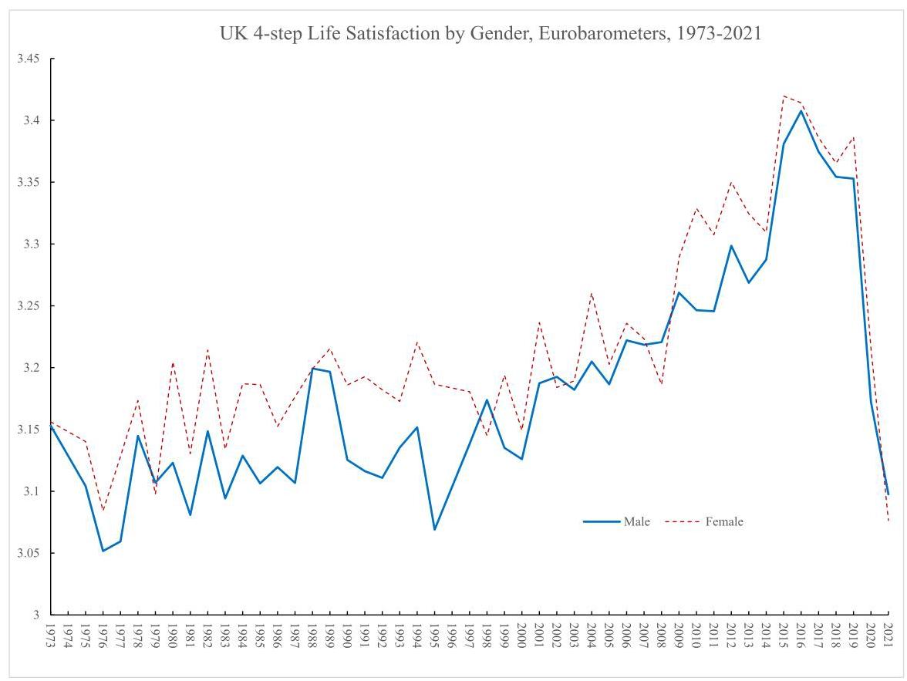

of their daily lives, even if the gender difference on global happiness and satisfaction is not clear-cut.

In the years 2006, 2012, and 2014, the European Social Survey (ESS) respondents provided information on five negative affect variables regarding how often in the last week they had felt depressed, anxious, sad, lonely, and that their sleep was restless (for more on restless sleep see Blanchflower and Bryson 2021b). Responses were coded none or almost none of the time $\left( { = 1}\right)$ ; some of the time $\left( { = 2}\right)$ ; most of the time $\left( { = 3}\right)$ ; all or almost all of the time $\left( { = 4}\right)$ . In every case, the male coefficient was negative, confirming that women scored more highly than men on negative affect. Taken together with the evidence on domain satisfaction, the ESS findings appear to cast doubt on the paradox of female (un)happiness. Instead, it appears men express greater satisfaction with most aspects of life and are less likely to express poor mental health.

Further doubts are raised about the paradox in Table 4, which reports wellbeing equations using four sweeps of the European Quality of Life Surveys (EQLS) from 2003, 2007, 2011, and 2016. With controls for wave and country, the coefficient on male in a happiness equation is positive and significant, while on life satisfaction, it is positive with the $t$ -value of 1.6 .

However, it turns out that there are nine other wellbeing variables in the 2007, 2011, and 2016 surveys. Five of them are related to positive affect - feeling cheerful and being in good spirits; calm and relaxed; active and vigorous; they woke up feeling fresh and rested and say that their daily life has been filled with things that interest them. Answers have five options including at no time and less than half the time as explained in the table. In all five cases, the male coefficient is significant and positive.

Table 4 Wellbeing in 36 European countries from European Quality of Life Surveys, 2003-2016

<table><tr><td/><td>Male coefficient</td><td>N</td></tr><tr><td colspan="3">a) 2003-2016</td></tr><tr><td>1) Happiness $\left( {1 = {10}}\right)$</td><td>.0229 (2.23)</td><td>141,184</td></tr><tr><td>2) Life satisfaction (1-10)</td><td>.0177 (1.61)</td><td>141,780</td></tr><tr><td colspan="3">b) 2007, 2011 & 2016 "I have felt .......at no time; some of the time; less than half of the time; more than half of the time; most of the time and all of the time?"</td></tr><tr><td>3) Cheerful and in good spirits</td><td>.1279 (18.22)</td><td>115,635</td></tr><tr><td>4) Calm and in good spirits</td><td>.2239 (30.50)</td><td>115,649</td></tr><tr><td>5) Active and vigorous</td><td>.1829 (23.58)</td><td>115,565</td></tr><tr><td>6) Woke up feeling fresh and rested</td><td>.2388 (29.12)</td><td>115,563</td></tr><tr><td>7) My daily life has been filled with things that interest me</td><td>.1368 (17.85)</td><td>115,081</td></tr><tr><td>8) Lonely (2011, 2016)</td><td>-.1922 (20.86)</td><td>80,026</td></tr><tr><td>9) Downhearted and depressed (2011, 2016)</td><td>-.2007 (22.79)</td><td>79,916</td></tr><tr><td>10) Tense (2011, 2016)</td><td>-.1459 (15.37)</td><td>79,976</td></tr><tr><td colspan="3">c) 2007, 2011, 2016 "Strongly disagree; disagree; neither; agree and strongly agree:”</td></tr><tr><td>11) I feel left out of society</td><td>-.0279 (4.73)</td><td>115,305</td></tr></table>

Controls are country and wave, with $t$ -statistics in parentheses. Countries are Albania, Austria, Belgium, Bulgaria, Croatia, Cyprus, Czech Republic, Denmark, Estonia, Finland, France, Macedonia, Germany, Greece, Hungary, Iceland, Ireland, Italy, Kosovo, Latvia, Lithuania, Luxembourg, Malta, Montenegro, Netherlands, Norway, Poland, Portugal, Romania, Serbia, Slovakia, Slovenia, Spain, Sweden, Turkey, and UK

There are also four negative affect variables - feeling left out of society, feeling lonely, downhearted, and depressed or feeling tense. Here, the male coefficients are all negative and significant.

Part (a) of Table 5 makes use of ten-step rather than the usual four-step life satisfaction variable. When this variable is regressed on a male dummy with country controls, the coefficient is significantly positive. The male dummy is also positive, and significant in estimates of ten-step positive affect variables regarding health, ability to perform daily tasks, and living conditions are used as dependent variables. These patterns in the male coefficient are replicated in the COVID period, as indicated in part (b) of Table 5, which estimates gender differentials in wellbeing using a recent Eurobarometer #95.1 for March-April 2021 for 39 European countries. It contains a number of variables on wellbeing, with the questions set out in the table, along with the standard four-step life satisfaction question in which the male coefficient is insignificant. This contrasts with the coefficients on the remaining six variables which are responses to a question on the respondent’s current emotional status. The one positive affect variable — calm — has a positive and significant male coefficient. The remaining five negative affect variables - loneliness, fear, helplessness, frustration, and uncertainty — all have significant negative coefficients.

We also find a positive male effect in expectations. Part (c) uses data from two Eurobarometer surveys taken in 2021, #94.3 and #95.3. They show positive male coefficients on expectations of the financial situation in the household as well as the economic and employment situation the respondent's country. However, the male coefficient is insignificant when the question relates to "life in general."

The evidence from these European surveys is that men tend to express greater satisfaction with various aspects of their lives, while women express worse mental health when reporting on questions regarding negative affect. However, there is less consistency in the male/female differential on "global" happiness and satisfaction responses. It also seems to matter if life satisfaction has a ten-step or a four-step response.

### 3.3 The world

To capture male/female differences in wellbeing across the world, we make use of data from the Gallup World Polls (GWP) of 2005-2021. Zweig (2014) had previously used the 2005-2008 GWP Cantril ladder variable to examine the male/female happiness gap. It is apparent from the raw data she presents that male happiness is above female happiness in 30 of the 73 countries she examines

Table 6 reports male coefficients and $t$ -statistics from regressions for 166 countries pooled. The first two columns estimate differences on enjoyment "yesterday" as captured by the question:

Q5. "Did you experience the following feelings during a lot of the day yesterday? How about enjoyment?"

---

	<table><tr><td colspan="2">Table 5 Wellbeing in 39 European countries in Eurobarometers, 2011 and 2021</td></tr><tr><td colspan="2">a) 2011 Eurobarometer #76.2, September November Could you please tell me on a scale of 1 to 10 how satisfied you are with each of the following items, where 'I' means you are "very dissatisfied" and '10' means you are "very satisfied"?</td></tr><tr><td colspan="2">Male coefficient</td></tr><tr><td>1. Your life in general $\left( {\mathrm{n} = {31},{144}}\right)$</td><td>.0756 (3.40)</td></tr><tr><td>2. Your health $\left( {\mathrm{n} = {31},{231}}\right)$</td><td>.2872 (11.08)</td></tr><tr><td>3. Your ability to perform day to day activities $\left( {n = {31},{187}}\right)$</td><td>.1408 (5.88)</td></tr><tr><td>4. Your living conditions (n=31,161)</td><td>.0911 (4.03)</td></tr><tr><td colspan="2">b) 2021 Eurobarometer #95.1, March-April</td></tr><tr><td colspan="2">Male coefficient</td></tr><tr><td>1. Life satisfaction $\left( {\mathrm{n} = {26},{613}}\right)$</td><td>-.0135 (1.68)</td></tr><tr><td>Feelings describing current emotional status (1,0 dummies) $\mathrm{n} = {26},{669}$ :</td><td/></tr><tr><td colspan="2">Male coefficient</td></tr><tr><td>2. Calm</td><td>.0742 (15.37)</td></tr><tr><td>3. Loneliness</td><td>-.0341 (7.70)</td></tr><tr><td>4. Fear</td><td>-.0690 (15.09)</td></tr><tr><td>5. Helplessness</td><td>-.0403 (7.94)</td></tr><tr><td>6. Frustration</td><td>-.0154 (2.78)</td></tr><tr><td>7. Uncertainty</td><td>-.0601 (10.00)</td></tr><tr><td colspan="2">c) 2021 Eurobarometers 94.3, February-March and 95.3 June-July pooled What are your expectations for the next twelve months: will the next twelve months be better (=3), worse (=1) or the same (=2), when it comes to...? (n=73,812)</td></tr><tr><td colspan="2">Male coefficient</td></tr><tr><td>Financial situation of your household</td><td>.0158 (3.43)</td></tr><tr><td>Economic situation in our country</td><td>.0420 (7.19)</td></tr><tr><td>Employment situation in our country</td><td>.0213 (3.72)</td></tr><tr><td>Your life in general</td><td>.0004 (0.09)</td></tr></table>

	$t$ -statistics in parentheses. Panel (a): Controls are country dummies only. Countries are Austria, Belgium,

	Bulgaria, Croatia, Cyprus, Czech Republic, Denmark, Estonia, Finland, France, Germany, Greece, Hun-

	gary, Iceland, Ireland, Italy, Latvia, Lithuania, Luxembourg, Macedonia, Malta, Netherlands, Norway,

	Poland, Portugal, Romania, Slovakia, Slovenia, Spain, Sweden, Turkey, and the UK. Panel (b): Controls

	are country dummies only. Countries are Austria, Belgium, Bulgaria, Croatia, Cyprus, Czech Republic,

	Denmark, Estonia, Finland, France, Germany, Greece, Hungary, Ireland, Italy, Latvia, Lithuania, Lux-

	embourg, Malta, Netherlands, Poland, Portugal, Romania, Slovakia, Slovenia, Spain, and Sweden. Panel

	(c): Controls are a wave dummy and country dummies for Albania, Austria, Belgium, Bosnia, Bulgaria,

	Croatia, Cyprus, Czechia, Denmark, Estonia, Finland, France, Germany, Greece, Hungary, Iceland, Ire-

	land, Italy, Kosovo, Latvia, Lithuania, Luxembourg, Malta, Montenegro, Netherlands, North Macedonia,

	Norway, Poland, Portugal, Romania, Serbia, Slovakia, Slovenia, Spain, Sweden, Switzerland, Turkey,

	Turkish Cyprus, and the UK

---

For comparison purposes, the last two columns report male coefficients on Cantril's life satisfaction variable where the question asked is:

Q6. "Please imagine a ladder with steps numbered from zero at the bottom to ten at the top. Suppose we say that the top of the ladder represents the best possible life for you, and the bottom of the ladder represents the worst possible life for you. On which step of the ladder would you say you personally feel you stand at this time, assuming that the higher the step the better you feel about your life, and the lower the step the worse you feel about it? Which step comes closest to the way you feel?"

Table 6. Enjoyment and Cantril life satisfaction from Gallup World Poll, 2005-2021

<table><tr><td/><td colspan="2">Enjoyment</td><td colspan="2">Cantril Life satisfaction</td></tr><tr><td>Male</td><td>.0083 (13.97)</td><td>.0048 (7.95)</td><td>-.0700 (25.07)</td><td>-.1094 (38.85)</td></tr><tr><td>Age</td><td/><td>-.0051 (59.09)</td><td/><td>-.0372 (91.55)</td></tr><tr><td>${\mathrm{{Age}}}^{2}$ *100</td><td/><td>.0037 (33.02)</td><td/><td>.0307 (70.33)</td></tr><tr><td>Year dummies</td><td>Yes</td><td>Yes</td><td>Yes</td><td>Yes</td></tr><tr><td>Country dummies</td><td>Yes</td><td>Yes</td><td>Yes</td><td>Yes</td></tr><tr><td>Education dummies</td><td>No</td><td>Yes</td><td>No</td><td>Yes</td></tr><tr><td>Constant</td><td>.8790</td><td>1.0724</td><td>7.5015</td><td>7.5243</td></tr><tr><td>Adjusted ${\mathrm{R}}^{2}$</td><td>.0523</td><td>.0655</td><td>.1901</td><td>.2147</td></tr><tr><td>$\mathrm{N}$</td><td>2,267,773</td><td>2,178,946</td><td>2,333,834</td><td>2,244,571</td></tr></table>

$t$ -statistics in parentheses

The mean on enjoyment is 0.70 , while the Cantril mean is 5.526. The answers are contradictory. Male enters positively for enjoyment yesterday and negatively to the Cantril variable that relates to life in general rather than yesterday. It seems men are happier "in the moment" than women but less happy if asked a question inviting them to reflect on their general happiness.

### 3.4 The UK

We now move on to look at gender differences in wellbeing for the UK in the Eurobarometer Surveys, 1973–2021; the Annual Population Surveys, 2012–2021; the Opinions and Lifestyle Survey, 2020-2022; the Health Survey for England, 2010–2019; and the 2020–2021 British Birth Cohort COVID surveys.

We begin by comparing files similar to the GSS for the US tracking life satisfaction back to the early 1970s. The trends in four-step life satisfaction scores in Fig. 2 plot average four-step life satisfaction scores for the UK for men and women using the 2003-2021 Eurobarometer files and the Mannheim Eurobarometer Trend files of 1973-2002. In contrast to the USA, life satisfaction rose steadily over time for men and women and female life satisfaction was above the male rate in the majority of years. Men's and women's life satisfaction plummets with the COVID pandemic. The female life satisfaction score for 2021 is below its prior historic lows, while for men, it is on a par with lows only previously seen in 1995 and the mid-1970s.

The bulk of our analysis involves examining microdata for the UK from the Annual Population Surveys of 2012-2021 (APS) which contains information on three 11-step wellbeing variables. ${}^{8}$ The questions asked are as follows, where respondents are asked to give their answers on a scale of 0 to 10 .

---

8 Data is also available on this question - "overall, to what extent do you feel the things you do in your life are worthwhile?" It follows closely the path followed by life satisfaction, given both relate to the integral of the past and we do not report separate results here. In the regressions, we restrict the data to the years 2013-2021 as the highest qualification variable was not included in the 2012 survey.

---

Fig. 2 UK 4-step Life Satisfaction by Gender, Eurobarometers, 1973-2021

Q7. "Life satisfaction — Overall, how satisfied are you with your life nowadays?"

Q8. “Happiness — Overall, how happy did you feel yesterday?”

Q9. "Anxious — Overall, how anxious did you feel yesterday?"

The results are reported quarterly by the Office of National Statistics. ${}^{9}$ The first of these variables refers to the integral of how life has been going and is unlikely to be changed quickly as compared with happiness and anxiety which relate directly to what happened the previous day. As would be expected, movements from the latter two are more pronounced and sharper than movements in the former that are initially slower to decline.

We trace the monthly path of wellbeing during period when the COVID virus had its greatest impact. This especially occurred in March and April 2020 and then recovery followed through September 2020, only to drop precipitously in late 2020 to reach a low on all measures in January 2021. Once again, wellbeing rose through to July 2021 but has slowed since then with an especially big drop in October 2021 as the Omicron variant of the COVID virus hit. We find that the negative sign on the male variable observed in earlier studies and in the UK for the period 2012-2019 switched and became positive in the case of the two positive affect measures. The anxiety gap between men and women increased in the pandemic; it seems that rise is driven by a rise in loneliness.

---

${}^{9}$ ONS (2020) also reported on the early impact of COVID-19 on anxiety in April and May 2020 using the APS data. It found that factors most strongly associated with high anxiety during lockdown include loneliness, marital status, sex, disability, whether someone feels safe at home or not\\, and work being affected by the coronavirus (COVID-19) pandemic. The odds of reporting high anxiety they found were twice as large for those aged 75 years and over than those aged 16 to 24 years.

---

New data by gender from the Opinions and Lifestyle Survey (OALS) in the UK from March 2020 through to February 2022. ${}^{10}$ As in the case of the APS, the questions regarding happiness and anxiety refer to "yesterday."

Q10. "Overall, how happy did you feel yesterday?"

Q11. "Overall, how anxious did you feel yesterday?"

These questions are answered on a scale of 0 to 10 , where 0 is "not at all" and 10 is "completely."

The time paths for men and women's happiness in the OALS are very similar to those reported in the APS data above, although the levels in the OALS are lower. Both have lows in March 2020 with recovery to a peak around July 2020 and a major trough at the start of 2021. ${}^{11}$ The low for females of 6.1 in 20-30 March 2020 is well below that of men of 6.6. The low in January 2021 is also a lot lower for women than men. For example, in the survey for 27-31 January, the male happiness score was 6.6 versus 6.2 for females. The APS data stopped in October 2021, having started falling; the extent of that drop looks greater than in the OALS data. By the start of February 2022, happiness levels were above their March 2020 levels but below what they had been in the summer of 2021 before omicron. Male and female happiness rates were both 6.9. These raw data reflect the findings discussed earlier, confirming that women tend to be more anxious than men, whereas differences in happiness are much less clear-cut.

Table 7 presents pre-COVID (2013-2019) and post-COVID (2020-2021) wellbeing equations for happiness, life satisfaction, and anxiety using the APS by year from 2012 to 2021 that provide very similar evidence to the OALS in 2020 and 2021. Controls are race, year, and country of residence - England, Northern Ireland, Scotland, or Wales. In the case of happiness, the sign on the male coefficient switches from negative to positive over time. The coefficient is negative and significant in 2012 only and negative but insignificant from 2015 to 2017. The sign switches to positive but insignificant in 2018 and positive and significant in 2019-2021. The phenomenon of a positive male coefficient started pre-COVID and so cannot be attributed solely to the effects of the pandemic. We do not know why.

For life satisfaction, there are negative and significant male coefficients in every year through 2017; in 2018 and 2019, they are insignificant and then both are positive in 2020 and 2021. In the case of anxiety, the negative coefficient gets larger over time. There is therefore a clear reversal whereby under COVID, men's wellbeing has improved compared with the wellbeing of women.

---

10 See "Coronavirus and the Social Impacts on Great Britain," ONS, 18 February 2022.

11 To get a sense of the decline in happiness in March 2020, between 2015 and 2019, weighted APS happiness averaged 7.53. For 2020, happiness averaged 7.38 for men and 7.30 for women and 7.47 and 7.39 for women in 2021. In the case of OALS, happiness averaged 7.00 for men and 6.86 for women in 2020 and 6.99 for men and 6.91 for women in 2021. The UCL Covid Social Survey has even lower happiness scores, which dropped to 5.6 for women and 6.0 for men in April 2020 and in the latest report #41 at the end of 2021 were at 6.4 for women and 6.8 for men.

---

Table 7. UK OLS coefficients on male dummy in wellbeing equations APS 2012-2021

<table><tr><td colspan="3">Happiness</td><td colspan="2">Life satisfaction</td><td colspan="2">Anxious</td></tr><tr><td>All</td><td>.0058 (1.62)</td><td>1,453,690</td><td>-.0107 (3.52)</td><td>1,454,283</td><td>-.3749 (78.32)</td><td>1,452,481</td></tr><tr><td>2012</td><td>-.0421 (3.84)</td><td>166,339</td><td>-.0598 (6.41)</td><td>166,406</td><td>-.2561 (17.90)</td><td>166,122</td></tr><tr><td>2013</td><td>-.0170 (1.57)</td><td>166,132</td><td>-.0416 (4.49)</td><td>166,212</td><td>-.2961 (20.83)</td><td>165,895</td></tr><tr><td>2014</td><td>-.0147 (1.36)</td><td>165,597</td><td>-.0448 (4.95)</td><td>165,693</td><td>-.3092 (21.74)</td><td>165,393</td></tr><tr><td>2015</td><td>-.0070 (0.65)</td><td>158,326</td><td>-.0239 (2.63)</td><td>158,377</td><td>-.3355 (23.17)</td><td>158,138</td></tr><tr><td>2016</td><td>-.0182 (1.63)</td><td>150,645</td><td>-.0338 (3.65)</td><td>150,706</td><td>-.3421 (23.10)</td><td>150,530</td></tr><tr><td>2017</td><td>-.1046 (1.35)</td><td>154,295</td><td>-.0259 (2.84)</td><td>154,349</td><td>-.3760 (25.62)</td><td>154,219</td></tr><tr><td>2018</td><td>.0098 (0.88)</td><td>148,046</td><td>.0109 (1.17)</td><td>148,105</td><td>-.4240 (28.35)</td><td>147,980</td></tr><tr><td>2019</td><td>.0277 (2.49)</td><td>145,439</td><td>.0102 (1.08)</td><td>145,505</td><td>-.4486 (29.69)</td><td>145,380</td></tr><tr><td>2020</td><td>.1080 (8.66)</td><td>112,536</td><td>.0860 (7.92)</td><td>112,566</td><td>-.5582 (32.60)</td><td>112,520</td></tr><tr><td>2021</td><td>.1089 (7.77)</td><td>86,335</td><td>.1027 (8.32)</td><td>86,364</td><td>-.5621 (29.16)</td><td>86,304</td></tr></table>

Controls are race, country of residence, and month, with $t$ -statistics in parentheses and number of observations following. Source: Annual Population Surveys

In Table 8, we examine pre-pandemic estimates of two wellbeing metrics from the English Health Surveys 2010-2019 in the first two columns. The questions were:

Q12. "Overall satisfaction with life nowadays? 0-10 — mean.

Table 8 Wellbeing from four UK birth cohorts, 2020-2021, and the Health Survey for England, 2010- 2019

<table><tr><td rowspan="2"/><td colspan="2">Health Survey for England</td><td colspan="2">Birth Cohorts</td></tr><tr><td>Life satisfaction 2016-2019</td><td>Good for me 2010-2019</td><td>Life satisfaction 2020-2021</td><td>Lonely 2020-2021</td></tr><tr><td>Male</td><td>.0680 (2.81)</td><td>.1609 (20.91)</td><td>.1610 (10.84)</td><td>-.1191 (25.39)</td></tr><tr><td>BCS70</td><td/><td/><td>-.2054 (9.13)</td><td>.0534 (7.51)</td></tr><tr><td>Next Steps</td><td/><td/><td>-.4554 (17.43)</td><td>.2842 (34.44)</td></tr><tr><td>MCS Cohort Member</td><td/><td>-1.0873 (42.14)</td><td>.5249 (64.44)</td><td/></tr><tr><td>MCS Parent</td><td/><td/><td>-.0861 (3.59)</td><td>.0085 (1.12)</td></tr><tr><td>Constant</td><td>7.1895</td><td>3.4507</td><td>7.2830</td><td>1.4578</td></tr><tr><td>Adjusted ${\mathrm{R}}^{2}$</td><td>.0091</td><td>.01207</td><td>.0457</td><td>.0958</td></tr><tr><td>$\mathrm{N}$</td><td>28,773</td><td>57,084</td><td>63,863</td><td>63,796</td></tr></table>

$t$ -statistics in parentheses. Equations include wave, region, and year dummies. Source for columns 1 and 2: Health surveys for England. Source for columns 3 and 4: British birth cohorts. Dependent variables are: Q12. "Overall satisfaction with life nowadays? 0-10 ; mean = 7.44. Q13. "Been feeling good about myself — none of the time (=2%); rarely (8%)" some of the time (34%), often (41%), and all of the time (15%) coded 1 through 5. For columns 3 and 4, the omitted category is NCDS. The data are from the birth cohort COVID surveys. Wave 1 April 2020; Wave 2 September 2020; Wave 3 February 2021. Millennium cohort study (born 2000-2002) both cohort members and parents (MCS). Next steps (born 1989–1990) was Longitudinal Study of Young People in England; 1970 British Cohort Study (BCS70); 1958 National Child Development Study (NCDS)

Q13. "Been feeling good about myself - none of the time $\left( { = 1}\right)$ , rarely $\left( { = 2}\right)$ , some of the time $\left( { = 3}\right)$ , often $\left( { = 4}\right)$ , and all of the time $\left( { = 5}\right)$ .

Men have both higher life satisfaction than women and spend more time than women feeling good about themselves. In the two right-hand columns, we estimate equations using British birth cohort data post-pandemic in relation to 11-step life satisfaction and a three-step loneliness variable using data on 64,000 respondents of various ages for 2020 and 2021 from three waves of a COVID-19 study. These are (1) Millennium Cohort Study (born 2000-2002) both cohort members and parents (MCS); (2) Next Steps (born 1989–1990), which formerly was The Longitudinal Study of Young People in England; (3) 1970 British Cohort Study (BCS70); and (4) 1958 National Child Development Study (NCDS).

The questions asked were the same for all four cohorts: was Q8 above for life satisfaction and

Q14. "Lonely - how often do you feel lonely - hardly ever $\left( { = 1}\right)$ ; some of the time $\left( { = 2}\right)$ often $\left( { = 3}\right)$ ?”

We include wave and cohort dummies along with regional controls plus a gender dummy. In column 3, the male variable is significantly positive in a life satisfaction equation. In the fourth column, the dependent variable is loneliness with a higher number meaning more loneliness and the male coefficient is negative. Hence, males have higher levels of life satisfaction and are less lonely. This confirms evidence from the APS for 2020 and 2021.

The patterns by gender we observed in the period since 2020 after the onset of the pandemic are also entirely consistent with those found for the UK in UCL's Covid Social Study. In report #41 for December 2021, separate results by gender are reported. ${}^{12}$ A number of factors are apparent in their report:

a) Males have lower levels of depression and anxiety across all months of the survey (Figure 5) and have lower levels of loneliness (Figure 22i) and covid-19 stress (Figure 9i). and the gender gap is broadly constant in all of them over time.

b) Financial (Figure 11i), food security (Figure 12i), and unemployment stress (Figure 10i); thoughts of death (Figure 14i) and self-harm (Figure 16i) are broadly flat over time with only small gender differences.

c) Life satisfaction and happiness are always higher for men than women (Figures 20i and 24i).

Women are less happy than men in these data for the UK.

The question that this finding begs is, how large are these effects? There is no simple way to do this, but we took the data from the Annual Population Survey reported in Table 7 and pooled the years 2019-2021 together and found the male coefficient with race, country of residence, month, and year controls was 0.074 . To get a sense of whether this is large or not, we calculated the weighted means of four comparables by labour force status, education, age, and race. The male differential is slightly smaller than in the regression when controls are included for race, year, and country, at 0.06 .

<table><tr><td/><td/></tr><tr><td>Male</td><td>7.47</td></tr><tr><td>Female</td><td>7.41</td></tr><tr><td>Employee</td><td>7.47</td></tr><tr><td>Unemployed</td><td>6.97</td></tr><tr><td>Degree</td><td>7.43</td></tr><tr><td>No qualification</td><td>7.08</td></tr><tr><td>Age 16-17</td><td>7.67</td></tr><tr><td>Age 50-54</td><td>7.25</td></tr><tr><td>White</td><td>7.44</td></tr><tr><td>Pakistani</td><td>7.36</td></tr><tr><td>Chinese</td><td>7.42</td></tr><tr><td>Black</td><td>7.40</td></tr></table>

There is a difference of 0.50 happiness points between employees and the unemployed; 0.35 between those with no qualifications and those with a degree and 0.42 between teenagers with the highest happiness levels and those with the lowest (ages 50-54). ${}^{13}$ Of particular note is the male differential of 0.06 happiness points is larger than that between whites and blacks and whites and Chinese and is slightly more than between whites and Pakistanis. The difference in happiness levels between men and women in their happiness scores is statistically significant and positive since 2019 and thus also seems to be non-trivial.

## 4 Discussion

For the last few years, there is increasing consistent evidence that there is not a female paradox in wellbeing. Men have higher wellbeing than women, whether that is measured using negative or positive affect variables and the gap has increased during the COVID-19 pandemic and associated lockdowns. There is some evidence though that the trend to observing a positive male coefficient in happiness equations had been in train prior to COVID. What we have seen is something quite unusual - a sign change on a variable in happiness and life satisfaction equations in the UK. In this case, the male dummy goes from significantly negative to significantly positive. ${}^{14}$ The question is whether this will continue in the future.

We contribute to the literature in several ways. First, using the General Social Survey (GSS) for the USA, we track men and women's happiness between 1973 and 2021. We show mean happiness does not differ between men and women over that long time period, but these results do shift over time, but there is instability as Bond and Lang (2019) found. Some periods show a significant negative male coefficient (1972-1987), while others show a significant positive (1988-2003). Happiness then plummets in 2021 for both, though women's satisfaction falls further. However, measures of satisfaction with finances shows men having higher wellbeing than women in all five time periods examined. We attempted to re-estimate using the median estimator method proposed by Chen et al. (2022) using a nonparametric estimator as an alternative. We found difficulty in having the estimates converge. The problem is that median regressions do not work well on a dependent variable that is categorical like happiness (there is such a big lump of people at 8 that the median is 8 for every group, so not very informative). For example, when we calculate the median for every possible subgroup based on male/race/month/year and country using the UK happiness data, the median is exactly 8 for 95.6% of the observations.

---

${}^{13}$ See Graham and Ruiz Pozuelo (2017), Blanchflower (2020,2021), and Blanchflower and Feir (2023) on the U-shape in age in wellbeing data.

${}^{14}$ Blanchflower and Clark (2021) found the same in relation to the sign on children in a happiness equation. For school-aged children, the sign flipped from negative to positive once controls were included for difficulty in paying the bills.

---

Furthermore, if you compare the mean differences between men's and women's wellbeing from Table 1 in the paper with the differences in medians below, the same pattern of results is obtained. The fact that the raw differences are not that different at the median and the mean suggest our results are likely robust to this concern.

Second, using data for Europe from the European Social Surveys and the European Quality of Life Surveys as well as a Eurobarometer Survey from 2020, we find broad evidence from a variety of wellbeing questions - on calmness, restless sleep., being cheerful, lonely, fearful, helpless, anxious, frustrated, tense, and more - we find that men have higher wellbeing than women. We also find that men are more satisfied than women in regard to broader questions about the state of the economy, democracy, and the state of health services and education in their country. We confirm that result using Gallup World Poll data on enjoyment.

Third, we turn to our main focus, namely gender differences in wellbeing and whether these have changed as a result of the COVID pandemic. We examine data for the UK from the Annual Population Survey and find that over time the sign on the male coefficient has shifted from negative to positive, but this change was already in train prior to the pandemic. The years 2020 and 2021 mark an important change but the change was already underway in 2018 and 2019. Data from the Opinion and Lifestyle Survey for the UK finds that for most of the period from April 2020 through February 2022, male happiness, yesterday, was above female happiness. We also find evidence for this from the Health Survey for England and from four UK birth cohorts.

Fourth, we show that in all of the various negative affect variables we examine, including anxiety depression, sadness, loneliness, and being tense, we confirm that women are always and everywhere have worse mental health, including higher levels of stress, anxiety, sadness, and depression than men.

Fifth, we find that the size of the gender differential in happiness does not appear to be trivial. Using UK data for 2019, we found that the male differential was about 0.6 happiness points which is more than the difference between the happiness of whites and blacks and about a quarter of the difference between someone with no qualifications and someone with a degree.

At the time of writing in July 2022, we find that the latest wellbeing data for the years since 2020 for the USA, the EU27 and the UK suggest that there is increasing evidence that there is no longer any female paradox. We report some evidence