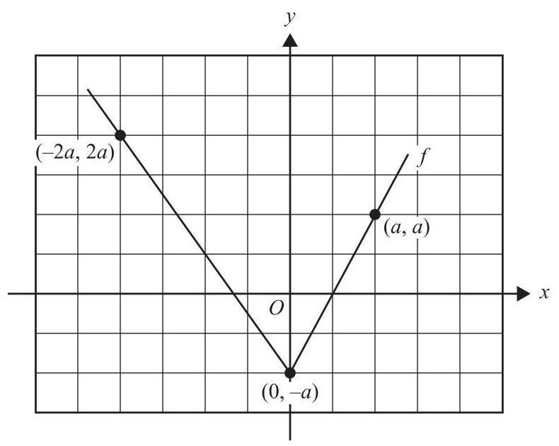
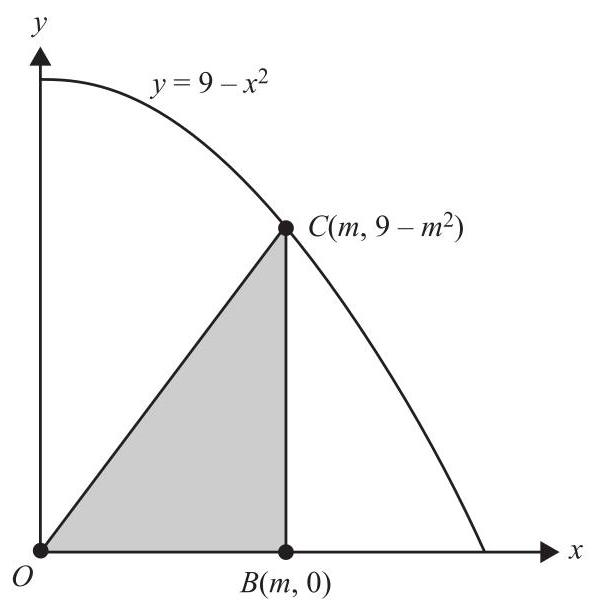
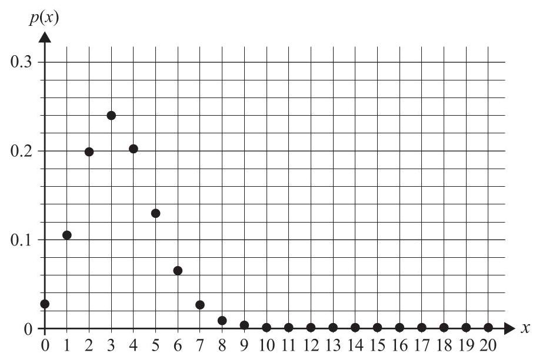
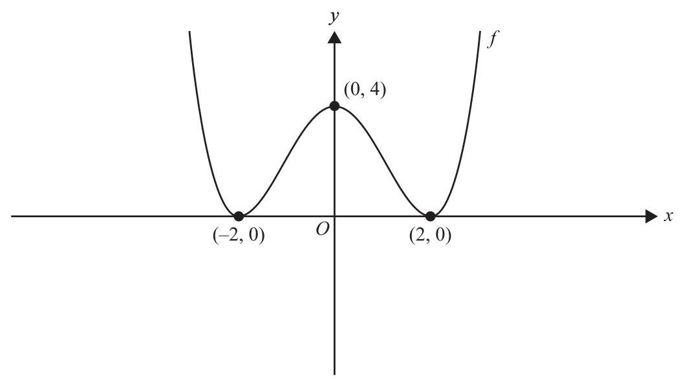
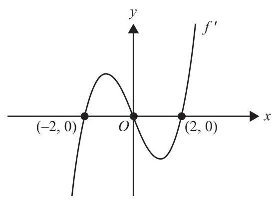
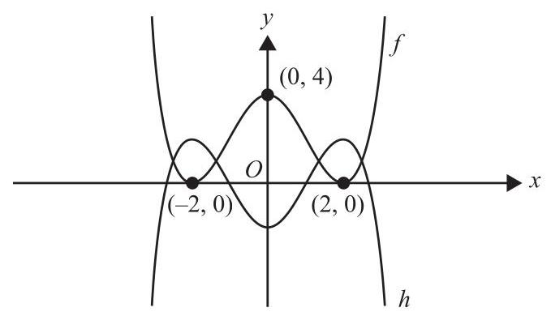
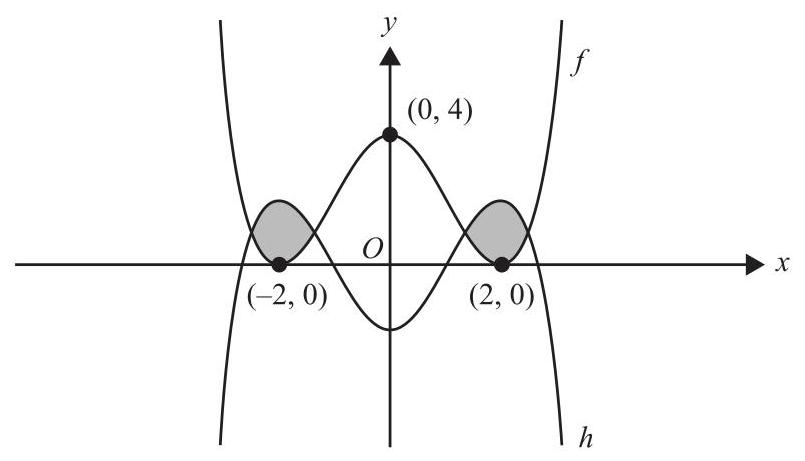
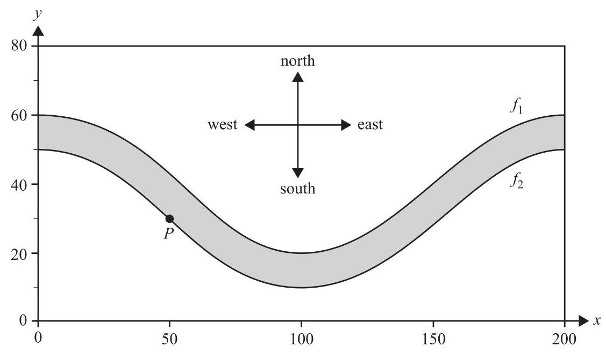

## Question 13

The transformation $T : {R}^{2} \rightarrow  {R}^{2}$ that maps the graph of $y = \cos \left( x\right)$ onto the graph of $y = \cos \left( {{2x} + 4}\right)$ is

A. $T\left( \left\lbrack  \begin{array}{l} x \\  y \end{array}\right\rbrack  \right)  = \left\lbrack  \begin{array}{ll} 1 & 0 \\  2 & 1 \end{array}\right\rbrack  \left( {\left\lbrack  \begin{array}{l} x \\  y \end{array}\right\rbrack   + \left\lbrack  \begin{matrix}  - 4 \\  0 \end{matrix}\right\rbrack  }\right)$

B. $T\left( \left\lbrack  \begin{array}{l} x \\  y \end{array}\right\rbrack  \right)  = \left\lbrack  \begin{array}{ll} 1 & 0 \\  2 & 1 \end{array}\right\rbrack  \left\lbrack  \begin{array}{l} x \\  y \end{array}\right\rbrack   + \left\lbrack  \begin{matrix}  - 4 \\  0 \end{matrix}\right\rbrack$

C. $T\left( \left\lbrack  \begin{array}{l} x \\  y \end{array}\right\rbrack  \right)  = \left\lbrack  \begin{array}{ll} 1 & 0 \\  2 & 1 \end{array}\right\rbrack  \left( {\left\lbrack  \begin{array}{l} x \\  y \end{array}\right\rbrack   + \left\lbrack  \begin{matrix}  - 2 \\  0 \end{matrix}\right\rbrack  }\right)$

D. $T\left( \left\lbrack  \begin{array}{l} x \\  y \end{array}\right\rbrack  \right)  = \left\lbrack  \begin{array}{ll} 2 & 0 \\  0 & 1 \end{array}\right\rbrack  \left( {\left\lbrack  \begin{array}{l} x \\  y \end{array}\right\rbrack   + \left\lbrack  \begin{array}{l} 2 \\  0 \end{array}\right\rbrack  }\right)$

E. $T\left( \left\lbrack  \begin{array}{l} x \\  y \end{array}\right\rbrack  \right)  = \left\lbrack  \begin{array}{ll} 2 & 0 \\  0 & 1 \end{array}\right\rbrack  \left\lbrack  \begin{array}{l} x \\  y \end{array}\right\rbrack   + \left\lbrack  \begin{array}{l} 2 \\  0 \end{array}\right\rbrack$

## Question 14

The random variable $X$ is normally distributed.

The mean of $X$ is twice the standard deviation of $X$ .

If $\Pr \left( {X > {5.2}}\right)  = {0.9}$ , then the standard deviation of $X$ is closest to

A. 7.238

B. 14.476

C. 3.327

D. 1.585

E. 3.169

Question 15

Part of the graph of a function $f$ , where $a > 0$ , is shown below.

The average value of the function $f$ over the interval $\left\lbrack  {-{2a}, a}\right\rbrack$ is

A. 0

B. $\frac{a}{3}$

C. $\frac{a}{2}$

D. $\frac{3a}{4}$

E. $a$

## Question 16

A right-angled triangle, ${OBC}$ , is formed using the horizontal axis and the point $C\left( {m,9 - {m}^{2}}\right)$ , where $m \in  \left( {0,3}\right)$ , on the parabola $y = 9 - {x}^{2}$ , as shown below.

The maximum area of the triangle ${OBC}$ is

A. $\frac{\sqrt{3}}{3}$

B. $\frac{2\sqrt{3}}{3}$

C. $\sqrt{3}$

D. $3\sqrt{3}$

E. $9\sqrt{3}$

Question 17

Let $f\left( x\right)  =  - {\log }_{e}\left( {x + 2}\right)$ .

A tangent to the graph of $f$ has a vertical axis intercept at(0, c).

The maximum value of $c$ is

A. -1

B. $- 1 + {\log }_{e}\left( 2\right)$

C. $- {\log }_{e}\left( 2\right)$

D. $- 1 - {\log }_{e}\left( 2\right)$

E. ${\log }_{e}\left( 2\right)$

---

		Question 18

	Let $a \in  \left( {0,\infty }\right)$ and $b \in  R$ .

	Consider the function $h : \left\lbrack  {-a,0)\cup (0, a}\right\rbrack   \rightarrow  R, h\left( x\right)  = \frac{a}{x} + b$ .

	The range of $h$ is

	A. $\left\lbrack  {b - 1, b + 1}\right\rbrack$

	B. $\left( {b - 1, b + 1}\right)$

C. $\left( {-\infty , b - 1}\right)  \cup  \left( {b + 1,\infty }\right)$

D. $\left( {-\infty , b - 1\rbrack \cup \lbrack b + 1,\infty }\right)$

	E. $\lbrack b - 1,\infty )$

---

## Question 19

Shown below is the graph of $p$ , which is the probability function for the number of times, $x$ , that a ’ 6 ’ is rolled on a fair six-sided die in 20 trials.

Let $q$ be the probability function for the number of times, $w$ , that a ‘ 6 ’ is not rolled on a fair six-sided die in 20 trials. $q\left( w\right)$ is given by

A. $p\left( {{20} - w}\right)$

B. $p\left( {1 - \frac{w}{20}}\right)$

C. $p\left( \frac{w}{20}\right)$

D. $p\left( {w - {20}}\right)$

E. $1 - p\left( w\right)$ Question 20 Let $f : R \rightarrow  R, f\left( x\right)  = \cos \left( {ax}\right)$ , where $a \in  R \smallsetminus  \{ 0\}$ , be a function with the property

$$
f\left( x\right)  = f\left( {x + h}\right) \text{, for all}h \in  Z
$$

Let $g : D \rightarrow  R, g\left( x\right)  = {\log }_{2}\left( {f\left( x\right) }\right)$ be a function where the range of $g$ is $\left\lbrack  {-1,0}\right\rbrack$ . A possible interval for $D$ is

A. $\left\lbrack  {\frac{1}{4},\frac{5}{12}}\right\rbrack$

B. $\left\lbrack  {1,\frac{7}{6}}\right\rbrack$

C. $\left\lbrack  {\frac{5}{3},2}\right\rbrack$

D. $\left\lbrack  {-\frac{1}{3},0}\right\rbrack$

E. $\left\lbrack  {-\frac{1}{12},\frac{1}{4}}\right\rbrack$

## SECTION B

## Instructions for Section B

Answer all questions in the spaces provided.

In all questions where a numerical answer is required, an exact value must be given unless otherwise specified.

In questions where more than one mark is available, appropriate working must be shown.

Unless otherwise indicated, the diagrams in this book are not drawn to scale.

Question 1 (11 marks)

Let $f : R \rightarrow  R, f\left( x\right)  = a{\left( x + 2\right) }^{2}{\left( x - 2\right) }^{2}$ , where $a \in  R$ . Part of the graph of $f$ is shown below. a. Show that $a = \frac{1}{4}$ . 1 mark

__________

__________

b. Express $f\left( x\right)  = \frac{1}{4}{\left( x + 2\right) }^{2}{\left( x - 2\right) }^{2}$ in the form $f\left( x\right)  = \frac{1}{4}{x}^{4} + b{x}^{2} + c$ , where $b$ and $c$ are integers. 1 mark

Part of the graph of the derivative function ${f}^{\prime }$ is shown below.

c. i. Write the rule for ${f}^{\prime }$ in terms of $x$ . 1 mark

ii. Find the minimum value of the graph of ${f}^{\prime }$ on the interval $x \in  \left( {0,2}\right)$ . 2 marks

__________

__________

__________

Let $h : R \rightarrow  R, h\left( x\right)  =  - \frac{1}{4}{\left( x + 2\right) }^{2}{\left( x - 2\right) }^{2} + 2$ . Parts of the graphs of $f$ and $h$ are shown below.

d. Write a sequence of two transformations that map the graph of $f$ onto the graph of $h$ . 1 mark

__________

__________

e. i. State the values of $x$ for which the graphs of $f$ and $h$ intersect. 1 mark

ii. Write down a definite integral that will give the total area of the shaded regions in the graph above. 1 mark

__________

iii. Find the total area of the shaded regions in the graph above. Give your answer correct to two decimal places. 1 mark

f. Let $D$ be the vertical distance between the graphs of $f$ and $h$ .

Find all values of $x$ for which $D$ is at most 2 units. Give your answers correct to two decimal places. 2 mar

__________

ductuntFZ-ulecolog SECTION B - continued TURN OVER

## Question 2 (11 marks)

An area of parkland has a river running through it, as shown below. The river is shown shaded.

The north bank of the river is modelled by the function ${f}_{1} : \left\lbrack  {0,{200}}\right\rbrack   \rightarrow  R,{f}_{1}\left( x\right)  = {20}\cos \left( \frac{\pi x}{100}\right)  + {40}$ .

The south bank of the river is modelled by the function ${f}_{2} : \left\lbrack  {0,{200}}\right\rbrack   \rightarrow  R,{f}_{2}\left( x\right)  = {20}\cos \left( \frac{\pi x}{100}\right)  + {30}$ .

The horizontal axis points east and the vertical axis points north.

All distances are measured in metres.

A swimmer always starts at point $P$ , which has coordinates (50,30).

Assume that no movement of water in the river affects the motion or path of the swimmer, which is always a straight line.

a. The swimmer swims north from point $P$ .

Find the distance, in metres, that the swimmer needs to swim to get to the north bank of the river. 1 mark