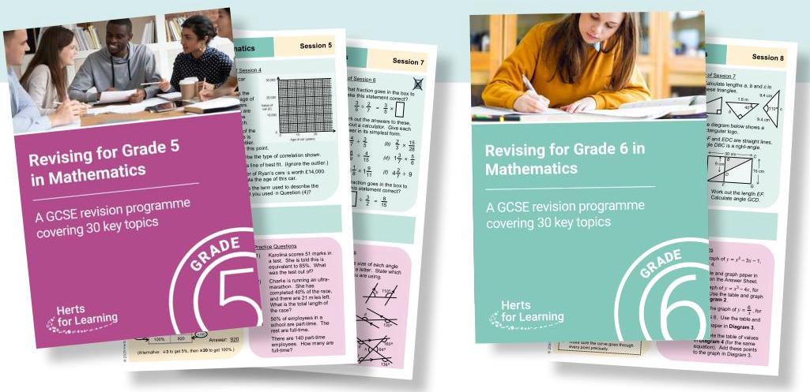
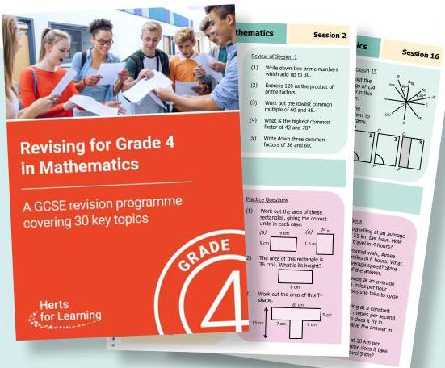

# Graded revision workbooks for Maths GCSE

## Revising for GCSEs or mocks? Looking for extra practice to improve your Maths? Need to remind yourself of key topics?

Designed to encourage independent working, they have been written to go alongside your work and revision in school. They will work well with any of the exam board GCSE (9-1) specifications.

The best way to revise Maths is to practise it. Each book contains a programme of 30 sessions. Each to work through. A full set of answers is provided at the back.

## In each session, you will find:

- a quick quiz to encourage recall of important facts and methods

- a short review of the previous session

- simple explanations and reminders

- several carefully varied questions to cement understanding

- a selection of reasoning and problem-solving questions 4600 session focusses on a key topic to help you succeed at GCSE, and is designed to take around 45 minutes

Topics have been chosen to help you make best use of your time. The workbook for your target grade will test and build your understanding of the more challenging topics. A workbook at a lower grade will remind you of key areas you may not have studied recently. Beautifully presented, in full colour, these workbooks offer excellent value for money. Work through your chosen book carefully and you will give yourself the best chance of getting the grade you need.

Order online at hertsforlearning.co.uk/shop Cost per book: £7.95 (plus postage and packing)