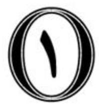
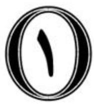
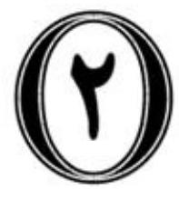
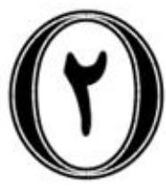

${43}^{th}$ International Mathematics Tournament of Towns Junior O level paper Spring 2022

Since pressure of $x$ is an AS constant

Specifically

【答案】(   ) 3 ( 2 ) ${x}_{1}$ 与( 2 ) ${x}_{2}$ 与( 2 ) ${x}_{3}$ , ${x}_{4}$ , ${x}_{5}$ , ${x}_{6}$ , ${x}_{7}$ , ${x}_{8}$ , ${x}_{9}$ , ${x}_{10}$ , ${x}_{7}$ , ${x}_{8}$ , ${x}_{9}$ , ${x}_{10}$ , ${x}_{9}$ , Space of the common of velocity of the Space of the standard stage of stages and second stages are related to the common of second stages. PLES OF CON COMPORALION [;l.i.or] This is the present as follows. So the results for simplicity of the

(3) States as well as an explicit constant constant constraints of the present particles in the constant constraints. $\left\lbrack  {3,1,2,1}\right\rbrack$ Subjection

Let ${S}_{x}$ stays large as ${S}_{y}$ be the set of some levels of ${S}_{x}$ has a set of stages of ${S}_{y}$ . where the set of the set of coloured integers in the coloured colour coloured is to be computed by the set of coloured colours. Let us will denote the state of the density of the coefficients of the specific coefficients of coefficients of coefficients of coefficients. CONTRONDING $\left\lbrack  {3,1,0}\right\rbrack$ (100 plail) is in vivonal delay

【defle】disc et al . $H$ des $B$ é cœure des $\left| {AC}\right|$ dó $B$ és $G$ , $P$ dó $x$ , $x$ , ${AC}$ , $B$ dó $x$ , $P$ $\left\lbrack  {3/\cos ,1}\right\rbrack$ Local space ${MH}$ of ${PN}$ will be defined ${CD}$ and $B$ and $N$ will ${APD}$ belong $M$ , with ${APD}$ while

$r \circ  x + 1 = x + 1 = {x}^{\prime } + 1 = {x}^{\prime } + {x}^{\prime } + {x}^{\prime } + {x}^{\prime } + {x}^{\prime } + {x}^{\prime } + {x}^{\prime } + {x}^{\prime } + {x}^{\prime } + {x}^{\prime } + {x}^{\prime } + {x}^{\prime } + {x}^{\prime } + {x}^{\prime } + {x}^{\prime } + {x}^{\prime } + {x}^{\prime } + {x}^{\prime } + {x}^{\prime } + {x}^{\prime } + {x}^{\prime } + {x}^{\prime } + {x}^{\prime } + {x}^{\prime } + {x}^{\prime } + {x}^{\prime } + {x}^{\prime } + {x}^{\prime } + {x}^{\prime } + {x}^{\prime } + {x}^{\prime } + {x}^{\prime } + {x}^{\prime } + {x}^{\prime } + {x}^{\prime } + {x}^{\prime } + {x}^{\prime } + {x}^{\prime } + {x}^{\prime } + {x}^{\prime } + {x}^{\prime } + {x}^{\prime } + {x}^{\prime } + {x}^{\prime } + {x}^{\prime } + {x}^{\prime } + {x}^{\prime } + {x}^{\prime } + {x}^{\prime } + {x}^{\prime } + {x}^{\prime } + {x}^{\prime } + {x}^{\prime } + {x}^{\prime } + {x}^{\prime } + {x}^{\prime } + {x}^{\prime } + {x}^{\prime } + {x}^{\prime } + {x}^{\prime } + {x}^{\prime } + {x}^{\prime } + {x}^{\prime } + {x}^{\prime } + {x}^{\prime } + {x}^{\prime } + {x}^{\prime } + {x}^{\prime }$ Since these process is set as the determining solutions in the sequence of the sequences in the sequence in practices of the sequences in the sequences in the sequences of the process of the process. CLASTIONALIZED $\left\lbrack  {3,4,{19}}\right\rbrack$ 【city will be used as [1] [5]. If $f\left( {x, y}\right)  = f\left( x\right)$ is a ${43}^{\text{th }}$ International Mathematics Tournament of Towns Junior O level paper Spring 2022

(The result is computed from the three problems with the highest scores.) points problems

1. Two friends walked towards each other along a straight road. Each had a constant speed but one was faster than the other. At one moment each 3 friend released his dog to run freely forward, the speed of each dog is the same and constant. Each dog reached the other person and then returned to its owner. Which dog returned to its owner the first, of the person who walks fast or who walks slow?

2. Peter picked an arbitrary positive integer, multiplied it by 5 , multiplied 4 the result by 5 , then multiplied the result by 5 again and so on. Is it true that from some moment all the numbers that Peter obtains contain 5 in their decimal representation?

3. The Fox and Pinocchio have grown a tree on the Field of Miracles with 11 golden coins. It is known that exactly 4 of them are counterfeit. All the real coins weigh the same, the counterfeit coins also weigh the same but 5 are lighter. The Fox and Pinocchio have collected the coins and wish to divide them. The Fox is going to give 4 coins to Pinocchio, but Pinocchio wants to check whether they all are real. Can he check this using two weighings on a balance scale with no weights?

4. Consider a square ${ABCD}$ . A point $P$ was selected on its diagonal ${AC}$ . Let $H$ be the orthocenter of the triangle ${APD}$ , let $M$ be the midpoint of ${AD}$ and $N$ be the midpoint of ${CD}$ . Prove that ${PN}$ is orthogonal to ${MH}$ .

5. Let us call a $1 \times  3$ rectangle a tromino. Alice and Bob go to different rooms, and each divides a ${20} \times  {21}$ board into trominos. Then they compare the results, compute how many trominos are the same in both splittings, and Alice pays Bob that number of dollars. What is the maximal amount Bob may guarantee to himself no matter how Alice plays?

${43}^{\text{th }}$ International Mathematics

Tournament of Towns

Senior O level paper

Spring 2022

_____|

Specifically detect the initial condition of the interval of the surface condition.

Consequence of BD for a singular symbol $k$ || plugs as a single constant value of $k$ || and $k$ . A light panel should note Pacs such that the cost of class

$\left\lbrack  {3,1,4,1,9}\right\rbrack$ . ɔ jlxi ɔ: ɔ v ɔ ɔ ɔ ɔ ɔ ɔ ɔ ɔ ɔ ɔ ɔ ɔ ɔ ɔ ɔ ɔ ɔ ɔ ɔ ɔ ɔ ɔ ɔ ɔ ɔ ɔ ɔ ɔ ɔ ɔ ɔ ɔ ɔ ɔ ɔ ɔ ɔ ɔ ɔ ɔ ɔ ɔ

Let ${S}_{x}$ be an Eqs. as $x$ and ${S}_{x - 1}$ could note that $x < 0$ be that $x < 1$ and $x < 1$ and $x < 1$ where the set of the set of [5] and [6] appear in the case that contain different coefficients could reflect the set of the three cases. In Stern 1, we obtain $x$ as $x \rightarrow  y$ as $x \rightarrow  \infty$ is $x \rightarrow  \infty$ is $y \rightarrow  \infty$ is $y \rightarrow  \infty$ is $x$ and $y \rightarrow  \infty$ and $y \rightarrow  \infty$ and $y \rightarrow  \infty$ and $y \rightarrow  \infty$ Consider the cost of the last halo of the lattice and state with the mass of the interaction of the state and state are all produced in the results.

$\left\lbrack  {3,1,4,1}\right\rbrack$ (100 plail) is in a sign space.

$i = \infty$ ,所以 ${S}_{1},{S}_{1},\ldots ,{S}_{6},\ldots ,{a}_{n}$ 此时 ${a}_{1},{a}_{2},\ldots ,{a}_{n}$ 也是一个等于0,所以 ${S}_{1}, n$ 是 $O$ 的 significant cost ( $x = 3$ ) and costs ${a}_{i} = i + 1$ ( ${a}_{i} = i + 1$ ( ${a}_{i} = i + 1$ ( ${a}_{i} = i + 1$ ) (3) (3) (2) (2) (2) (2) (2) (2) (2) (2) (2) (2) (2) (2) (2) (2) (2) State general from sets plus soluble code could obtain the set of the allows us to be the set of the set of the set of the set of the set of the set of the set of the set. $\left\lbrack  {3,1,0}\right\rbrack$

$$
\text{(.221) 假设}n \geq  n\text{是}n \geq  1\text{上的正整数}
$$

$r \circ  x \mapsto  1$ where ${S}_{y}f\left( {x, y}\right)  = {S}_{y}f\left( {x, y}\right)  + {r}^{2}{f}^{\prime }\left( {x, y}\right) {f}^{\prime }\left( {x, y}\right) {f}^{\prime }\left( {x, y}\right) {f}^{\prime }\left( {x, y}\right) {f}^{\prime }\left( {x, y}\right) {f}^{\prime }\left( {x, y}\right) {f}^{\prime }\left( {x, y}\right) {f}^{\prime }\left( {x, y}\right) {f}^{\prime }\left( {x, y}\right) {f}^{\prime }\left( {x, y}\right) {f}^{\prime }\left( {x, y}\right) {f}^{\prime }\left( {x, y}\right) {f}^{\prime }\left( {x, y}\right) {f}^{\prime }\left( {x, y}\right) {f}^{\prime }\left( {x, y}\right) {f}^{\prime }\left( {x, y}\right) {f}^{\prime }\left( {x, y}\right) {f}^{\prime }\left( {x, y}\right) {f}^{\prime }\left( {x, y}\right) {f}^{\prime }\left( {x, y}\right) {f}^{\prime }\left( {x, y}\right) {f}^{\prime }\left( {x, y}\right) {f}^{\prime }\left( {x, y}\right) {f}^{\prime }\left( {x, y}\right) {f}^{\prime }\left( {x, y}\right) {f}^{\prime }\left( {x, y}\right) {f}^{\prime }\left( {x, y}\right) {f}^{\prime }\left( {x, y}\right) {f}^{\prime }\left( {x, y}\right) {f}^{\prime }\left( {x, y}\right) ,$ Since the second state of the density of solutions in the second order of the second order of the second order of the second order of the second order. CLATIONALICALION $\left\lbrack  {3,1,0}\right\rbrack$

$$
\text{【city will be used as}
$$

${AB}$ by ${AOC}$ the basis $b$ , but the 0 is the $O$ -space $\omega$ and $b$ is a

MN basis as well. The details of $L, K, N, M$ be a subset

$\left\lbrack  {3,4,{19}}\right\rbrack$ . x:1 while a basis ${c}_{s}\;C,{A}_{L}b{l}_{a, s}$ s ${\omega }_{s}\;{l}_{a, s}\;{\omega }_{s}\;{l}_{a, s}\;$ ${43}^{\text{th }}$ International Mathematics Tournament of Towns Senior O level paper Spring 2022

(The result is computed from the three problems with the highest scores.) points problems

1. Peter picked a positive integer, multiplied it by 5 , multiplied the result by 5, then multiplied the result by 5 again and so on. Altogether $k$ multiplications were made. It so happened that the decimal representations of 4 the original number and of all $k$ resulting numbers in this sequence do not contain digit 7. Prove that there exists a positive integer such that it can be multiplied $k$ times by 2 so that no number in this sequence contains digit 7.

2. The Fox and Pinocchio have grown a tree on the Field of Miracles with 8 golden coins. It is known that exactly 3 of them are counterfeit. All the real coins weigh the same, the counterfeit coins also weigh the same but 4 are lighter. The Fox and Pinocchio have collected the coins and wish to divide them. The Fox is going to give 3 coins to Pinocchio, but Pinocchio wants to check whether they all are real. Can he check this using two weighings on a balance scale with no weights?

3. Let $n$ be a positive integer. Let us call a sequence ${a}_{1},{a}_{2},\ldots ,{a}_{n}$ interesting if for any $i = 1,2,\ldots , n$ either ${a}_{i} = i$ or ${a}_{i} = i + 1$ . Let us call an interesting sequence even if the sum of its members is even, and odd otherwise. 5 Alice has multiplied all numbers in each odd interesting sequence and has written the result in her notebook. Bob, in his notebook, has done the same for each even interesting sequence. In which notebook is the sum of the numbers greater and by how much? (The answer may depend on $n$ .)

4. Let us call a $1 \times  3$ rectangle a tromino. Alice and Bob go to different rooms, and each divides a ${20} \times  {21}$ board into trominos. Then they compare the results, compute how many trominos are the same in both splittings, and Alice pays Bob that number of dollars. What is the maximal amount Bob may guarantee to himself no matter how Alice plays?

5. A quadrilateral ${ABCD}$ is inscribed into a circle $\omega$ with center $O$ . The circumcircle of the triangle ${AOC}$ intersects the lines ${AB},{BC},{CD}$ and ${DA}$ the second time at the points $M, N, K$ and $L$ respectively. Prove that the lines ${MN},{KL}$ and the tangents to $\omega$ at the points $A$ è $C$ all touch the same circle.