# THE 2021-2022 KENNESAW STATE UNIVERSITY HIGH SCHOOL MATHEMATICS COMPETITION

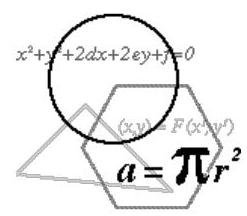

PART I - MULTIPLE CHOICE

For each of the following 25 questions, carefully blacken the appropriate box on the answer sheet with a #2 pencil. Do not fold, bend, or write stray marks on either side of the answer sheet. Each correct answer is worth 6 points. Two points are given if no box is marked. Zero points are given for an incorrect answer or if multiple boxes are marked. Note that wild guessing is likely to lower your score. When the exam is over, give your answer sheet to your proctor. You may keep your copy of the questions.

## NO CALCULATORS

1. Consider the following 5 statements:

(i) Statement (ii) is true.

(ii) At most one of these 5 statements is true.

(iii) All 5 of these statements are true.

(iv)

(v)

The last two statements are invisible. Which of the following is correct?

(A) Only statement (i) is true. (B) Only statement (ii) is true.

(C) Only one of statements (iv) or (v) is true. (D) Both statements (iv) and (v) are true.

(E) Neither of statements (iv) and (v) are true.

2. Compute the sum of all values of $b,3 \leq  b \leq  {10}$ , such that the base 10 representation of ${2101}_{b}$ is the square of an integer.

(A) 11 (B) 12 (C) 13 (D) 14 (E) 15

3. If ${x}^{2} + {xy} + x = {14}$ and ${y}^{2} + {xy} + y = {28}$ , which of the following is a possible value for $x + y$ ?

(A) 3 (B) 1 (C) 0 (D) -6 (E) -7

4. In the sequence $1,3,2,\ldots$ , each term after the second is equal to the preceding term minus the term preceding that. Compute the sum of the first 2021 terms of the sequence.

(A) 0 (B) 2 (C) 4 (D) 5 (E) 6

5. A circle has diameter with endpoints $\mathrm{A}\left( {3,1}\right)$ and $\mathrm{B}\left( {5,7}\right)$ . Point $\mathrm{C}$ with coordinates(1, y) lies on the circle. Compute the sum of all possible values for $y$ .

(A) 7 (B) 8 (C) 9 (D) 10 (E) 11

6. If ${0}^{ \circ  } < \theta  < {90}^{ \circ  }$ , and ${15}\cos \theta  - {20}\sin \theta  = 7$ , what is the value of ${15}\sin \theta  + {20}\cos \theta$ ?

(A) -25 (B) -7 (C) 10 (D) 17 (E) 24

7. In Dr. Garner's math classes, all the students were either juniors or seniors. He gave the same test to all his students. All the scores ranged from 0 to 100 . The average score for all 40 juniors in his classes was 74, while the average score for all the students was 78 . What is the minimum number of seniors among Dr. Garner's students?

(A) 4 (B) 8 (C) 10 (D) 12 (E) 16

8. The digits1,2,3,4,5, and 6 are arranged in some order to form a six-digit number with these properties:

- The six-digit number is divisible by 6 .

- The number formed by the five left-most digits is divisible by 5 .

- The number formed by the four left-most digits is divisible by 4 .

- The number formed by the three left-most digits is divisible by 3 .

- The number formed by the two left-most digits is divisible by 2 .

- The left-most digit is divisible by 1 (Obviously).

There are two such numbers. Compute their sum.

(A) 346812 (B) 445308 (C) 565302 (D) 645150 (E) 687966

9. A bag is filled with red and blue marbles. Before any marbles are drawn from the bag, the probability of drawing a blue marble is $\frac{1}{4}$ . After drawing one marble (and not putting it back), the probability of drawing a blue marble becomes $\frac{1}{5}$ . How many red marbles were in the bag to begin with?

(A) 8 (B) 10 (C) 12 (D) 15 (E) 20

10. A positive integer $N$ equals the sum of 3 consecutive positive integers and the sum of 4 consecutive positive integers. If $N \leq  {2021}$ , how many such positive integers $N$ are there?

(A) 164 (B) 165 (C) 166 (D) 167 (E) 168

11. The letters of the word LOGARITHM are placed in a 3x3 grid as shown, and each letter represents a real number. The grid is a multiplicative magic square in which each row, each column, and each main diagonal have the same product,2021. If $G = {43}$ , compute the product $H \cdot  O \cdot  L \cdot  A$ .

<table><tr><td>$L$</td><td>0</td><td>$G$</td></tr><tr><td>$A$</td><td>$R$</td><td>$I$</td></tr><tr><td>$T$</td><td>$H$</td><td>  </td></tr></table>

(A) 52021 (B) 73649 (C) 86903 (D) 94987 (E) None of these

12. Keisha has some ${25} ¢ ,{26} ¢$ , and ${35} ¢$ stamps. She has a total of 180 stamps with a total value of \$54.00. Keisha noticed that the numbers of stamps of each type form an arithmetic sequence. How many ${35}¢$ stamps does Keisha have?

(A) 82 (B) 84 (C) 85 (D) 86 (E) 88

13. A standard deck of playing cards has 26 red and 26 black cards. Debbie and Don split a deck into two non-empty piles. In Debbie's pile, there are four times as many black cards as red cards. In Don's pile, the number of red cards is an integer multiple of the number of black cards. How many red cards are in Don's pile?

(A) 16 (B) 18 (C) 20 (D) 22 (E) 24

14. The graphs of the equations $y = {7x} + b$ and $y = {x}^{2} + {bx} + 7$ intersect the graph of the equation $y = 5{x}^{3} - {12}{x}^{2} - {9x} + {10}$ in three points each. Compute the sum of the $x$ -coordinates of these six distinct points.

(A) 5 (B) 7 (C) 9 (D) 10 (E) 12

15. A fair coin is tossed repeatedly. Compute the probability that heads will appear four times before tails appears twice.

(A) $\frac{1}{2}$ (B) $\frac{7}{32}$ (C) $\frac{3}{16}$ (D) $\frac{1}{8}$ (E) None of these

16. ABCD is a square. Let $\mathrm{Q}$ be a point on side $\overline{\mathrm{{AD}}}$ . Choose point $\mathrm{P}$ on ray $\overrightarrow{\mathrm{{AB}}}$ , as shown, so that $\overline{\mathrm{{PC}}}$ is perpendicular to $\overline{\mathrm{{QC}}}$ . If the area of triangle QCP is $\frac{3}{4}$ of the area of the square, compute the ratio of QD to AQ.

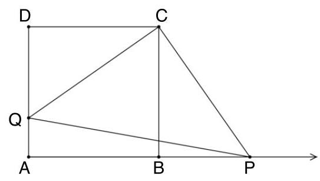

(E) $1 + \sqrt{2}$

(A) 3 (B) $\sqrt{3}$ (C) $1 + \sqrt{3}$ (D) $\sqrt{2}$

17. Compute the remainder when $1 + 9 + {9}^{2} + {9}^{3} + \cdots  + {9}^{2021}$ is divided by 13 .

(A) 1 (B) 3 (C) 7 (D) 10 (E) None of these

18. ${A}_{1},{A}_{2},{A}_{3},{A}_{4}$ is a sequence of two-digit positive integers such that ${A}_{2}$ equals the product of the digits of ${A}_{1},{A}_{3}$ equals the product of the digits of ${A}_{2}$ , and ${A}_{4}$ equals the product of the digits of ${A}_{3}$ . If the product of the digits of ${A}_{4}$ is 8, compute ${A}_{1} + {A}_{2} + {A}_{3} + {A}_{4}$ .

(A) 120 (B) 150 (C) 156 (D) 180 (E) 192

19. Suppose $p$ and $q$ are positive real numbers for which ${\log }_{9}p = {\log }_{12}q = {\log }_{16}\left( {p + q}\right)$ Compute the value of $\frac{p}{q}$ .

(A) $\frac{\sqrt{2}}{\sqrt{5}}$ (B) $\frac{2}{\sqrt{5}}$ (C) $\frac{\sqrt{5} - 1}{4}$ (D) $\frac{\sqrt{5} - 1}{2}$ (E) $\frac{\sqrt{5} + 1}{4}$

20. On square ABCD, P and Q are placed on sides CD and AD, respectively, so that $\mathrm{{AQ}} = \mathrm{{DP}} = 2$ and $\mathrm{{DQ}} = \mathrm{{CP}} = 1.\mathrm{O}$ is the intersection of AP and BQ. Determine the area of quadrilateral DPOQ.

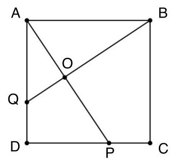

(A) 2 (B) $\frac{9}{4}$ (C) $\frac{27}{13}$ (D) $\frac{5}{2}$ (E) $\frac{33}{15}$

21. For all non-zero real numbers $\mathrm{x}$ , the function $\mathrm{f}\left( \mathrm{x}\right)$ satisfies $f\left( x\right)  + {2f}\left( \frac{1}{x}\right)  = 3\mathrm{x}$ . If $\mathrm{a} > 0$ , and $f\left( a\right)  = f\left( {-a}\right)$ , which of the following statements is true?

(A) $0 < a < 1$ (B) $1 < a < 2$ (C) $2 < a < 3$ (D) $3 < a < 4$ (E) $a > 4$

22. It is possible to form two different (non-similar) rectangles whose vertices are four vertices of the same regular octagon. Compute the ratio of the area of the larger rectangle to the area of the smaller.

(A) $\frac{\sqrt{2}}{1}$ (B) $\frac{2}{1}$ (C) $\frac{\sqrt{3}}{\sqrt{2}}$ (D) $\frac{3\sqrt{2}}{2}$ (E) $\frac{3\sqrt{2}}{4}$

23. Compute the least value of $\mathrm{k}$ for which the inequality $\mathrm{k} < \frac{{2x} - 7}{2{x}^{2} - {2x} - 5} < 1$ has no real solutions.

(A) $\frac{1}{7}$ (B) $\frac{1}{9}$ (C) $\frac{1}{11}$ (D) $\frac{1}{13}$ (E) $\frac{1}{15}$

24. If $x - \frac{1}{x} = i\sqrt{2}$ , where $\mathrm{i}$ is the imaginary unit, compute ${x}^{3} - \frac{1}{{x}^{3}}$ .

(A) $i\sqrt{2}$ (B) ${2i}\sqrt{2}$ (C) ${3i}\sqrt{2}$ (D) $- {2i}\sqrt{2}$ (E) $- i\sqrt{2}$

25. In the diagram, $\overline{\mathrm{{BA}}},\overline{\mathrm{{BC}}}$ , and $\overline{\mathrm{{BD}}}$ are chords of circle $\mathrm{P}$ with lengths of 4,7, and 11, respectively. If $\overline{\mathrm{{BD}}}$ bisects $\angle \mathrm{{ABC}}$ , compute the area of circle $\mathrm{P}$ .

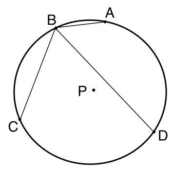

(A) ${31\pi }$ (B) ${32\pi }$ (C) ${33\pi }$ (D) ${34\pi }$ (E) ${35\pi }$

## Solutions

1. D If the first statement (i) were true, it would make (ii) true, but then we would have two true statements already, and that contradicts (ii). Therefore, (i) must be false, and so is (ii). Clearly (iii) is false, and the only way to have at least two correct statements (remember, (ii) is false) is to have (iv) and (v) both true.

2. A ${2101}_{b} = 2{b}^{3} + {b}^{2} + 1$ . Trying $b = 3,4,5,6,7,8$ , we find ${2101}_{3} = {64} = {8}^{2}$ and ${2101}_{8} = {1089} = {33}^{2}$ work. Based on the choices, there is no need to try 9 or 10. Therefore, the desired sum is 11.

3. E Adding the two equations, we obtain ${x}^{2} + {2xy} + {y}^{2} + x + y = {42}$ or equivalently ${x}^{2} + {2xy} + {y}^{2} + x + y - {42} = 0$ . Factoring the left side of this equation gives ${\left( x + y\right) }^{2} + x + y - {42} = \left( {x + y - 6}\right) \left( {x + y + 7}\right)  = 0.$

Therefore, $x + y - 6 = 0$ or $x + y + 7 = 0 \Rightarrow  x + y = 6$ or $x + y =  - 7$ .

4. B The first few terms of the sequence are $1,3,2, - 1, - 3, - 2,1,3,\ldots$ Since the seventh and eighth terms are the same as the first two, there is a 6-term repeat pattern, with each cycle giving a sum of zero. Since 2016 = (6)(336), the sum of the first 2021 terms is the same as the sum of the first five. The desired sum is 2 .

5. B If $\mathrm{A}\left( {3,1}\right)$ and $\mathrm{B}\left( {5,7}\right)$ are the endpoint of the diameter, then $\bigtriangleup \mathrm{{ABC}}$ is a right triangle with right angle at $\mathrm{C}$ . Thus, $\overline{\mathrm{{AC}}} \bot  \overline{\mathrm{{BC}}}$ , and their slopes must be negative reciprocals of each other. Therefore, $\frac{7 - y}{4} =  - \frac{2}{1 - y} \Rightarrow  {y}^{2} - {8y} + {15} = 0$ , from which $\mathrm{y} = 3$ or 5 . The desired sum is 8 .

6. $\mathrm{E}{\left( {15}\cos \theta  - {20}\sin \theta \right) }^{2} + {\left( {15}\sin \theta  + {20}\cos \theta \right) }^{2} = {625}{\cos }^{2}\theta  + {625}{\sin }^{2}\theta  = {625}$ . Since ${\left( {15}\cos \theta  - {20}\sin \theta \right) }^{2} = {7}^{2} = {49},{\left( {15}\sin \theta  + {20}\cos \theta \right) }^{2} = {625} - {49} = {576}$ , and ${15}\sin \theta  + {20}\cos \theta  = \sqrt{576} = {24}$ .

7. B Let $\mathrm{S}$ be the number of seniors and $\mathrm{A}$ be their average score. Then, total points can be tallied in two ways that are equal: ${40}\left( {74}\right)  + \mathrm{S}\left( \mathrm{A}\right)  = \left( {{40} + \mathrm{S}}\right) \left( {78}\right)$ . This can be rewritten as $\mathrm{S}\left( {\mathrm{A} - {78}}\right)  = {160}$ . Since $\mathrm{A} \leq  {100},\mathrm{\;A} - {78} \leq  {22}$ . In order to minimize $\mathrm{S},\mathrm{A} - {78}$ must be as large as possible. Therefore, $\mathrm{A} - {78} = {20}$ and $\mathrm{S} = 8$ .

8. B Because the ${2}^{\text{nd }},{4}^{\text{th }}$ , and ${6}^{\text{th }}$ digits must be even, the digits must alternate odd, then even. The fifth digit must be five. Four cannot be the fourth digit because 14 and 34 are not divisible by 4 . Four or six cannot be the second digit because $1 + 4 + 3$ and $1 + 6 + 3$ are not divisible by 3 . Therefore, the second digit is 2 and the sixth digit is 4 . The two numbers are 123654 and 321654 with a sum of 445308.

9. C Let $r$ be the number of red marbles and $b$ be the number of blue marbles. Before drawing a marble, we know that the probability of drawing a blue marble is $\frac{b}{b + r} = \frac{1}{4}$ . After drawing one marble, the probability of drawing a blue marble has decreased. Thus, a blue marble was drawn, and now the probability of drawing a blue marble is $\frac{b - 1}{b - 1 + r} = \frac{1}{5}$ . We can rewrite these two equations as ${4b} = b + r$ and ${5b} - 5 = b - 1 + r$ . Solving these two equations, we obtain $b = 4$ and $r = {12}$ , and hence there are 12 red marbles in the bag.

10. D We are given that $N = \left( x\right)  + \left( {x + 1}\right)  + \left( {x + 2}\right)  = {3x} + 3$ , and also that $N = \left( y\right)  + \left( {y + 1}\right)  + \left( {y + 2}\right)  + \left( {y + 3}\right)  = {4y} + 6$ for some positive integers $\mathrm{x}$ and $\mathrm{y}$ . Therefore, ${4y} = 3\left( {x - 1}\right)$ , which is satisfied for any value of $y$ that is a multiple of 3 . Since ${4y} + 6 \leq  {2021}, y \leq  {503.75}$ . Then the possible values for y are $3,6,9,\ldots {501}$ , for a total of 167 possibilities.

11. C Since each row has a product of 2021, the product LOGARITHM has a value of ${2021}^{3}$ . But the product ${GIM} = {2021}$ , and the product ${RT} = {47}$ (since ${GRT} = {2021} = {43} \cdot  {47}$ and we are given $G = {43}$ ). Then $\left( {HOLA}\right) \left( {RT}\right) \left( {GIM}\right)  = \left( {HOLA}\right) \left( {47}\right) \left( {2021}\right)  = {2021}^{3}$ and ${HOLA} = {86903}$ .

<table><tr><td>$L$</td><td>0</td><td>$G$</td></tr><tr><td>$A$</td><td>$R$</td><td>$I$</td></tr><tr><td>$T$</td><td>$H$</td><td>$M$</td></tr></table>

12. B Let $\mathrm{x} =$ the number of 25 cent stamps and $\mathrm{y} =$ the number of 35 cent stamps. Then ${180} - \mathrm{x} - \mathrm{y} =$ the number of 26 cent stamps. Therefore, we have

<table><tr><td>X</td><td>V</td><td>180-x-y</td></tr><tr><td>9</td><td>81</td><td>90</td></tr><tr><td>18</td><td>82</td><td>80</td></tr><tr><td>27</td><td>83</td><td>70</td></tr><tr><td>36</td><td>84</td><td>60</td></tr><tr><td>45</td><td>85</td><td>50</td></tr><tr><td>54</td><td>86</td><td>40</td></tr><tr><td>63</td><td>87</td><td>30</td></tr><tr><td>72</td><td>88</td><td>20</td></tr><tr><td>81</td><td>89</td><td>10</td></tr><tr><td>90</td><td>90</td><td>0</td></tr></table>

${25x} + {35y} + {26}\left( {{180} - x - y}\right)  = {5400}$ or $x = 9\left( {y - {80}}\right) .$ Noting that $\mathrm{x}$ is a multiple of 9, the chart at the right shows possible solutions. Notice that 36,60,84 form an arithmetic sequence. Therefore, the number of 35 cent stamps is 84 .

13. C Let ${r}_{1}$ and ${b}_{1}$ denote the number of red and black cards in Debbie’s, so the numbers in Don’s pile must be ${r}_{2} = {26} - {r}_{1}$ and ${b}_{2} = {26} - {b}_{1}$ . Also, the numbers ${r}_{1}$ and ${b}_{1}$ satisfy ${b}_{1} = 4{r}_{1}$ and ${26} - {r}_{1} = k\left( {{26} - {b}_{1}}\right)$ for some integer $\mathrm{k}$ . Combining these equations and solving for ${r}_{1}$ , we find that ${r}_{1} = \frac{{26}\left( {k - 1}\right) }{{4k} - 1}$ . Since ${r}_{1}$ is an integer, ${4k} - 1$ must be a multiple of 13. Setting ${4k} - 1$ equal to 13,26,39,... we find that when $\mathrm{k} = {10},{r}_{1} = 6$ . and thus ${r}_{2} = {20}$ .

14. A The sum of the roots of any equation of the form $a{x}^{3} + b{x}^{2} + {cx} + d = 0$ is $- \frac{b}{a}$ . The x-coordinates of the points of intersection of the graphs of the cubic and the linear functions are the solutions to the equation $5{x}^{3} - {12}{x}^{2} - {9x} + {10} = {7x} + b$ or

$5{x}^{3} - {12}{x}^{2} - {16x} + {10} - b = 0$ . The sum of the roots of this equation is $\frac{12}{5}$ .

The x-coordinates of points of intersection of the graphs of the cubic and quadratic functions are the solutions to $5{x}^{3} - {12}{x}^{2} - {9x} + {10} = {x}^{2} + {bx} + 7$ or

$5{x}^{3} - {13}{x}^{2} - \left( {9 + b}\right) x + 3 = 0$ . The sum of the roots of this equation is $\frac{13}{5}$ .

Therefore, the sum of the x-coordinates of all six points is $\frac{12}{5} + \frac{13}{5} = 5$ .

15. C For 4 heads to appear before 2 tails, there can be 4 heads in a row or 4 heads out of 5 tosses. $\mathrm{P}\left( {4\text{heads}}\right)  = {\left( \frac{1}{2}\right) }^{4} = \frac{1}{16}$ , and $\mathrm{P}\left( {4\text{ out of }5\text{ heads}}\right)  = {}_{5}{\mathrm{C}}_{4}{\left( \frac{1}{2}\right) }^{4}{\left( \frac{1}{2}\right) }^{1} = \frac{5}{32}$ . But this includes the probability of getting 4 heads and then a tail, which is ${\left( \frac{1}{2}\right) }^{5} = \frac{1}{32}$ . Therefore, the desired probability is $\frac{1}{16} + \frac{5}{32} - \frac{1}{32} = \frac{3}{16}$ .

16. E Without loss of generality, let the side length of the square be 1. Since $\angle \mathrm{{QCP}}$ is a right angle, $\angle \mathrm{{BCP}} \cong  \angle \mathrm{{DCQ}}$ , making $\Delta \mathrm{{CDQ}} \cong  \Delta \mathrm{{CBP}}$ . Therefore, $\mathrm{{CQ}} = \mathrm{{PC}}$ , and $\Delta \mathrm{{CPQ}}$ is an

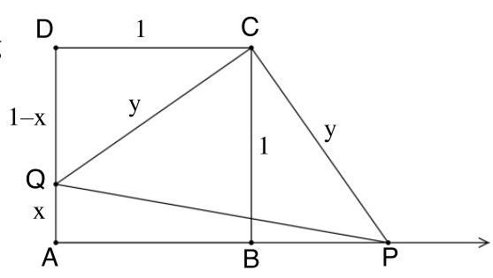

isosceles right triangle. Thus $\frac{1}{2}{y}^{2} = \frac{3}{4}$ and $y = \sqrt{\frac{3}{2}}$ .

Using the Pythagorean Theorem on $\bigtriangleup \mathrm{{CDQ}}$ ,

$$
{\left( 1 - x\right) }^{2} + {1}^{2} = \frac{3}{2}\text{ or }2{\mathrm{x}}^{2} - 4\mathrm{x} + 1 = 0.
$$

Solving gives $x = \frac{4 \pm  \sqrt{{16} - 8}}{4} \cdot   = 1 \pm  \frac{\sqrt{2}}{2}$ . Since $x < 1, x = 1 - \frac{\sqrt{2}}{2}$ . Thus, $\frac{QD}{AQ} = \frac{\frac{\sqrt{2}}{2}}{1 - \frac{\sqrt{2}}{2}} = 1 + \sqrt{2}$ .

17. E Note that $1 + 9 + {9}^{2} = {91}$ is divisible by 13 . Also note that every group of three consecutive terms of $1 + 9 + {9}^{2} + {9}^{3} + \cdots  + {9}^{2021}$ is divisible by $1 + 9 + {9}^{2}$ . For example, ${9}^{6} + {9}^{7} + {9}^{8} = {9}^{6}\left( {1 + 9 + {9}^{2}}\right)$ . Therefore,

$$
1 + 9 + {9}^{2} + {9}^{3} + \cdots  + {9}^{2021} = \left( {1 + 9 + {9}^{2}}\right) \left( {1 + {9}^{3} + {9}^{6} + \cdots {9}^{2019}}\right) .
$$

Thus, the given expression is divisible by 13 and so the desired remainder is 0 .

18. D Work backwards to compute all possible values of ${A}_{4},{A}_{3},{A}_{2}$ , and ${A}_{1}$ . The possibilities are summarized in the figure shown, and the only possible value for ${A}_{1}$ is 77 . Therefore, ${A}_{1} + {A}_{2} + {A}_{3} + {A}_{4} = {77} + {49} + {36} + {18} = {180}$ .

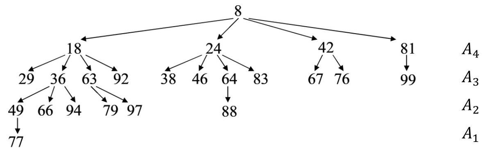

19. D Let $K$ be the common value of ${\log }_{9}p,{\log }_{12}q$ , and ${\log }_{16}\left( {p + q}\right)$ . Then,

$$
p = {9}^{K}, q = {12}^{K}\text{, and}{16}^{K} = p + q = {9}^{K} + {12}^{K}\text{.}
$$

Dividing the last equation by ${9}^{K}$ we obtain $\frac{{16}^{K}}{{9}^{K}} = 1 + \frac{{12}^{K}}{{9}^{K}}$ . Letting $x = \frac{q}{p} = \frac{{12}^{K}}{{9}^{K}}$ and

noting that $\frac{{16}^{K}}{{9}^{K}} = {\left( \frac{{4}^{K}}{{3}^{K}}\right) }^{2} = {\left( \frac{{12}^{K}}{{9}^{K}}\right) }^{2} = {\left( \frac{q}{p}\right) }^{2}$ , we obtain ${x}^{2} = 1 + x$ . Solving gives

$x = \frac{1 \pm  \sqrt{5}}{2}$ . Since $p$ and $q$ are given positive, $\frac{q}{p} = \frac{1 + \sqrt{5}}{2}$ . Then $\frac{p}{q} = \frac{2}{1 + \sqrt{5}} = \frac{\sqrt{5} - 1}{2}$ .

20. C Method 1: Triangle ADP has area $1/2\left( 3\right) \left( 2\right)  = 3$ and hypotenuse equal to $\sqrt{13}$ . Since $\bigtriangleup \mathrm{{BAQ}} \cong  \bigtriangleup \mathrm{{ADP}},\angle \mathrm{{BQA}} \cong  \angle \mathrm{{APD}}$ . Then, $\bigtriangleup \mathrm{{AQO}} \sim  \bigtriangleup \mathrm{{APD}}$ with scale factor $\frac{2}{\sqrt{13}}$ . Thus, $\angle \mathrm{{AOQ}}$ is a right angle. Then $\frac{\text{ area of triangle AQO }}{\text{ area of triangle ADP }} = {\left( \frac{2}{\sqrt{13}}\right) }^{2}$ . Therefore, the area of $\bigtriangleup \mathrm{{AQO}}$ is $3{\left( \frac{2}{\sqrt{13}}\right) }^{2} = \frac{12}{13}$ . The area of quadrilateral DPOQ is then $3 - \frac{12}{13} = \frac{27}{13}$ .

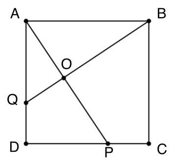

Method 2: Place square ABCD on a coordinate system with the origin at $\mathrm{D}$ and $\overline{\mathrm{{DC}}}$ and $\overline{\mathrm{{DA}}}$ on the $\mathrm{x}$ and $\mathrm{y}$ -axes, respectively. Line AP has equation $y =  - \frac{3}{2}x + 3$ and line BQ has equation $y = \frac{2}{3}x + 1$ . Solving this system of equations gives the coordinate of $\mathrm{O}$ to be $\left( {\frac{12}{13},\frac{21}{13}}\right)$ . Now, let $\mathrm{R}$ be the foot of the perpendicular from $\mathrm{O}$ to $\mathrm{{CD}}$ . Trapezoid DROQ has area $\frac{1}{2}\left( \frac{12}{13}\right) \left( {1 + \frac{21}{13}}\right)  = \frac{204}{169}$ and triangle ORP has area $\frac{1}{2}\left( \frac{21}{13}\right) \left( {2 - \frac{12}{13}}\right)  = \frac{147}{169}$ . The sum of these gives the area of quadrilateral DPOQ, i.e. $\frac{{204} + {147}}{169} = \frac{27}{13}$ .

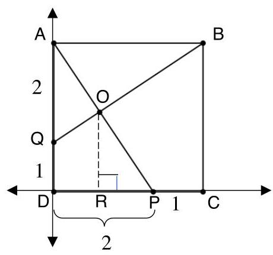

21. B We are given $f\left( x\right)  + {2f}\left( \frac{1}{x}\right)  = 3\mathrm{x}$ . Replacing $\mathrm{x}$ with $\frac{1}{x}, f\left( \frac{1}{x}\right)  + {2f}\left( x\right)  = \frac{3}{x}$ . Eliminating $f\left( \frac{1}{x}\right)$ from these two equations, we get ${3f}\left( x\right)  = \frac{6}{x} - 3\mathrm{x}$ or $f\left( x\right)  = \frac{2}{x} - \mathrm{x}$ . If $f\left( a\right)  = f\left( {-a}\right)$ , Then $\frac{2}{a} - \mathrm{a} = \frac{2}{-a} + \mathrm{a}$ from which $\frac{4}{a} = 2\mathrm{a}$ and $a =  \pm  \sqrt{2}$ . Since we are given that a $> 0, a = \sqrt{2} \approx  {1.414}$ . Thus, $1 < a < 2$ .

22. A The two rectangles are shown (dotted and shaded). Note that the dotted rectangle is a square. Let the length of the sides of the octagon be $2\mathrm{a}$ . Note also that $\mathrm{m}\angle \mathrm{{BCA}} = {45}$ making right triangle $\mathrm{{ABC}}$ a 45-45-90 triangle, so that $\mathrm{{BC}} = a\sqrt{2}$ . Thus, the dimensions of the shaded rectangle are ${2a}$ and $\left( {{2a} + {2a}\sqrt{2}}\right)$ , and its area is ${2a}\left( {{2a} + {2a}\sqrt{2}}\right)  = 4{a}^{2}\left( {1 + \sqrt{2}}\right)$ . Both rectangles have the same diagonal. Let $\mathrm{d}$ be the length of the diagonal.

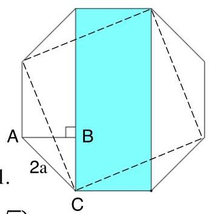

Then ${d}^{2} = {\left( 2a\right) }^{2} + {\left( 2a + 2a\sqrt{2}\right) }^{2} = 4{a}^{2}\left\lbrack  {1 + {\left( 1 + \sqrt{2}\right) }^{2}}\right\rbrack   = 4{a}^{2}\left( {4 + 2\sqrt{2}}\right)$ .

Since the dotted rectangle is a square, its area is $\frac{1}{2}{d}^{2} = 4{a}^{2}\left( {2 + \sqrt{2}}\right)$ .

Thus, the desired ratio is $\frac{4{a}^{2}\left( {2 + \sqrt{2}}\right) }{4{a}^{2}\left( {1 + \sqrt{2}}\right) } = \frac{2 + \sqrt{2}}{1 + \sqrt{2}} = \frac{\sqrt{2}}{1}$ .

23. C Let $y = \frac{{2x} - 7}{2{x}^{2} - {2x} - 5}$ . Then $\left( {2y}\right) {x}^{2} + \left( {-{2y} - 2}\right) x + 7 - {5y} = 0$ . This is a quadratic

equation in $x$ . Use the quadratic formula

$$
x = \frac{{2y} + 2 \pm  \sqrt{{\left( -2 - 2y\right) }^{2} - 4\left( {2y}\right) \left( {7 - {5y}}\right) }}{4y}.
$$

For $\mathrm{x}$ to be a real number, the discriminant must be non-negative.

${\left( -2 - 2y\right) }^{2} - 4\left( {2y}\right) \left( {7 - {5y}}\right)  \geq  0 \Rightarrow  4\left( {{11y} - 1}\right) \left( {y - 1}\right)  \geq  0.$

Then $y \leq  \frac{1}{11}$ or $y \geq  1$ , and there are no attainable values of $\mathrm{y}$ in the interval $\frac{1}{11} < y < 1$ .

Thus, the least value of $k$ is $\frac{1}{11}$ .

24. A Method 1

Let ${A}_{n} = {x}^{n} - \frac{1}{{x}^{n}}$ , and note that for $\mathrm{n} = 1$ ,

$$
{\left( {A}_{1}\right) }^{2} + 3 = {\left( x - \frac{1}{x}\right) }^{2} + 3 = {\left( i\sqrt{2}\right) }^{2} + 3 = 1.
$$

Also, ${\left( {A}_{n}\right) }^{3} = {x}^{3n} - 3{x}^{n} + \frac{3}{{x}^{n}} - \frac{1}{{x}^{3n}} = {A}_{3n} - 3{A}_{n}$ .

Therefore, ${A}_{3n} = {\left( {A}_{n}\right) }^{3} + 3{A}_{n} = {A}_{n}\left\lbrack  {{\left( {A}_{n}\right) }^{2} + 3}\right\rbrack$ .

Hence, ${A}_{3} = {A}_{1}\left\lbrack  {{\left( {A}_{1}\right) }^{2} + 3}\right\rbrack   = {A}_{1} = i\sqrt{2}$

Method 2

$x - \frac{1}{x} = i\sqrt{2} \Rightarrow  {x}^{2} - 1 = x\left( {i\sqrt{2}}\right)$ . Squaring both sides and simplifying, $x =  \pm  \sqrt[4]{-1}$ .

Use De Moivre's Theorem:

$x =  \pm  {\left\lbrack  1\left( \cos {180} + i\sin {180}\right) \right\rbrack  }^{\frac{1}{4}} =  \pm  1\left( {\cos {45} + i\sin {45}}\right) \rbrack  =  \pm  \frac{\sqrt{2}}{2}\left( {1 + i}\right) .$

Factoring ${x}^{3} - \frac{1}{{x}^{3}} = \left( {x - \frac{1}{x}}\right) \left( {{x}^{2} + 1 + \frac{1}{{x}^{2}}}\right)$ .

For both possible values of $\mathrm{x},{x}^{2} = {\left\lbrack  \frac{\sqrt{2}}{2}\left( 1 + i\right) \right\rbrack  }^{2} = i$ and $\frac{1}{{x}^{2}} = \frac{1}{i} =  - i$ .

Therefore, ${x}^{3} - \frac{1}{{x}^{3}} = \left( {x - \frac{1}{x}}\right) \left( {{x}^{2} + 1 + \frac{1}{{x}^{2}}}\right)  = i\sqrt{2}\left( {i + 1 - i}\right)  = i\sqrt{2}$ .

25. A Method 1: Construct the chords $\overline{\mathrm{{AD}}},\overline{\mathrm{{AC}}}$ , and $\overline{\mathrm{{CD}}}$ , and note that $\overline{\mathrm{{AD}}} \cong  \overline{\mathrm{{CD}}}$ because they intercept congruent arcs.

Using Ptolemy's Theorem on cyclic quadrilateral ABCD, $\mathrm{{AB}} \cdot  \mathrm{{CD}} + \mathrm{{BC}} \cdot  \mathrm{{AD}} = \mathrm{{AC}} \cdot  \mathrm{{BD}}$ . Therefore,

$$
4 \cdot  \mathrm{{CD}} + 7 \cdot  \mathrm{{AD}} = {11} \cdot  \mathrm{{AC}} \Rightarrow  4 \cdot  \mathrm{{CD}} + 7 \cdot  \mathrm{{CD}} = {11} \cdot  \mathrm{{AC}}\text{.}
$$

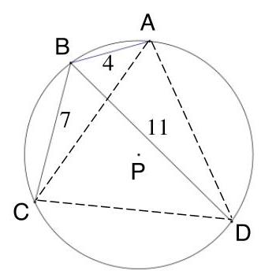

Thus, $\mathrm{{AC}} = \mathrm{{CD}} = \mathrm{{AD}}$ , making $\bigtriangleup \mathrm{{ADC}}$ equilateral. Then the measure of arc $\mathrm{{AD}} = {120}$ , and $\mathrm{m}\angle \mathrm{{ABD}} = {60}$ .

Using the Law of Cosines on $\bigtriangleup \mathrm{{ABD}}$ ,

$$
{\left( AD\right) }^{2} = {4}^{2} + {11}^{2} - 2\left( 4\right) \left( {11}\right) \cos {60} = {93}.
$$

Finally, constructing radii $\overline{\mathrm{{PA}}}$ and $\overline{\mathrm{{PD}}}$ and noting that $\mathrm{m}\angle \mathrm{{APD}} = {120}$ , use the Law of Cosines on $\bigtriangleup \mathrm{{APD}}$ .

$$
{93} = {r}^{2} + {r}^{2} - 2\left( r\right) \left( r\right) \cos {120} = 3{r}^{2} \Rightarrow  {r}^{2} = {31}\text{.}
$$

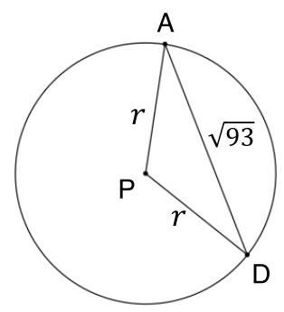

Therefore, the area of circle $\mathrm{P}$ is ${31\pi }$ .

Method 2: Construct $\overline{\mathrm{{AD}}}$ and $\overline{\mathrm{{CD}}}$ and note they congruent because they are inscribed in congruent arcs. Let $\angle \mathrm{{ABD}} = \angle \mathrm{{CBD}} = \theta$ . Then using the Law of Cosines on both $\bigtriangleup \mathrm{{ABD}}$ and $\bigtriangleup \mathrm{{CBD}}$ ,

$$
{\left( AD\right) }^{2} = {4}^{2} + {11}^{2} - 2\left( 4\right) \left( {11}\right) \cos \theta \text{ and }
$$

$$
{\left( \mathrm{{CD}}\right) }^{2} = {7}^{2} + {11}^{2} - 2\left( 7\right) \left( {11}\right) \cos \theta .
$$

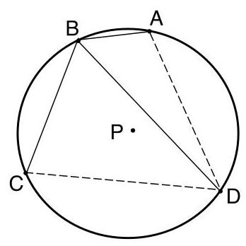

Setting the right sides of the equations equal and solving for $\cos \theta$ , we get $\cos \theta  = \frac{1}{2}$ and $\theta  = {60}^{ \circ  }$ .

Substituting into either of the first two equations above, $\mathrm{{AD}} = \mathrm{{CD}} = \sqrt{93}$ . Since $\mathrm{m}\angle \mathrm{{ABD}} = {60}^{ \circ  }$ , the measure of arc $\mathrm{{AD}}$ is ${120}^{ \circ  }$

Finally, constructing radii $\overline{\mathrm{{PA}}}$ and $\overline{\mathrm{{PD}}}$ and noting that $\mathrm{m}\angle \mathrm{{APD}} = {120}$ , use the Law of Cosines on $\bigtriangleup \mathrm{{APD}}$ .

$$
{93} = {r}^{2} + {r}^{2} - 2\left( r\right) \left( r\right) \cos {120} = 3{r}^{2} \Rightarrow  {r}^{2} = {31}\text{.}
$$

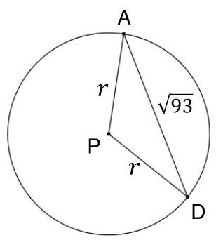

Therefore, the area of circle $\mathrm{P}$ is ${31\pi }$ .