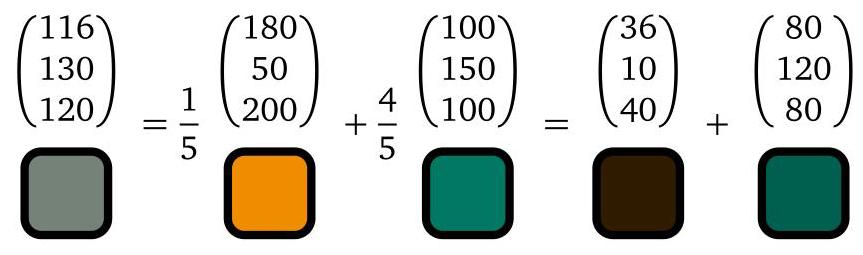
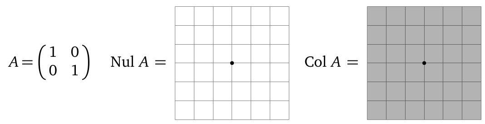
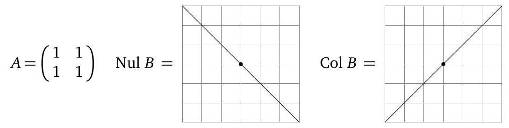
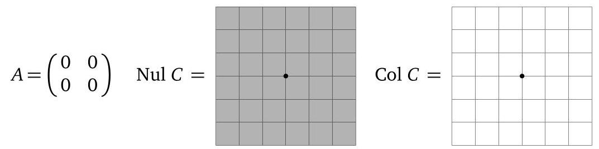

Suppose now that $h = {120}$ . The parametric form for the solution the above vector equation is

$$
x =  - {.2z}
$$

$$
y =  - {.8z}\text{.}
$$

Taking $z = 1$ gives the linear combination

$$
- {.2}\left( \begin{matrix} {180} \\  {50} \\  {200} \end{matrix}\right)  - {.8}\left( \begin{matrix} {100} \\  {150} \\  {100} \end{matrix}\right)  + \left( \begin{matrix} {116} \\  {130} \\  {120} \end{matrix}\right)  = \left( \begin{array}{l} 0 \\  0 \\  0 \end{array}\right) .
$$

In terms of colors:

3. Which of the following must be true for any set of seven vectors in ${\mathbf{R}}^{5}$ ? Answer “yes”, “no”, or “maybe” in each case.

a) The vectors span ${\mathbf{R}}^{5}$ .

b) The vectors are linearly dependent.

c) At least one of the vectors is in the span of the other six vectors.

d) If we put the seven vectors as the columns of a matrix $A$ , then the matrix equation ${Ax} = 0$ must have infinitely many solutions.

e) Suppose we put the seven vectors as the columns of a matrix $A$ . Then for each $b$ in ${\mathbf{R}}^{5}$ , the matrix equation ${Ax} = b$ must be consistent.

f) If every vector $b$ in ${\mathbf{R}}^{5}$ can be written as a linear combination of our seven vectors, then in fact every $b$ in ${\mathbf{R}}^{5}$ can be written in infinitely many different ways as a linear combination of our seven vectors.

## Solution.

a) Maybe.

b) Yes.

c) Yes.

d) Yes.

e) Maybe.

f) Yes. By assumption, the matrix $A$ whose columns are our seven vectors has ${\mathbf{R}}^{5}$ as its column span, so $A$ will have a pivot in every row. Therefore, $A$ will have 5 pivot columns, so it will have 2 columns without pivots. This means that ${Ax} = b$ will be consistent no matter what $b$ is, and there will be two free variables.

4. Suppose $A$ is a $2 \times  3$ matrix and the solution set to ${Ax} = 0$ is $\operatorname{Span}\left\{  \left( \begin{array}{l} 0 \\  1 \\  2 \end{array}\right) \right\}$ . Must it be true that the equation ${Ax} = b$ is consistent for each $b$ in ${\mathbf{R}}^{2}$ ?

Solution.

Yes. The matrix equation ${Ax} = 0$ has one free variable because its solution set is a line. Since $A$ is a $2 \times  3$ matrix, this means $A$ has two pivots, so it has a pivot in every row. Therefore, the columns of $A$ span ${\mathbf{R}}^{2}$ , so the matrix equation ${Ax} = b$ is consistent for each $b$ in ${\mathbf{R}}^{2}$ .

5. Write vectors $u, v$ , and $w$ in ${\mathbf{R}}^{4}$ so that $\{ u, v, w\}$ is linearly dependent, but $u$ is not in $\operatorname{Span}\{ v, w\}$ .

## Supplemental problems: §§2.6, 2.7, 2.9

1. Circle TRUE if the statement is always true, and circle FALSE otherwise.

a) If $A$ is a $3 \times  {100}$ matrix of rank 2, then $\dim \left( {\operatorname{Nul}A}\right)  = {97}$ .

TRUE FALSE

b) If $A$ is an $m \times  n$ matrix and ${Ax} = 0$ has only the trivial solution, then the columns of $A$ form a basis for ${\mathbf{R}}^{m}$ .

TRUE FALSE

c) The set $V = \left\{  {\left. {\left( \begin{array}{l} x \\  y \\  z \\  w \end{array}\right) \text{ in }{\mathbf{R}}^{4}}\right| \;x - {4z} = 0}\right\}$ is a subspace of ${\mathbf{R}}^{4}$ .

TRUE FALSE

## Solution.

a) False. By the Rank Theorem, $\operatorname{rank}\left( A\right)  + \dim \left( {\operatorname{Nul}A}\right)  = {100}$ , so $\dim \left( {\operatorname{Nul}A}\right)  = {98}$ .

b) False. For example, $A = \left( \begin{array}{ll} 1 & 0 \\  0 & 1 \\  0 & 0 \end{array}\right)$ has only the trivial solution for ${Ax} = 0$ , but its column space is a 2-dimensional subspace of ${\mathbf{R}}^{3}$ .

c) True. $V$ is $\operatorname{Nul}\left( A\right)$ for the $1 \times  4$ matrix $A$ below, and therefore is automatically a subspace of ${\mathbf{R}}^{4}$ :

$$
A = \left( \begin{array}{llll} 1 & 0 &  - 4 & 0 \end{array}\right) .
$$

Alternatively, we could verify the subspace properties directly if we wished, but this is much more work!

(1) The zero vector is in $V$ , since $0 - 4\left( 0\right) 0 = 0$ .

(2) Let $u = \left( \begin{array}{l} {x}_{1} \\  {y}_{1} \\  {z}_{1} \\  {w}_{1} \end{array}\right)$ and $v = \left( \begin{array}{l} {x}_{2} \\  {y}_{2} \\  {z}_{2} \\  {w}_{2} \end{array}\right)$ be in $V$ , so ${x}_{1} - 4{z}_{1} = 0$ and ${x}_{2} - 4{z}_{2} = 0$ .

We compute

$$
u + v = \left( \begin{matrix} {x}_{1} + {x}_{2} \\  {y}_{1} + {y}_{2} \\  {z}_{1} + {z}_{2} \\  {w}_{1} + {w}_{2} \end{matrix}\right) .
$$

Is $\left( {{x}_{1} + {x}_{2}}\right)  - 4\left( {{z}_{1} + {z}_{2}}\right)  = 0$ ? Yes, since

$$
\left( {{x}_{1} + {x}_{2}}\right)  - 4\left( {{z}_{1} + {z}_{2}}\right)  = \left( {{x}_{1} - 4{z}_{1}}\right)  + \left( {{x}_{2} - 4{z}_{2}}\right)  = 0 + 0 = 0.
$$

(3) If $u = \left( \begin{array}{l} x \\  y \\  z \\  w \end{array}\right)$ is in $V$ then so is ${cu}$ for any scalar $c$ :

$$
{cu} = \left( \begin{matrix} {cx} \\  {cy} \\  {cz} \\  {cw} \end{matrix}\right) \;\text{ and }\;{cx} - {4cz} = c\left( {x - {4z}}\right)  = c\left( 0\right)  = 0.
$$

2. Write a matrix $A$ so that $\operatorname{Col}A = \operatorname{Span}\left\{  \left( \begin{matrix} 1 \\   - 3 \\  1 \end{matrix}\right) \right\}$ and $\operatorname{Nul}A$ is the ${xz}$ -plane. Solution.

Many examples are possible. We’d like to design an $A$ with the prescribed column span, so that $\left( {A \mid  0}\right)$ will have free variables ${x}_{1}$ and ${x}_{3}$ . One way to do this is simply to leave the ${x}_{1}$ and ${x}_{3}$ columns blank, and make the second column $\left( \begin{matrix} 1 \\   - 3 \\  1 \end{matrix}\right)$ . This guarantees that $A$ destroys the ${xz}$ -plane and has the column span required.

$$
A = \left( \begin{matrix} 0 & 1 & 0 \\  0 &  - 3 & 0 \\  0 & 1 & 0 \end{matrix}\right)
$$

An alternative method for finding the same matrix: Write $A = \left( \begin{array}{lll} {v}_{1} & {v}_{2} & {v}_{3} \end{array}\right)$ . We want the column span to be the span of $\left( \begin{matrix} 1 \\   - 3 \\  1 \end{matrix}\right)$ and we want

$A\left( \begin{array}{l} x \\  0 \\  z \end{array}\right)  = \left( \begin{array}{lll} {v}_{1} & {v}_{2} & {v}_{3} \end{array}\right) \left( \begin{array}{l} x \\  0 \\  z \end{array}\right)  = x{v}_{1} + z{v}_{3} = \left( \begin{array}{l} 0 \\  0 \\  0 \end{array}\right)$ for all $x$ and $z.$

One way to do this is choose ${v}_{1} = \left( \begin{array}{l} 0 \\  0 \\  0 \end{array}\right)$ and ${v}_{3} = \left( \begin{array}{l} 0 \\  0 \\  0 \end{array}\right)$ , and ${v}_{2} = \left( \begin{matrix} 1 \\   - 3 \\  1 \end{matrix}\right)$ .

3. Circle $\mathbf{T}$ if the statement is always true, and circle $\mathbf{F}$ otherwise. You do not need to explain your answer.

a) If $\left\{  {{v}_{1},{v}_{2},{v}_{3},{v}_{4}}\right\}$ is a basis for a subspace $V$ of ${\mathbf{R}}^{n}$ , then $\left\{  {{v}_{1},{v}_{2},{v}_{3}}\right\}$ is a linearly independent set.

b) The solution set of a consistent matrix equation ${Ax} = b$ is a subspace.

c) A translate of a span is a subspace.

Solution.

a) True. If $\left\{  {{v}_{1},{v}_{2},{v}_{3}}\right\}$ is linearly dependent then $\left\{  {{v}_{1},{v}_{2},{v}_{3},{v}_{4}}\right\}$ is automatically linearly dependent, which is impossible since $\left\{  {{v}_{1},{v}_{2},{v}_{3},{v}_{4}}\right\}$ is a basis for a subspace.

b) False. this is true if and only if $b = 0$ , i.e., the equation is homogeneous, in which case the solution set is the null space of $A$ .

c) False. A subspace must contain 0 .

4. True or false (justify your answer). Answer true if the statement is always true. Otherwise, answer false.

a) There exists a $3 \times  5$ matrix with rank 4 .

b) If $A$ is an $9 \times  4$ matrix with a pivot in each column, then

$$
\text{Nul}A = \{ 0\} \text{.}
$$

c) There exists a $4 \times  7$ matrix $A$ such that nullity $A = 5$ .

d) If $\left\{  {{v}_{1},{v}_{2},\ldots ,{v}_{n}}\right\}$ is a basis for ${\mathbf{R}}^{4}$ , then $n = 4$ . Solution.

a) False. The rank is the dimension of the column space, which is a subspace of ${\mathbf{R}}^{3}$ , hence has dimension at most 3 .

b) True.

c) True. For instance,

$$
A = \left( \begin{array}{lllllll} 1 & 0 & 0 & 0 & 0 & 0 & 0 \\  0 & 1 & 0 & 0 & 0 & 0 & 0 \\  0 & 0 & 0 & 0 & 0 & 0 & 0 \\  0 & 0 & 0 & 0 & 0 & 0 & 0 \end{array}\right) .
$$

d) True. Any basis of ${\mathbf{R}}^{4}$ has 4 vectors.

5. Find bases for the column space and the null space of

$$
A = \left( \begin{matrix} 0 & 1 &  - 3 & 1 & 0 \\  1 &  - 1 & 8 &  - 7 & 1 \\   - 1 &  - 2 & 1 & 4 &  - 1 \end{matrix}\right)
$$

Solution.

The RREF of $\left( {A \mid  0}\right)$ is

$$
\left( \begin{array}{rrrrrr} 1 & 0 & 5 &  - 6 & 1 & 0 \\  0 & 1 &  - 3 & 1 & 0 & 0 \\  0 & 0 & 0 & 0 & 0 & 0 \end{array}\right)
$$

so ${x}_{3},{x}_{4},{x}_{5}$ are free, and

$$
\left( \begin{array}{l} {x}_{1} \\  {x}_{2} \\  {x}_{3} \\  {x}_{4} \\  {x}_{5} \end{array}\right)  = \left( \begin{matrix}  - 5{x}_{3} + 6{x}_{4} - {x}_{5} \\  3{x}_{3} - {x}_{4} \\  {x}_{3} \\  {x}_{4} \\  {x}_{5} \end{matrix}\right)  = {x}_{3}\left( \begin{matrix}  - 5 \\  3 \\  1 \\  0 \\  0 \end{matrix}\right)  + {x}_{4}\left( \begin{matrix} 6 \\   - 1 \\  0 \\  1 \\  0 \end{matrix}\right)  + {x}_{5}\left( \begin{matrix}  - 1 \\  0 \\  0 \\  0 \\  1 \end{matrix}\right) .
$$

Therefore, a basis for Nul $A$ is $\left\{  {\left( \begin{matrix}  - 5 \\  3 \\  1 \\  0 \\  0 \end{matrix}\right) ,\left( \begin{matrix} 6 \\   - 1 \\  0 \\  1 \\  0 \end{matrix}\right) ,\left( \begin{matrix}  - 1 \\  0 \\  0 \\  0 \\  1 \end{matrix}\right) }\right\}$ .

To find a basis for $\mathrm{{Col}}A$ , we use the pivot columns as they were written in the original matrix $A$ , not its RREF. These are the first two columns:

$$
\left\{  {\left( \begin{matrix} 0 \\  1 \\   - 1 \end{matrix}\right) ,\left( \begin{matrix} 1 \\   - 1 \\   - 2 \end{matrix}\right) }\right\}
$$

6. Find a basis for the subspace $V$ of ${\mathbf{R}}^{4}$ given by

$$
V = \left\{  {\left. {\left( \begin{matrix} x \\  y \\  z \\  w \end{matrix}\right) \text{ in }{\mathbf{R}}^{4}}\right| \;x + {2y} - {3z} + w = 0}\right\}  .
$$

Solution.

$V$ is Nul $A$ for the $1 \times  4\operatorname{matrix}A = \left( \begin{array}{llll} 1 & 2 &  - 3 & 1 \end{array}\right)$ . The augmented matrix $\left( {A \mid  0}\right)  =$ $\left( {\begin{array}{llll} 1 & 2 &  - 3 & 1 \end{array} \mid  0}\right)$ gives $x =  - {2y} + {3z} - w$ where $y, z, w$ are free variables. The parametric vector form for the solution set to ${Ax} = 0$ is

$$
\left( \begin{array}{l} x \\  y \\  z \\  w \end{array}\right)  = \left( \begin{matrix}  - {2y} + {3z} - w \\  y \\  z \\  w \end{matrix}\right)  = y\left( \begin{matrix}  - 2 \\  1 \\  0 \\  0 \end{matrix}\right)  + z\left( \begin{array}{l} 3 \\  0 \\  1 \\  0 \end{array}\right)  + w\left( \begin{matrix}  - 1 \\  0 \\  0 \\  1 \end{matrix}\right) .
$$

Therefore, a basis for $V$ is

$$
\left\{  {\left( \begin{matrix}  - 2 \\  1 \\  0 \\  0 \end{matrix}\right) ,\left( \begin{array}{l} 3 \\  0 \\  1 \\  0 \end{array}\right) ,\left( \begin{matrix}  - 1 \\  0 \\  0 \\  1 \end{matrix}\right) }\right\}
$$

7. a) True or false: If $A$ is an $m \times  n$ matrix and $\operatorname{Nul}\left( A\right)  = {\mathbf{R}}^{n}$ , then $\operatorname{Col}\left( A\right)  = \{ 0\}$ .

b) Give an example of $2 \times  2$ matrix whose column space is the same as its null space.

c) True or false: For some $m$ , we can find an $m \times  {10}$ matrix $A$ whose column span has dimension 4 and whose solution set for ${Ax} = 0$ has dimension 5 .

## Solution.

a) If $\operatorname{Nul}\left( A\right)  = {\mathbf{R}}^{n}$ then ${Ax} = 0$ for all $x$ in ${\mathbf{R}}^{n}$ , so the only element in $\operatorname{Col}\left( A\right)$ is $\{ 0\}$ . Alternatively, the rank theorem says

$\dim \left( {\operatorname{Col}A}\right)  + \dim \left( {\operatorname{Nul}A}\right)  = n \Rightarrow  \dim \left( {\operatorname{Col}A}\right)  + n = n \Rightarrow  \dim \left( {\operatorname{Col}A}\right)  = 0 \Rightarrow  \operatorname{Col}A = \{ 0\}$ .

b) Take $A = \left( \begin{array}{ll} 0 & 1 \\  0 & 0 \end{array}\right)$ . Its null space and column space are $\operatorname{Span}\left\{  \left( \begin{array}{l} 1 \\  0 \end{array}\right) \right\}$ .

c) False. The rank theorem says that the dimensions of the column space(ColA) and homogeneous solution space $\left( {\operatorname{Nul}A}\right)$ add to 10, no matter what $m$ is.

8. Suppose $V$ is a 3-dimensional subspace of ${\mathbf{R}}^{5}$ containing $\left( \begin{matrix} 1 \\   - 4 \\  0 \\  0 \\  0 \end{matrix}\right) ,\left( \begin{matrix} 1 \\  0 \\   - 3 \\  1 \\  0 \end{matrix}\right)$ , and $\left( \begin{array}{l} 9 \\  8 \\  1 \\  0 \\  1 \end{array}\right)$ .

Is $\left\{  {\left( \begin{matrix} 1 \\   - 4 \\  0 \\  0 \\  0 \end{matrix}\right) ,\left( \begin{matrix} 1 \\  0 \\   - 3 \\  1 \\  0 \end{matrix}\right) ,\left( \begin{array}{l} 9 \\  8 \\  1 \\  0 \\  1 \end{array}\right) }\right\}$ a basis for $V$ ? Justify your answer. Solution.

Yes. The Basis Theorem says that since we know $\dim \left( V\right)  = 3$ , our three vectors will form a basis for $V$ if and only if they are linearly independent.

Call the vectors ${v}_{1},{v}_{2},{v}_{3}$ . It is very little work to show that the matrix $A = \left( \begin{array}{l} {v}_{1} \\  {v}_{2} \\  {v}_{3} \end{array}\right)$

has a pivot in every column, so the vectors are linearly independent.

9. a) Write a $2 \times  2$ matrix $A$ with rank 2, and draw pictures of $\mathrm{{Nul}}A$ and $\mathrm{{Col}}A$ .

b) Write a $2 \times  2$ matrix $B$ with rank 1, and draw pictures of $\operatorname{Nul}B$ and $\operatorname{Col}B$ .

c) Write a $2 \times  2$ matrix $C$ with rank 0, and draw pictures of $\operatorname{Nul}C$ and $\operatorname{Col}C$ .

(In the grids, the dot is the origin.)

## Supplemental problems: $§{3.1}$

1. Review from 2.6-2.9. Fill in the blanks: If $A$ is a $7 \times  6$ matrix and the solution set for ${Ax} = 0$ is a plane, then the column space of $A$ is a 4 -dimensional subspace of ${\mathrm{R}}^{7}$ .

Reason: $\operatorname{rank}\left( A\right)  + \operatorname{nullity}\left( A\right)  = 6\;\operatorname{rank}\left( A\right)  + 2 = 6\;\operatorname{rank}\left( A\right)  = 4$

2. Review from 2.6-2.9: Consider the matrix $A$ below and its RREF:

$$
A = \left( \begin{matrix} 1 & 2 &  - 1 &  - 1 \\   - 2 &  - 4 &  - 6 & 2 \\  1 & 2 &  - 5 &  - 1 \end{matrix}\right) \xrightarrow[]{RREF}\left( \begin{matrix} 1 & 2 & 0 &  - 1 \\  0 & 0 & 1 & 0 \\  0 & 0 & 0 & 0 \end{matrix}\right) .
$$

a) Write a basis for $\mathrm{{Col}}A$ .

The pivot columns (1 and 3) form a basis for $\operatorname{Col}\left( A\right)$ , but really column 3 and any other column will work.

$$
\left\{  {\left( \begin{matrix} 1 \\   - 2 \\  1 \end{matrix}\right) ,\left( \begin{matrix}  - 1 \\   - 6 \\   - 5 \end{matrix}\right) }\right\}
$$

b) Find a basis for Nul $A$ . From the RREF of $A$ , we see the solution set is

$$
{x}_{1} + 2{x}_{2} - {x}_{4} = 0,\;{x}_{3} = 0,
$$

so ${x}_{1} =  - 2{x}_{2} + {x}_{4},{x}_{2}$ and ${x}_{4}$ are free, and ${x}_{3} = 0$ .

$$
\left( \begin{array}{l} {x}_{1} \\  {x}_{2} \\  {x}_{3} \\  {x}_{4} \end{array}\right)  = \left( \begin{matrix}  - 2{x}_{2} + {x}_{4} \\  {x}_{2} \\  0 \\  {x}_{4} \end{matrix}\right)  = {x}_{2}\left( \begin{matrix}  - 2 \\  1 \\  0 \\  0 \end{matrix}\right)  + {x}_{4}\left( \begin{array}{l} 1 \\  0 \\  0 \\  1 \end{array}\right) .\;\text{ A basis is }\left\{  {\left( \begin{matrix}  - 2 \\  1 \\  0 \\  0 \end{matrix}\right) ,\left( \begin{array}{l} 1 \\  0 \\  0 \\  1 \end{array}\right) }\right\}  .
$$

c) Is there a matrix $B$ so that $\operatorname{Col}\left( B\right)  = \operatorname{Nul}\left( A\right)$ ? If yes, write such a $B$ . If not,

justify why no such matrix $B$ exists.

Yes. Just take the columns of $B$ to be a set whose span is Nul $A$ , for example

$$
B = \left( \begin{matrix}  - 2 & 1 \\  1 & 0 \\  0 & 0 \\  0 & 1 \end{matrix}\right)
$$

3. Suppose $T$ is a matrix transformation and the range of $T$ is the subspace

$$
V = \left\{  {\left. \left( \begin{array}{l} x \\  y \\  z \end{array}\right) \right| \;x - {3y} + {4z} = 0}\right\}
$$

of ${\mathbf{R}}^{3}$ , which contains the vectors ${v}_{1} = \left( \begin{array}{l} 3 \\  1 \\  0 \end{array}\right)$ and ${v}_{2} = \left( \begin{matrix}  - 4 \\  0 \\  1 \end{matrix}\right)$ . Is $\left\{  {{v}_{1},{v}_{2}}\right\}$ a basis for the range of $T$ ?

Solution.

Yes. We know that $V$ is a 2-dimensional subspace of ${\mathbf{R}}^{3}$ since $V = \operatorname{Nul}\left( \begin{array}{lll} 1 &  - 3 & 4 \end{array}\right)$ which corresponds to a homogeneous system with two free variables. Since $\left\{  {{v}_{1},{v}_{2}}\right\}$ is clearly a linearly independent set in $V$ and $\dim \left( V\right)  = 2$ , it forms a basis for $V$ by the Basis Theorem.

4. True or false. If the statement is always true, answer TRUE. Otherwise, circle FALSE. a) The matrix transformation $T\left( \begin{array}{l} x \\  y \end{array}\right)  = \left( \begin{matrix}  - 1 & 0 \\  0 & 0 \end{matrix}\right) \left( \begin{array}{l} x \\  y \end{array}\right)$ performs reflection across the $x$ -axis in ${\mathbf{R}}^{2}$ . TRUE FALSE ( $T$ reflects across the $y$ -axis then projects onto the $x$ -axis)

b) The matrix transformation $T\left( \begin{array}{l} x \\  y \end{array}\right)  = \left( \begin{matrix} 0 & 1 \\   - 1 & 0 \end{matrix}\right) \left( \begin{array}{l} x \\  y \end{array}\right)$ performs rotation counterclockwise by ${90}^{ \circ  }$ in ${\mathbf{R}}^{2}$ . TRUE FALSE (T rotates clockwise ${90}^{ \circ  }$ )

5. Let $T$ be the matrix transformation $T\left( x\right)  = {Ax}$ , where $A = \left( \begin{matrix} 1 & 1 & 2 & 1 \\   - 1 & 0 &  - 1 &  - 2 \\  2 & 2 & 4 & 2 \end{matrix}\right)$ . What is the domain of $T$ ? What is its codomain? Find a basis for the range of $T$ and a basis for the kernel of $T$ (the kernel of $T$ is the set of all vectors satisfying $T\left( x\right)  = 0)$ .

Solution: The domain of $T$ is ${\mathbf{R}}^{4}$ and the codomain of $T$ is ${\mathbf{R}}^{3}$ . The range of $T$ is Col $A$ and the kernel of $T$ is Nul $A$ . We row-reduce $\left( {A \mid  0}\right)$ :

$$
\left( \begin{array}{rrrrr} 1 & 1 & 2 & 1 & 0 \\   - 1 & 0 &  - 1 &  - 2 & 0 \\  2 & 2 & 4 & 2 & 0 \end{array}\right) \xrightarrow[{{R}_{3} = {R}_{3} - 2{R}_{1}}]{{R}_{2} = {R}_{2} + {R}_{1}}\left( \begin{array}{rrrrr} 1 & 1 & 2 & 1 & 0 \\  0 & 1 & 1 &  - 1 & 0 \\  0 & 0 & 0 & 0 & 0 \end{array}\right) \xrightarrow[]{{R}_{1} = {R}_{1} - {R}_{2}}\left( \begin{array}{rrrrr} 1 & 0 & 1 & 2 & 0 \\  0 & 1 & 1 &  - 1 & 0 \\  0 & 0 & 0 & 0 & 0 \end{array}\right) \text{.}
$$

We see ${x}_{3}$ and ${x}_{4}$ are free, and ${x}_{1} =  - {x}_{3} - 2{x}_{4}$ and ${x}_{2} =  - {x}_{3} + {x}_{4}$ . The parametric vector form for elements of Nul $A$ is:

$$
\left( \begin{array}{l} {x}_{1} \\  {x}_{2} \\  {x}_{3} \\  {x}_{4} \end{array}\right)  = \left( \begin{matrix}  - {x}_{3} - 2{x}_{4} \\   - {x}_{3} + {x}_{4} \\  {x}_{3} \\  {x}_{4} \end{matrix}\right)  = {x}_{3}\left( \begin{matrix}  - 1 \\   - 1 \\  1 \\  0 \end{matrix}\right)  + {x}_{4}\left( \begin{matrix}  - 2 \\  1 \\  0 \\  1 \end{matrix}\right) \text{. A basis for kernel}\left( T\right) \text{is}\left\{  {\left( \begin{matrix}  - 1 \\   - 1 \\  1 \\  0 \end{matrix}\right) ,\left( \begin{matrix}  - 2 \\  1 \\  0 \\  1 \end{matrix}\right) }\right\}  \text{.}
$$