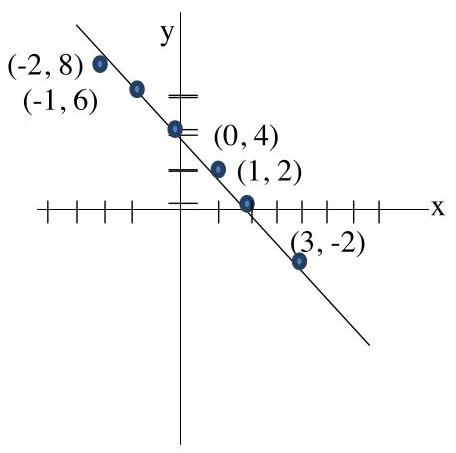
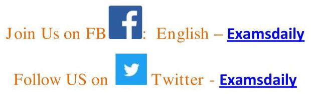

## EXAMS DAILY

AlgebraicExpressions and

Inequalities Study Material

## 3. ALGEBRAICEXPRESSIONS

AND INEQUALITIES

## VARIABLE

The unknown, quantities used in any equation are known as variables. Generally, they are denoted by the last English alphabet $\mathrm{x},\mathrm{y},\mathrm{z}$ etc.

An equation is a statement of equality of two algebraic expressions, which involve one or more unknown quantities, called the variables.

## LINEAR EQUATION

An equation in which the highest power of variables is one, is called a linear equation. These equations are called linear be-cause the graph of such equations on the x-y Cartesian plane is a straight line.

Linear Equation in one variable: A linear equation which contains only one variable is called linear equation in one variable.

The general form of such equations is a $x + b = c$ , where $\mathrm{a},\mathrm{b}$ and $\mathrm{c}$ are constants and $\mathrm{a} \neq  0$ .

All the values of $\mathrm{x}$ which satisfy this equation are called its solution(s). NOTE:

An equation satisfied by all values of the variable is called an identity. For examples: ${2x} + x = {3x}$ .

Example 1:

Solve $\frac{4}{x} - \frac{3}{2x} = 5$

Solution:

$\frac{4}{x} - \frac{3}{2x} = 5 \Rightarrow  \frac{8 - 3}{2x} = 5$

$\Rightarrow  \frac{5}{2x} = 5 \Rightarrow  {10}\mathrm{x} = 5$

$\Rightarrow  x = \frac{5}{10} = \frac{1}{2}$

APPLICATIONS OF LINEAR

EQUATIONS WITH ONE VARIABLES

Example 2:

The sum of the digits of a two digit number is 16 , If the number formed by reversing the digits is less than the original number by 18 . Find the original number.

Solution:

Let unit digit be $\mathrm{x}$ .

Then tens digit $= {16} - \mathrm{x}$

$\therefore$ Original number $= {10} \times  \left( {{16} - \mathrm{x}}\right)  + \mathrm{x} = {160} - 9\mathrm{x}$ . On reversing the digits, we have $\mathrm{x}$ at the tens place and (16-x)at the unit place. $\therefore$ New number $= {10}\mathrm{x} + \left( {{16} - \mathrm{x}}\right)  = 9\mathrm{x} + {16}$ Original number-New number $= {18}$ $\left( {{160} - {9x}}\right)  - \left( {{9x} + {16}}\right)  = {18}$ 160-18x-16=18 $- {18x} + {144} = {18}$ $- {18x} = {18} - {144} \Rightarrow  {18x} = {126}$ $\Rightarrow  \mathrm{x} = 7$ $\therefore$ In the original number, we have unit digit $= 7$ Tens digit $= \left( {{16} - 7}\right)  = 9$ Thus, original number=97

## Example 3:

The denominator of a rational number is greater than its numerator by 4 . If 4 is subtracted from the numerator and 2 is added to its denominator, the new number becomes $\frac{1}{6}$ .

Find the original number.

Solution:

Let the numerator be $\mathrm{x}$ .

Then, denominator=x+4

$\therefore \frac{x - 4}{x + 4 + 2} = \frac{1}{6}$

$\Rightarrow  \frac{x - 4}{x + 6} = \frac{1}{6}$

## EXAMS DAILY

AlgebraicExpressions and

Inequalities Study Material

$\Rightarrow  6\left( {\mathrm{x} - 4}\right)  = \mathrm{x} + 6$

$\Rightarrow  6\mathrm{x} - {24} = \mathrm{x} + 6 \Rightarrow  5\mathrm{x} = {30}$

$\therefore \mathrm{x} = 6$

Thus, Numerators $= 6$ , Denominator $= 6 + 4 = {10}$ .

Hence the original number $= \frac{6}{10}$

Linear equation in two variables: General equation of a linear equation in two variables is ax + by $+ \mathrm{c} = 0$ , where $\mathrm{a},\mathrm{b} \neq  0$ and $\mathrm{c}$ is, a constant,’ and $\mathrm{x}$ and $y$ are the two variables

The sets of values of $\mathrm{x}$ and $\mathrm{y}$ satisfying any equation are called its solution(s).

Consider the equation ${2x} + y = 4$ . Now, if we substitute $\mathrm{x} =  - 2$ in the equation, we obtain $2.\left( {-2}\right)  + \mathrm{y} =$ 4 or-4 + $y = 4$ or $y = 8$ . Hence(-2,8)is a solution. If we substitute $\mathrm{x} = 3$ in the equation, we obtain ${2.3} + \mathrm{y} = 4$ or $6 + y = 4$ or $y =  - 2$

Hence(3, - 2)is a solution. The following table lists six possible values for $\mathrm{x}$ and the corresponding values for y, i.e. six solutions of the equation.

<table><tr><td>X</td><td>-2</td><td>- 1</td><td>0</td><td>1</td><td>2</td><td>3</td></tr><tr><td>Y</td><td>8</td><td>6</td><td>4</td><td>2</td><td>0</td><td>12</td></tr></table>

If we plot the solutions of the equation ${2x} + y$ - 4 which appear in the above table then we see that they all lie on the same line. We call .this line the graph of the equation since it corresponds precisely to the solution set of the equation.

(2,0)

Example 4:

Find the values of $\mathrm{x}$ and $\mathrm{y}$ which satisfy the equations:

${4x} + {3y} = {25}$ and $x + {5y} = {19}$ .

Solution:

Substitution Method:

4x+3y=25(i)

x + 5y = 19(ii)

$\Rightarrow  \mathrm{x} = {19} - 5\mathrm{y}$

Substitute $\mathrm{x} = {19} - 5\mathrm{y}$ in equation (1), we get

4(19-5y) +3y =25

$\Rightarrow  {76} - {20}\mathrm{y} + 3\mathrm{y} = {25} \Rightarrow  {76} - {17}\mathrm{y} = {25}$

$\Rightarrow  {17}\mathrm{y} = {51} \Rightarrow  \mathrm{y} = 3$

Putting $y = 3$ in equation (ii), we obtain

$x + 5 \times  3 = {19}$

$\Rightarrow  \mathrm{x} + {15} = {19} \Rightarrow  \mathrm{x} = 4$

$\therefore \mathrm{x} = 4$ and $\mathrm{y} = 3$ is the solution.

## Elimination Method:

$$
\text{4x + 3y = 25} \tag{i}
$$

$$
\text{x + 5y =19} \tag{ii}
$$

Multiply equation (ii) by 4 on both sides. We find ${4x} + {20y} = {76}$

Subtracting equation (i) from equation (iii), we have

4x + 20y = 76

4x + 3y=25

_____

17 y = 51

$\Rightarrow  \mathrm{y} = \frac{51}{17} = 3$

Substituting value of $y$ in equation (i), we get ${4x} + 3 \times  3 = {25}$

${4x} = {16} \Rightarrow  x = \frac{16}{4} = 4$

$\therefore \mathrm{x} = 4$ and $\mathrm{y} = 3$ is the solution.

Now consider two linear equations in two unknowns,

${\mathrm{a}}_{1}\mathrm{x} + {\mathrm{b}}_{1}\mathrm{y} = {\mathrm{c}}_{1}$(i)

${\mathrm{a}}_{2}\mathrm{x} + {\mathrm{b}}_{2}\mathrm{y} = {\mathrm{c}}_{2}$(ii)

The above equations arc nothing else but equations of 2 lines. Any pair(x, y)which satisfy both the equation is called a solution to the above system of equations.

## EXAMS DAILY

<table><tr><td>S. No</td><td>Solutions</td><td>Feature</td><td>Example</td></tr><tr><td>1.</td><td>One</td><td>Lines intersect at(1, - 2)each other $\mathrm{x} + \mathrm{y} = 1$ $\mathrm{x} - \mathrm{y} = 3$</td><td>  </td></tr><tr><td>2.</td><td>No solution</td><td>Lines are parallel to each other $\mathrm{x} + \mathrm{y} =  - 1$ 2x + 2y = -6</td><td>  </td></tr><tr><td>3.</td><td>Infinite solutions - all points lying on the given line</td><td>Both the lines coincide each other $\mathrm{x} + \mathrm{y} = 1$ ${2x} + {2y} = 2$</td><td>  </td></tr></table>

SYSTEMS OF LINEAR EQUATION

Consistent System: A system (of 2 or. 3 or more equations taken together) of linear equations is said to be consistent, if it has at least one solution.

Inconsistent System: A system of simultaneous linear equations is said to be inconsistent, if it has no solutions at all

$$
\text{e.g.}\mathrm{X} + \mathrm{Y} = 9;\;3\mathrm{X} + 3\mathrm{Y} = 8
$$

Clearly there are no values of $\mathrm{X}\& \mathrm{Y}$ which simultaneously satisfy the given equations. So the system is inconsistent

## REMEMBER

* The system ${a}_{1}x + {b}_{1}y = {c}_{1}$ and ${a}_{2}x + {b}_{2}y = {c2}$ has:

- a unique solution, if $\frac{{a}_{1}}{{a}_{2}} \neq  \frac{{b}_{1}}{{b}_{2}}$

- Infinitely many solutions, if $\frac{{\mathrm{a}}_{1}}{{\mathrm{a}}_{2}} = \frac{{\mathrm{b}}_{1}}{{\mathrm{\;b}}_{2}} = \frac{{\mathrm{c}}_{1}}{{\mathrm{c}}_{2}}$ .

- No solution, if $\frac{{\mathrm{a}}_{1}}{{\mathrm{a}}_{2}} = \frac{{\mathrm{b}}_{1}}{{\mathrm{\;b}}_{2}} \neq  \frac{{\mathrm{c}}_{1}}{{\mathrm{c}}_{2}}$

The homogeneous system ${a}_{1}x + {b}_{1}y = 0$ and ${\mathrm{a}}_{2}\mathrm{x} + {\mathrm{b}}_{2}\mathrm{y} = 0$ has the only solution $\mathrm{x} = \mathrm{y} = 0$ when $\frac{{\mathrm{a}}_{1}}{{\mathrm{a}}_{2}} \neq  \frac{{\mathrm{b}}_{1}}{{\mathrm{\;b}}_{2}}$ . AlgebraicExpressions and Inequalities Study Material

4 The homogeneous system ${a}_{1}x + {b}_{1}y = 0$ and ${\mathrm{a}}_{2}\mathrm{x} + {\mathrm{b}}_{2}\mathrm{y} = 0$ has a non-zero solution only when $\frac{{a}_{1}}{{a}_{2}} = \frac{{b}_{1}}{{b}_{2}}$ and in this case, the system has an infinite number of solutions.

Example 5:

Find $\mathrm{k}$ for which the system $6\mathrm{x} - 2\mathrm{y} = 3,\mathrm{{kx}} - \mathrm{y} =$ 2 has a unique solution.

Solution:

The given system will have a unique solution, if $\frac{{\mathrm{a}}_{1}}{{\mathrm{a}}_{2}} \neq  \frac{{\mathrm{b}}_{1}}{{\mathrm{\;b}}_{2}}$ i.e. $\frac{6}{\mathrm{k}} \neq  \frac{-2}{-1}$ or $\mathrm{k} \neq  3$ .

Example 6:

What is the value of $\mathrm{k}$ for which the system $x + {2y} = 3,{5x} + {ky} =  - 7$ is inconsistent?

Solution:

The given system will be inconsistent if $\frac{{a}_{1}}{{a}_{2}} =$ $\frac{{\mathrm{b}}_{1}}{{\mathrm{\;b}}_{2}} \neq  \frac{{\mathrm{c}}_{1}}{{\mathrm{c}}_{2}}$

i.e. if $\frac{1}{5} = \frac{2}{k} \neq  \frac{3}{-7}$ or $\mathrm{k} = {10}$

Example 7:

Find $\mathrm{k}$ such that the system $3\mathrm{x} + 5\mathrm{y} = 0,\mathrm{{kx}} +$ ${10}\mathrm{y} = 0$ has a non-zero solution.

Solution:

The given system has a non zero solution,

$$
\text{if}\frac{3}{k} = \frac{5}{10}\text{or}\mathrm{k} = 6
$$

## QUADRATIC EQUATION

An equation of the degree two of one variable is called quadratic equation.

General form: ${\mathrm{{ax}}}^{2} + \mathrm{{bx}} + \mathrm{c} = 0\ldots$ . (l) where $\mathrm{a},\mathrm{b}$ and $\mathrm{c}$ are all real number and $\mathrm{a} \neq  0$ . For Example:

$$
2{x}^{2} - {5x} + 3 = 0;2{x}^{2} - 5 = 0;{x}^{2} + {3x} = 0
$$

A quadratic equation gives two and only two values of the unknown variable and both these values are called the roots of the equation.

The roots of the quadratic equation, (1) can be evaluated using the following formula.

$$
x = \frac{-b \pm  \sqrt{{b}^{2} - {4ac}}}{2a} \tag{2}
$$

## EXAMS DAILY

The above formula provides both the roots of the quadratic equation, which are generally denoted by $\alpha$ and $\beta$ ,

say $\alpha  = \frac{-b + \sqrt{{b}^{2} - {4ac}}}{2a}$ and $\beta  = \frac{-b - \sqrt{{b}^{2} - {4ac}}}{2a}$

* The expression inside the square root ${\mathrm{b}}^{2} - 4\mathrm{{ac}}$ is called the DISCRIMINANT of the quadratic equation and denoted by D. Thus, Discriminant $\left( \mathrm{D}\right)  = {\mathrm{b}}^{2} - 4\mathrm{{ac}}$ .

Solving a quadratic equation by factorization

STEP I: Express the equation in the standard from, i.e. $a{x}^{2} + {bx} + c = 0$

STEP II: Factorise the expression ${\mathrm{{ax}}}^{2} + \mathrm{{bx}} + \mathrm{c}$

STEP III: Put each of the factors equal to zero and find the values of $x$ .

These values of $\mathrm{x}$ are solutions or

roots of the quadratic equation.

Example 8: Solve $\mathrm{x} - \frac{1}{\mathrm{x}} = 1\frac{1}{2}$

Solution:

$$
\mathrm{x} - \frac{1}{\mathrm{x}} = 1\frac{1}{2} \Rightarrow  \frac{{\mathrm{x}}^{2} - 1}{\mathrm{x}} = \frac{3}{2}
$$

$$
\Rightarrow  2\left( {{\mathrm{x}}^{2} - 1}\right)  = 3\mathrm{x} \Rightarrow  2{\mathrm{x}}^{2} - 2 = 3\mathrm{x}
$$

$$
\Rightarrow  2{\mathrm{x}}^{2} - 3\mathrm{x} - 2 = 0
$$

$\Rightarrow  2{\mathrm{x}}^{2} - 4\mathrm{x} + \mathrm{x} - 2 = 0$

$\Rightarrow  2\mathrm{x}\left( {\mathrm{x} - 2}\right)  + 1\left( {\mathrm{x} - 2}\right)  = 0$

$\Rightarrow  \left( {2\mathrm{x} + 1}\right) \left( {\mathrm{x} - 2}\right)  = 0$

Either ${2x} + 1 = 0$ or $x - 2 = 0$

$\Rightarrow  2\mathrm{x} =  - 1$ or $\mathrm{x} = 2$

$\Rightarrow  \mathrm{x} = \frac{-1}{2}$ or $\mathrm{x} = 2$

$\therefore \mathrm{x} = \frac{-1}{2},2$ are solutions.

Nature of Roots: The nature of roots of the equation depends upon the nature of its discriminant D.

1. If $\mathrm{D} < 0$ , then the roots are non-real complex, Such roots are always conjugate to one another. That is, if one root is $\mathrm{p} + \mathrm{{iq}}$ then other is $\mathrm{p} - \mathrm{{iq}},\mathrm{q} \neq  0$ .

2. If $\mathrm{D} = 0$ , then the roots are real and equal. Each root of the equation becomes $- \frac{\mathrm{b}}{2\mathrm{a}}$ . Equal

AlgebraicExpressions and

Inequalities Study Material roots are referred as repeated roots or double roots also:

3. If $\mathrm{D} > 0$ then, the roots are real and unequal.

4. In particular, if $a, b, c$ are rational number, $D >$ 0 and $\mathrm{D}$ is a perfect square, then the roots of the equation are rational number and unequal.

5. If $\mathrm{a},\mathrm{b},\mathrm{c}$ , are rational number, $\mathrm{D} > 0$ but $\mathrm{D}$ is not a perfect square, then the roots of the equation are irrational (surd). Surd roots are always conjugate to one another, that is if one root is $p + \sqrt{q}$ then the other is $p - \sqrt{q}, q > 0$ .

6. If $a = 1, b$ and $c$ are integers, $D > 0$ and perfect square, then the roots of the equation are integers.

Sign of Roots: Let $\alpha ,\beta$ are real roots of the quadratic equation ${\mathrm{{ax}}}^{2} + \mathrm{{bx}} + \mathrm{c} = 0$ that is $\mathrm{D} = {\mathrm{b}}^{2}$ - 4ac≥0. Then

1. Both the roots are positive if a and c have the same sign and the sign of $b$ is Opposite.

2. Both the roots are negative if $a, b$ and $c$ all have the same sign.

3. The Roots have opposite sign if sign of a and c are opposite.

4. The Roots are equal in magnitude and opposite in sign if $b = 0$ [that is its roots $\alpha$ and $- \alpha$ ]

5. The roots are reciprocal if $a = c$ .

[that Is the roots are $\alpha$ and $\frac{1}{\alpha }$ ]

6. If $c = 0$ . then one root is zero.

7. If $b = c = 0$ . then both the roots are zero.

8. If $a = 0$ , then one root is infinite.

9. If $a = b = 0$ , then both the roots are infinite.

10. If $a = b = c = 0$ , then the equation becomes an identity

11. If $a + b + c = 0$ then one root is always unity and the other

root is $\frac{c}{a}$ , Hence the roots are rational provided $\mathrm{a},\mathrm{b},\mathrm{c}$ , are rational.

## Example 9:

Find solutions of the equation $\sqrt{{25} - {x}^{2}} = \mathrm{x} - 1$ Solution:

$\sqrt{{25} - {x}^{2}} = \mathrm{x} - 1$

## EXAMS DAILY

$$
\text{or}{25} - {x}^{2} = {\left( x - 1\right) }^{2}\text{or}{25} - {x}^{2} = {x}^{2} + 1 - {2x}
$$

$$
\text{or}2{x}^{2} - {2x} - {24} = 0\text{or}{x}^{2} - x - {12} = 0
$$

$$
\text{or}\left( {x - 4}\right) \left( {x + 3}\right)  = 0\text{or}x = 4, x =  - 3
$$

Example 10:

If $2{x}^{2} - {7xy} + 3{y}^{2} = 0$ , then what is the value of $x$ :

y?

Solution:

$2{x}^{2} - {7xy} + 3{y}^{2} = 0$

$2{\left( \frac{x}{y}\right) }^{2} - 7\left( \frac{x}{y}\right)  + 3 = 0$

$\frac{x}{y} = \frac{-b \pm  \sqrt{{b}^{2} - {4ac}}}{2a} = \frac{7 \pm  \sqrt{{49} - {24}}}{2 \times  2}$

$$
= \frac{7 \pm  5}{4} = 3,\frac{1}{2}
$$

$$
\Rightarrow  \frac{x}{y} = \frac{3}{1}\text{or}\frac{x}{y} = \frac{1}{2}
$$

Symmetric Functions of Roots: An expression in $\alpha ,\beta$ is called asymmetric function of $\alpha ,\beta$ if the function is not affected by inter changing $\alpha$ and $\beta$ . If $\alpha ,\beta$ are the roots of the quadratic equation $a{x}^{2} + {bx} + c = 0, a \neq  0$ then,

Sum of roots: $\alpha  + \beta  =  - \frac{\mathrm{b}}{\mathrm{a}} =  - \frac{\text{ co efficient of }\mathrm{x}}{\text{ coefficient of }{\mathrm{x}}^{2}}$ and Product of roots: ${\alpha \beta } = \frac{\mathrm{c}}{\mathrm{a}} = \frac{\text{ constant }\text{ term }}{\text{ coefficient }\text{ of }{\mathrm{x}}^{2}}$

AlgebraicExpressions and

Inequalities Study Material

NOTE :

Above relation hold for any quadric equation whether the coefficient are real or non-real complex.

With the help of above relations many other symmetric functions of $\alpha$ and $\beta$ can be expressed in terms of the coefficients a, b and c.

3. Recurrence Relation

${\alpha }^{\mathrm{n}} + {\beta }^{\mathrm{n}} = \left( {\alpha  + \beta }\right) \left( {{\alpha }^{\mathrm{n} - 1} + {\beta }^{\mathrm{n} - 1}}\right)$

$- {\alpha \beta }\left( {{\alpha }^{n - 2} + {\beta }^{n - 2}}\right)$

Some symmetric functions of roots are

(i) ${\alpha }^{2} + {\beta }^{2} = {\left( \alpha  + \beta \right) }^{2} - {2\alpha \beta }$

(ii) $\alpha  - \beta  =  \pm  \sqrt{{\left( \alpha  + \beta \right) }^{2} - {4\alpha \beta }}$

(iii) ${\alpha }^{2} - {\beta }^{2} =  \pm  \left( {\alpha  + \beta }\right) \left( {\alpha  - \beta }\right)$

$=  \pm  \left( {\alpha  + \beta }\right) \sqrt{{\left( \alpha  + \beta \right) }^{2} - {4\alpha \beta }}$

(iv) ${\alpha }^{3} + {\beta }^{3} = {\left( \alpha  + \beta \right) }^{3} - {3\alpha \beta }\left( {\alpha  + \beta }\right)$

(v) ${\alpha }^{3} - {\beta }^{3} = {\left( \alpha  - \beta \right) }^{3} + {3\alpha \beta }\left( {\alpha  - \beta }\right) \&$

$\alpha  - \beta  =  \pm  \sqrt{{\left( \alpha  + \beta \right) }^{2} - {4\alpha \beta }}$

(vi) ${\alpha }^{4} + {\beta }^{4} = {\left( {\alpha }^{2} + {\beta }^{2}\right) }^{2} - 2{\alpha }^{2}{\beta }^{2}$

$= {\left\lbrack  {\left( \alpha  + \beta \right) }^{2} - 2\alpha \beta \right\rbrack  }^{2} - 2{\left( \alpha \beta \right) }^{2}$

(vii) ${\alpha }^{4} - {\beta }^{4} = \left( {{\alpha }^{2} + {\beta }^{2}}\right) \left( {{\alpha }^{2} - {\beta }^{2}}\right)$

$= \left\lbrack  {{\left( \alpha  + \beta \right) }^{2} - {2\alpha \beta }}\right\rbrack  \left\lbrack  {\pm \sqrt{{\left( \alpha  + \beta \right) }^{2} - {4\alpha \beta }}}\right\rbrack$

## FORMATION OF QUADRATIC EQUATION WITH GIVEN ROOTS.

4 An equation whoso roots are $\alpha$ and $\beta$ can be written as $\left( {\mathrm{x} - \alpha }\right) \left( {\mathrm{x} - \beta }\right)  = 0$ or ${\mathrm{x}}^{2} - \left( {\alpha  + \beta }\right) \mathrm{x} +$ ${\alpha \beta } = 0$ or ${\mathrm{x}}^{2}$ -(sum of the roots) $\mathrm{x}$ . + product of the roots $= 0$ .

* Further If $\alpha$ and $\beta$ are the roots of a quadratic equation ${\mathrm{{ax}}}^{2} + \mathrm{{bx}} + \mathrm{c} = 0$ , then

$a{x}^{2} + {bx} + c = a\left( {x - \alpha }\right) \left( {x - \beta }\right)$ is an identity.

A number of relations between the roots can be derived using this identity by substituting suitable values of $\mathrm{x}$ real or imaginary.

Condition of a Common Root between two quadratic equations:

Consider two quadratic equations

$$
{\mathrm{a}}_{1}{\mathrm{x}}^{2} + {\mathrm{b}}_{1}\mathrm{x} + {\mathrm{c}}_{1} = 0 \tag{i}
$$

$$
\text{nd}{a}_{2}{x}^{2} + {b}_{2}x + {c}_{2} = 0 \tag{ii}
$$

Let $\alpha$ be a common root of the two equations

Then ${\mathrm{a}}_{1}{\alpha }^{2} + {\mathrm{b}}_{1}\alpha  + {\mathrm{c}}_{1} = 0$ and ${\mathrm{a}}_{2}{\alpha }^{2} + {\mathrm{b}}_{2}\alpha  + {\mathrm{c}}_{2} = 0$ On solving we get

$$
\frac{{\alpha }^{2}}{{b}_{1}{c}_{2} - {b}_{2}{c}_{1}} = \frac{a}{{c}_{1}{a}_{2} - {c}_{2}{a}_{1}} = \frac{1}{{a}_{1}{b}_{2} - {a}_{2}{b}_{1}}
$$

$$
\text{or}{\alpha }^{2} = \frac{{\mathrm{b}}_{1}{\mathrm{c}}_{2} - {\mathrm{b}}_{2}{\mathrm{c}}_{1}}{?} = {\left( \frac{{\mathrm{c}}_{1}{\mathrm{a}}_{2} - {\mathrm{c}}_{2}{\mathrm{a}}_{1}}{?}\right) }^{2}
$$

which gives the common root as well as the condition for common root.

Condition that two quadratic equation have both the Roots Common:

Suppose that the equations ${a}_{1}{x}^{2} + {b}_{1}x + {c}_{1} = 0$ and ${a}_{2}{x}^{2} + {b}^{2}x + {c2} = 0$ , have both the roots common then $\frac{{a}_{1}}{{a}_{2}} = \frac{{b}_{1}}{{b}_{2}} = \frac{{c}_{1}}{{c}_{2}}$

If the coefficients of two quadratic equations are national (real) and they have one irrational (imaginary) root common then they must have both the roots common as such roots occur in conjugate pair.

Example 11:

If and $b$ are the roots of the equation ${x}^{2} - {6x} +$ $6 = 0$ , then the value of ${a}^{2} + {b}^{2}$ is: Solution:

The sum of roots $= \mathrm{a} + \mathrm{b} = 6$

Product of roots $= \mathrm{{ab}} = 6$

Now, ${\mathrm{a}}^{2} + {\mathrm{b}}^{2} = {\left( \mathrm{a} + \mathrm{b}\right) }^{2} - 2\mathrm{{ab}} = {36} - {12} = {24}$ Example 12: If $\alpha$ and $\beta$ are the roots of the quadratic equation $a{x}^{2} + {bx} + c = 0$ . Then find the value of $\frac{{\alpha }^{2}}{\beta } + \frac{{\beta }^{2}}{\alpha }$ in terms of $\mathrm{a},\mathrm{b}$ and $\mathrm{c}$ .

Solution:

Here, $\left( {\alpha  + \beta }\right)  =  - \frac{b}{a}$ and ${\alpha \beta } = \frac{c}{a}$

Thus, $\frac{{\alpha }^{2}}{\beta } + \frac{{\beta }^{2}}{\alpha } = \frac{{\alpha }^{3} + {\beta }^{3}}{\alpha \beta }$

$= \frac{\left( {\alpha  + \beta }\right) \left( {{\alpha }^{2} - {\alpha \beta } + {\beta }^{2}}\right) }{\alpha \beta }$ (i)

Now, $\left( {{\alpha }^{2} + {\beta }^{2} - {\alpha \beta }}\right)$

$= \left\lbrack  {{\left( \alpha  + \beta \right) }^{2} - {2\alpha \beta } - {\alpha \beta }}\right\rbrack$

$= \left\lbrack  {{\left( \alpha  + \beta \right) }^{2} - {3\alpha \beta }}\right\rbrack$

Hence (i) becomes

Inequalities Study Material

$$
\Rightarrow  \frac{\left( {\alpha  + \beta }\right) \left\lbrack  {\left( {{\alpha }^{2} + {\beta }^{2}}\right)  - {3\alpha \beta }}\right\rbrack  }{\alpha \beta } = \frac{-\frac{b}{a}\left\lbrack  {\frac{{b}^{2}}{{a}^{2}} - \frac{3c}{a}}\right\rbrack  }{\frac{c}{a}}
$$

$$
=  - \frac{b}{c}\left\lbrack  \frac{{b}^{2} - {3ac}}{{a}^{2}}\right\rbrack   = \frac{{3abc} - {b}^{3}}{{a}^{2}c}
$$

Example 13:

If $a, b$ are two roots of a quadratic equation such that $a + b = {24}$ and $a - b = 8$ , then find a quadratic equation having $\mathrm{a}$ and $\mathrm{b}$ as its roots. Solution:

$$
\mathrm{a} + \mathrm{b} = {24}\text{ and }\mathrm{a} - \mathrm{b} = 8
$$

$$
\Rightarrow  \mathrm{a} = {16}\text{and}\mathrm{b} = 8 \Rightarrow  {16} \times  8 = {128}
$$

A quadratic equation with roots $a$ and $b$ is

${\mathrm{x}}^{2} - \left( {\mathrm{a} + \mathrm{b}}\right) \mathrm{x} + \mathrm{{ab}} = 0$ or ${\mathrm{x}}^{2} - {24}\mathrm{x} + {128} = 0$

In equations: A statement or equation which states that one thing is not equal to another, is called an in equation.

Symbols:

'<' means "is less than"

'>' means "is greater than"

'≤' means "is less than or equal to"

‘≥’ means “is greater than or equal to”

For example:

(a) $x < 3$ means $x$ is less than 3 .

(b) $y \geq  9$ means $y$ is greater than or equal to 9 .

## PROPERTIES

1. Adding the same number to each side of an equation does not effect the sign of inequality, it remains same, i.e. if $x > y$ then, $x + a > y +$ a.

2. Subtracting the same number to each side of an inequation does not effect the sign of inequality, i.e. if $x < y$ then, $x - a < y - a$ .

3. Multiplying each side of an inequality with same number does not effect the sign of inequality, i.e., if $\mathrm{x} \leq  1$ then $\mathrm{{ax}} \leq$ ay (where, $\mathrm{a} >$ 0).

4. Multiplying each side of an inequality with a negative number effects the sign of inequality or sign of inequality reverses, i.e., if $x < y$ then ax > ay (where a < 0)

5. Dividing each side of an inequation by a positive number does not effect the sign of

## EXAMS DAILY

AlgebraicExpressions and

Inequalities Study Material

inequality, i.e., if $\mathrm{x} \leq  \mathrm{y}$ then $\frac{x}{a} \leq  \frac{y}{a}$ (where, a> 0).

6. Dividing each side of an inequation by a negative number reserves the sign of inequality, i.e., if $\mathrm{x} > \mathrm{y}$ then $\frac{x}{a} < \frac{y}{a}$ (where, $\mathrm{a} <$ $0)$ .

## NOTE:

4 If $a > b$ and $a, b, n$ are positive, then ${a}^{n} > {b}^{n}$ but ${\mathrm{a}}^{-\mathrm{n}} < {\mathrm{b}}^{-\mathrm{n}}$ . For example $5 > 4$ ; then ${5}^{3} > {4}^{3}$ or 125 > 64, but

${5}^{-3} < {4}^{-3}$ or $\frac{1}{125} < \frac{1}{64}.$

4 If $a > b$ and $c > d$ , then $\left( {a + c}\right)  > \left( {b + d}\right)$ .

4 If $a > b > 0$ and $c > d > 0$ , then ${ac} > {bd}$ .

- If the signs of all the terms of an inequality are changed, then the sign of the inequality will also be reversed.

MODULUS:

$\left| x\right|  = \left\{  \begin{matrix} x, x \geq  0 \\   - x, x < 0 \end{matrix}\right.$

1. If a is positive real number, $\mathrm{x}$ and $\mathrm{y}$ be the fixed real numbers, then

(i) $\left| {x - y}\right|  < a \Leftrightarrow  y - a < x < y + a$

(ii) $\left| {\mathrm{x} - \mathrm{y}}\right|  \leq  \mathrm{a} \Leftrightarrow  \mathrm{y} - \mathrm{a} \leq  \mathrm{x} \leq  \mathrm{y} + \mathrm{a}$

(iii) $\left| {x - y}\right|  > a \Leftrightarrow  x > y + a$ or $x < y - a$

(iv) $\left| {\mathrm{x} - \mathrm{y}}\right|  \geq  \mathrm{a}$

$\Leftrightarrow  \mathrm{x} \geq  \mathrm{y} + \mathrm{a}$ or $\mathrm{x} \leq  \mathrm{y} - \mathrm{a}$

2. Triangle Inequality:

(i) $\left| {x + y}\right|  \leq  \left| x\right|  + \left| y\right| ,\forall x, y \in  R$

(ii) $\left| {\mathrm{x} - \mathrm{y}}\right|  \geq  \left| \mathrm{x}\right|  - \left| \mathrm{y}\right| ,\forall \mathrm{x},\mathrm{y} \in  \mathrm{R}$

Example 14:

If $a - 8 = b$ , then determine the value of $\left| {a - b}\right|  -$

lb - al.

$\begin{array}{llll} \text{ (a) }{16} & \text{ (b) }0 & \text{ (c) }4 & \text{ (d) }2 \end{array}$

Solution:

(b) $\left| {a - b}\right|  = \left| 8\right|  = 8$

$\Rightarrow  \left| {\mathrm{b} - \mathrm{a}}\right|  = \left| {-8}\right|  = 8 \Rightarrow  \left| {\mathrm{a} - \mathrm{b}}\right|  - \left| {\mathrm{b} - \mathrm{a}}\right|  = 8 - 8 = 0$

---

Example 15: Solve: $3\mathrm{x} + 4 \leq  {19},\mathrm{x} \in  \mathrm{N}$

Solution:

	3x + 4 ≤ 19

	${3x} + 4 - 4 \leq  {19} - 4$ [Subtracting 4 from both

	the sides]

	3x ≤ 15

	$\frac{3x}{3} \leq  \frac{15}{3}$ [Dividing both the

	sides by 3]

	$\mathrm{x} \leq  5$ ; $\mathrm{x} \in  \mathrm{N}$

	$\therefore \mathrm{x} = \{ 1,2,3,4,5\}$ .

---

Example 16: Solve $5 \leq  {2x} - 1 \leq  {11}$

Solution:

$5 \leq  {2x} - 1 \leq  {11}$

$5 + 1 \leq  {2x} - 1 + 1 \leq  {11} + 1$ [Adding 1 to each sides]

$6 \leq  2\mathrm{x} \leq  {12}$

$\frac{6}{2} \leq  \frac{2x}{2} \leq  \frac{12}{2}\;$ [Dividing each side by 2]

$3 \leq  \mathrm{x} \leq  6$

$\Rightarrow  \mathrm{x} = \{ 3,4,5,6\}$ .

## APPLICATIONS

Problems on Ages can be solved by linear equations in one variable, linear equations in two variables, and quadratic equations.

## Example 17:

Kareem is three times as old as his son. After ten years, the sum of their ages will be 76 years. Find their present ages.

Solution:

Let the present age of Kareem's son be $\mathrm{x}$ years.

Then, Kareem’s age $= 3 \times$ years

After 10 years, Kareem’s age $= 3\mathrm{x} + {10}$ years

and Kareem’s son’s age $= \mathrm{x} + {10}$ years

$\therefore \left( {3\mathrm{x} + {10}}\right)  + \left( {\mathrm{x} + {10}}\right)  = {76}$

$\Rightarrow  4\mathrm{x} = {56} \Rightarrow  \mathrm{x} = {14}$

$\therefore$ Kareem’s present age $= 3\mathrm{x} = 3 \times  {14} = {42}$ years

Kareem’s son’s age $= \mathrm{x} = {14}$ years.

## EXAMS DAILY

AlgebraicExpressions and

Inequalities Study Material

Example 18:

The present ages of Vikas and Vishal are in the ratio 15:8. After ten years, their ages will be in the ratio 5:3. Find their present ages.

Solution:

Let the present ages of Vikas and Vishal be 15x years and 8x years.

After 10 years,

Vikas’s age $= {15}\mathrm{x} + {10}$ and

Vishal’s age $= 8\mathrm{x} + {10}$

$\therefore \frac{{15x} + {10}}{{8x} + {10}} = \frac{5}{3}$

$\Rightarrow  3\left( {{15x} + {10}}\right)  = 5\left( {{8x} + {10}}\right)$

$\Rightarrow  {45x} + {30} = {40x} + {50}$

$\Rightarrow  5\mathrm{x} = {20} \Rightarrow  \mathrm{x} = \frac{20}{5} = 4$

$\therefore$ Present age of Vikas $= {15} \times   = {15} \times  4 = {60}$ years

Present age of Vishal $= 8\mathrm{x} = 8 \times  4 = {32}$ years.

## Example 19:

Father's age is 4 less than five times the age of his son and the product of their age is 288 . Find the father's age. Solution:

Let the son’s age be $\mathrm{x}$ years.

So, father’s age $= 5\mathrm{x} - 4$ years.

$\therefore \mathrm{x}\left( {5\mathrm{x} - 4}\right)  = {288}$

$\Rightarrow  5{x}^{2} - {4x} - {288} = 0$

$\Rightarrow  5{x}^{ * } - {40x} + {36x} - {288} = 0$

$\Rightarrow  5\mathrm{x}\left( {\mathrm{x} - 8}\right)  + {36}\left( {\mathrm{x} - 8}\right)  = 0$

$\Rightarrow  \left( {5\mathrm{x} + {36}}\right) \left( {\mathrm{x} - 8}\right)  = 0$

Either $\mathrm{x} - 8 = 0$ or $5\mathrm{x} + {36} = 0$

$\Rightarrow  \mathrm{x} - 8$ or $\mathrm{x} = \frac{-{36}}{5}$

$\mathrm{x}$ cannot be negative; therefore, $\mathrm{x} = 8$ is the solution.

$\therefore$ Son’s age - 8 years and Father’s age $= 5\mathrm{x} - 4$ $= {36}$ years.

- If present age of the father is $\mathrm{F}$ times the age of his son. T years later, the father's age become $\mathrm{Z}$ times the age of son then present age of his son is given by $\frac{\left( {Z - 1}\right) T}{\left( F - Z\right) }$

## Example 20:

Present age of the father is 9 times the age of his son. One year later, father's age become 7 times the age of his son. What are the present ages of the father and his son.

Solution:

By the formula

Son’s age $= \frac{\left( 7 - 1\right) }{\left( 9 - 7\right) } \times  1 = 6/2 \times  1 = 3$ years.

So, father’s age $= 9 \times$ son’s age $= 9 \times  3 = {27}$ years.

4 If ${T}_{1}$ years earlier the age of the father was $n$ times the age of his son, ${\mathrm{T}}_{2}$ years later, the age of the father becomes $\mathrm{m}$ times the age of his son then his son's age is given by

Son’s age $= \frac{{T}_{2}\left( {n - 1}\right)  + {T}_{1}\left( {m - 1}\right) }{n - m}$

Example 21:

10 years ago, Shakti's mother was 4 times older than her. After 10 years, the mother will be twice older than the daughter. What is the present age of Shakti?

Solution:

By using formula,

Shakti’s age $= \frac{{10}\left( {4 - 1}\right)  + {10}\left( {2 - 1}\right) }{4 - 2} = {20}$ years.

* Present age of Father: Son=a:b

After/Before T/years $= \mathrm{m} : \mathrm{n}$

Then son’s age $=  \pm  \mathrm{b} \times  \frac{\mathrm{T}\left( {\mathrm{m} - \mathrm{n}}\right) }{\mathrm{{an}} - \mathrm{{bm}}}$

and Father’s age $=  \pm  \mathrm{a} \times  \frac{\mathrm{T}\left( {\mathrm{m} - \mathrm{n}}\right) }{\mathrm{{an}} - \mathrm{{bm}}}$

+ve for after & -ve for before

Example 22:

The ratio of the ages of the father and the son at present is $3 : 1$ . Four years earliar, the ratio was 4:1. What are the present ages of the son and the father?

Solution:

Ratio of present age of Father and Son $= 3 : 1$

4 years before $= 4 : 1$

Son’s age $= 1 \times  \frac{4\left( {4 - 1}\right) }{4 \times  1 - 3 \times  1} = {12}$ years.

Father’s age $= 3 \times  \frac{4\left( {4 - 1}\right) }{4 \times  1 - 3 \times  1} = {36}$ years. AlgebraicExpressions and Inequalities Study Material NOTE:

## IMPORTANT ALGEBRAIC FORMULAE

${\left( a + b\right) }^{2} = {a}^{2} + {2ab} + {b}^{2}$

${\left( a - b\right) }^{2} = {a}^{2} - {2ab} + {b}^{2}$

$\left( {a - b}\right) \left( {a + b}\right)  = {a}^{2} - {b}^{2}$

${\left( a + b\right) }^{2} + {\left( a - b\right) }^{2} = 2\left( {{a}^{2} + {b}^{2}}\right)$

${\left( a + b\right) }^{2} - {\left( a - b\right) }^{2} = {4ab}$

${\left( a + b\right) }^{3} = {a}^{3} + {b}^{3} + {3ab}\left( {a + b}\right)$

${\left( a - b\right) }^{3} = {a}^{3} - {b}^{3} - {3ab}\left( {a - b}\right)$

${a}^{3} + {b}^{3} = \left( {a + b}\right) \left( {{a}^{2} - {ab} + {b}^{2}}\right)$

${a}^{3} - {b}^{3} = \left( {a - b}\right) \left( {{a}^{2} + {ab} + {b}^{2}}\right)$

10. ${\left( a + b + c\right) }^{2} = \left( {{a}^{2} + {b}^{2} + {c}^{2}}\right)  + 2\left( {{ab} + {bc} + {ca}}\right)$

11. ${a}^{3} + {b}^{3} + {c}^{3} - {3abc} = \left( {a + b + c}\right) \left( {{a}^{2} + {b}^{2} + {c}^{2}}\right.$

$- \mathrm{{ab}} - \mathrm{{bc}} - \mathrm{{ca}})$

2. ${a}^{4} - {b}^{4} = \left( {{a}^{2} - {b}^{2}}\right) \left( {{a}^{2} + {b}^{2}}\right)$

13. $a\frac{b}{c} + d\frac{e}{f} + g\frac{h}{i} - j\frac{k}{l} = \left( {\mathrm{a} + \mathrm{d} + \mathrm{g} - \mathrm{j}}\right)  +$

$\left( {\frac{b}{c} + \frac{e}{f} + \frac{h}{i} - \frac{k}{l}}\right)$

IMPORTANT SERIES TYPE FORMULA

(i) Value of $\sqrt{P + \sqrt{P + \sqrt{P + \cdots \infty }}} = \frac{\sqrt{{4P} + 1} + 1}{2}$

(ii) Value of $\sqrt{P - \sqrt{P - \sqrt{P - \cdots \infty }}} = \frac{\sqrt{{4P} + 1} - 1}{2}$

(iii) Value of $\sqrt{P.\sqrt{P.\sqrt{P\ldots \infty }}} = P$

(iv) Value of $\sqrt{P\sqrt{P\sqrt{P\sqrt{P\sqrt{P}}}}} = {P}^{\left( {{2}^{n} - 1}\right)  + {2}^{n}}$

Where $\mathrm{n} \rightarrow$ no. of times $\mathrm{P}$ repeated.

## SOME SPECIAL SERIES

(i) Sum of first $n$ natural numbers $1 + 2 + 3 + \ldots n$

$$
= \frac{\left( n\right) \left( {n + 1}\right) }{2}
$$

(ii) Sum of the squares of first $n$ natural numbers

$$
{1}^{2} + {2}^{2} + {3}^{2} + \ldots .{\mathrm{b}}^{2} = \frac{\left( n\right) \left( {n + 1}\right) \left( {{2n} + 1}\right) }{6}
$$

(iii) Sum of the cubes of first $n$ natural numbers

$$
{1}^{3} + {2}^{3} + {3}^{3} + \ldots {\mathrm{n}}^{3} = {\left( \frac{\left( n\right) \left( {n + 1}\right) }{2}\right) }^{2}
$$

GK Study Materials PDF Download All subject Study Materials PDF Download 2018 Current Affairs Download - PDF Download

