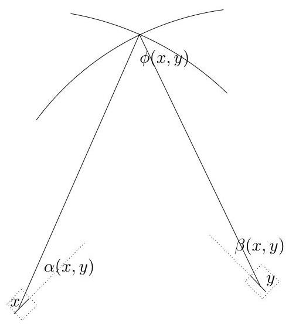

# DISTANCES IN POSITIVE DENSITY SETS IN ${\mathbb{R}}^{d}$

## ANTHONY QUAS

Abstract. We show that for a subset $A$ of ${\mathbb{R}}^{d}$ with positive upper density, there is an $R > 0$ such that for any $r > R$ , there exist $x$ and $y$ in $A$ with $d\left( {x, y}\right)  = r$ . The proof is based on the well-known second moment method in probability.

We will denote the Lebesgue measure of a subset $F$ of ${\mathbb{R}}^{d}$ by $\left| F\right|$ . For a measurable set $A \subset  {\mathbb{R}}^{d}$ , we write $\bar{\rho }\left( A\right)  = \mathop{\lim }\limits_{{R \rightarrow  \infty }}\mathop{\sup }\limits_{{\operatorname{side}\left( S\right)  \geq  R}}\left| {A \cap  S}\right| /\left| S\right|$ , where the supremum is taken over cubes with side length at least $R$ .

For $C$ a set of finite measure, we define the density of $A$ in $C$ to be $\left| {A \cap  C}\right| /\left| C\right|$ .

Theorem 1. Let $A$ be a measurable subset of ${\mathbb{R}}^{2}$ and suppose that $\bar{\rho }\left( A\right)  > 0$ . Then there exists an $R > 0$ such that for all $r \geq  R$ , A contains points $x$ and $y$ with $\left| {x - y}\right|  = r.$

Corollary 2. Let $A$ be a measurable subset of ${\mathbb{R}}^{d}$ for $d \geq  2$ and suppose that $\bar{\rho }\left( A\right)  > 0$ . Then there exists an $R > 0$ such that for all $r \geq  R$ , $A$ contains points $x$ and $y$ with $\left| {x - y}\right|  = r$ .

Theorem 1 was conjectured in the thesis of Székely [8] and was originally proved using ergodic techniques by Furstenberg, Katznelson and Weiss [5]. A subsequent proof was given using harmonic analysis by Bourgain [2]. A further proof using geometric measure theory techniques was given in the two-dimensional case by Falconer and Marstrand [4].

In his paper, Bourgain also proved a $d$ -dimensional result: given a configuration $V$ of $d$ points of ${\mathbb{R}}^{d}$ in general position, then for every set $A \subset  {\mathbb{R}}^{d}$ of positive upper density, there exists an $R > 0$ such that for all $r \geq  R, A$ contains an isometric copy of ${rV}$ . Recently, a paper of Bukh [3] extends the methods used by Bourgain and proves a more general result. See also work of Ziegler [9] for a development of the techniques of [5].

Clearly the result of Bourgain is an extension of Theorem 1. However, the techniques in this paper are very different, with the proof being based on probability rather than harmonic analysis. Moreover since there are a number of unresolved questions in the area (some of which are presented in the final section), one may hope that a new approach will shed light on some of these.

Our proof will be divided into 3 principal parts:

(1) Define a class of $\rho$ -configurations consisting of the unit ball and a large number, $N\left( \rho \right)$ , of small squares of side $\delta \left( \rho \right)$ arranged around it at roughly a fixed distance $s\left( \rho \right)$ from the ball satisfying certain properties; use probabilistic methods to show the existence of a $\rho$ -configuration. The ball and squares in such a configuration will be called its components.

---

This work was supported in part by an NSERC grant.

---

(2) Show that for any $\rho$ -configuration $\Xi$ , if $A$ is a measurable set whose density in each component $E$ exceeds $\rho$ , then $A$ contains two points separated by a distance exactly $s\left( \rho \right)$ .

(3) Show that if $\bar{\rho }\left( A\right)  > \rho$ , then for any $\rho$ -configuration $\Xi$ , there is a $T$ such that for all $t > T$ , there is a translate of ${t\Xi }$ such that in each component, $A$ has density at least $\rho$ . (This will then guarantee that $A$ contains points separated by ${ts}\left( \rho \right)$ and hence that $A$ contains points separated by all distances greater than ${Ts}\left( \rho \right)$ ).

In our proof, we take care to use as few properties of Lebesgue measure as possible, as we hope to extend the proof to suitable finitely additive measures so that it can be applied to non-measurable sets $A$ . Part 1 does not depend on the set $A$ at all and one can check that part 3 holds for any finitely additive translationally-invariant measure, so that to extend the results, it is sufficient to extend part 2 to finitely additive measures.

In the paper, we make use of the following fairly standard notation. Given a random variable $X$ and an event $S$ , we define $\mathbb{E}\left( {X;S}\right)  = \mathbb{E}\left( {X{\mathbf{1}}_{S}}\right)$ . We will frequently use the notation $X = O\left( {f\left( \rho \right) }\right)$ to mean that there is a constant $K$ (dependent only on the dimension $d$ ) such that $\left| X\right|  \leq  {Kf}\left( \rho \right)$ for all sufficiently small $\rho$ . Similarly $X = \Omega \left( {f\left( \rho \right) }\right)$ will mean that there is a constant $K > 0$ such that $\left| X\right|  \geq  {Kf}\left( \rho \right)$ for all sufficiently small $\rho$ .

I would like to thank the anonymous referee for numerous helpful suggestions.

## 1. Step 1: $\rho$ -CONFIGURATIONS

Given $\rho  > 0$ , let $N\left( \rho \right)  = \left\lfloor  {\rho }^{-7}\right\rfloor  ,\delta \left( \rho \right)  = {\rho }^{4}$ and $s\left( \rho \right)  = {\rho }^{-{25}}$ . We deal in this section with a fixed $\rho$ and will just write $N,\delta$ and $s$ for the above quantities. It will also be convenient to fix the function $g\left( r\right)  = 2\sqrt{\max \left( {1 - {r}^{2},0}\right) }$ .

Let $D$ denote the unit disc and let $\mathbb{P}$ denote the normalized Lebesgue measure on $D$ . A squarelet will be a square of side ${2\delta }$ whose centre is a distance between $s$ and $s + 1 + \delta$ from the origin and whose sides are parallel and perpendicular to the line joining the origin to the centre of the square.

Given a squarelet $S$ whose centre $P$ is at a distance $s + r$ from the origin, we let e be the unit vector in the direction $\overrightarrow{PO}$ . The strip corresponding to $S$ is the set $L\left( S\right)$ of points $X$ such that $s - \delta  < \overrightarrow{PX} \cdot  \mathbf{e} < s + \delta$ . The fattened strip corresponding to $S$ is the set $\bar{L}\left( S\right)$ of points $X$ such that $s - \delta  - 1/s < \overrightarrow{PX} \cdot  \mathbf{e} < s + \delta  + 1/s$ .

The role of the strips $L\left( S\right)$ in the proof is that these will approximate the ’forbidden regions’ of $D$ that need to be avoided if one is to ensure that there are no two points separated by a distance $s$ (one in $S$ and the other in $D$ ). If the strips cover too much of $D$ , we will obtain a contradiction.

Given a squarelet $S$ whose centre is at a distance $s + r$ from the origin, let $Z\left( S\right)  = {2\delta \rho g}\left( {r + \delta  + 1/s}\right) /\pi$ and let $\bar{Z}\left( S\right)  = \rho \mathbb{P}\left( {L\left( S\right) }\right)$ . Note that since $L\left( S\right)$ contains a rectangle of dimensions $g\left( {r + \delta }\right)  \times  {2\delta }$ , we have $Z\left( S\right)  \leq  \bar{Z}\left( S\right)$ . Given a subset $B$ of $S$ of density $\rho , Z\left( S\right)$ will be seen to be a lower bound for the $\mathbb{P}$ -measure of the set of points at a distance exactly $s$ from a point of $B$ .

Given a pair of squarelets $S$ and ${S}^{\prime }$ , let

$$
X\left( {S,{S}^{\prime }}\right)  = \left\{  \begin{array}{ll} \left( {1 + \delta }\right) \min \left( {\frac{{\rho }^{2}\left| {L\left( S\right)  \cap  L\left( {S}^{\prime }\right) }\right| }{\pi },1}\right) & \text{ if }\bar{L}\left( S\right)  \cap  \bar{L}\left( {S}^{\prime }\right)  \cap  D \neq  \varnothing ; \\  0 & \text{ otherwise. } \end{array}\right.
$$

$$
\underline{\mathrm{X}}\left( {S,{S}^{\prime }}\right)  = \frac{{\rho }^{2}\left| {L\left( S\right)  \cap  L\left( {S}^{\prime }\right)  \cap  D}\right| }{\pi } = {\rho }^{2}\mathbb{P}\left( {L\left( S\right)  \cap  L\left( {S}^{\prime }\right) }\right)
$$

so that $\underline{X}\left( {S,{S}^{\prime }}\right)  \leq  X\left( {S,{S}^{\prime }}\right)$ .

A $\rho$ -configuration is the unit disc together with a collection of $N\left( \rho \right)$ squarelets ${S}_{1},\ldots ,{S}_{N}$ such that

(1)

$$
\mathop{\sum }\limits_{{i = 1}}^{N}{Z}_{i} > 2/\rho
$$

(2)

$$
\mathop{\sum }\limits_{{i < j}}\left( {{X}_{i, j} - {Z}_{i}{Z}_{j}}\right)  < 1/\rho
$$

where ${Z}_{i} = Z\left( {S}_{i}\right)$ and ${X}_{i, j} = X\left( {{S}_{i},{S}_{j}}\right)$ .

Lemma 3. For sufficiently small $\rho  > 0$ , there exist $\rho$ -configurations.

Proof. For $\left( {r,\theta }\right)  \in  \lbrack 0,1 + \delta ) \times  \lbrack 0,{2\pi })$ , let $S\left( {r,\theta }\right)$ be the squarelet with centre $((r +$ $s)\cos \theta ,\left( {r + s}\right) \sin \theta )$ . We equip the set of parameters with a uniform distribution, which we shall denote by $\mathcal{P}$ . We will write $\mathcal{E}$ for expectations with respect to $\mathcal{P}$ and $\mathbb{E}$ for expectations with respect to $\mathbb{P}$ . Let ${S}_{1} = S\left( {{r}_{1},{\theta }_{1}}\right) ,{S}_{2} = S\left( {{r}_{2},{\theta }_{2}}\right) ,\ldots ,{S}_{N} =$ $S\left( {{r}_{N},{\theta }_{N}}\right)$ be $N$ independently chosen squarelets with distribution $\mathcal{P}$ . We show that for small $\rho$ , with high probability, they form a $\rho$ -configuration.

We have for $i \neq  j,{\underline{\mathrm{X}}}_{i, j} = {\rho }^{2}\mathbb{E}{\mathbf{1}}_{L\left( {S}_{i}\right) }{\mathbf{1}}_{L\left( {S}_{j}\right) }$ so that we see the following: $\mathcal{E}{\underline{\mathrm{X}}}_{i, j} =$ ${\rho }^{2}\mathcal{E}\mathbb{E}\left\lbrack  {{\mathbf{1}}_{L\left( {S}_{i}\right) }\left( x\right) {\mathbf{1}}_{L\left( {S}_{j}\right) }\left( x\right) }\right\rbrack   = {\rho }^{2}\mathbb{E}\left\lbrack  {\mathcal{E}{\mathbf{1}}_{L\left( {S}_{i}\right) }\left( x\right) \mathcal{E}{\mathbf{1}}_{L\left( {S}_{j}\right) }\left( x\right) }\right\rbrack   = {\rho }^{2}\mathbb{E}{F}^{2}$ , where $F\left( x\right)  =$ $\int {\mathbf{1}}_{L\left( {S\left( \omega \right) }\right) }\left( x\right) d\mathcal{P}\left( \omega \right)$ . Since the situation is rotationally symmetric about the origin, it is sufficient to calculate $F\left( {t,0}\right)$ for $0 \leq  t < 1$ . If $\theta$ is fixed, then we have $\left( {t,0}\right)  \in  L\left( {S}_{r,\theta }\right)$ if and only if $t\cos \theta  - \delta  < r \leq  t\cos \theta  + \delta$ . This gives

$$
{2\pi }\left( {1 + \delta }\right) F\left( {t,0}\right)  = {\int }_{0}^{2\pi }{d\theta }{\int }_{0}^{1 + \delta }{\mathbf{1}}_{\lbrack t\cos \theta  - \delta , t\cos \theta  + \delta )}\left( r\right) {dr}
$$

$$
= {\int }_{0}^{\pi }{d\theta }{\int }_{-\left( {1 + \delta }\right) }^{1 + \delta }{\mathbf{1}}_{\lbrack t\cos \theta  - \delta , t\cos \theta  + \delta )}\left( r\right) {dr} = {2\pi \delta }.
$$

This shows that $F\left( x\right)  = \delta /\left( {1 + \delta }\right)$ for $x \in  D$ so that we have $\mathcal{E}{\underline{X}}_{i, j} = {\rho }^{2}{\delta }^{2}/{\left( 1 + \delta \right) }^{2}$ . Similarly, $\mathcal{E}\left( {\bar{Z}}_{i}\right)  = {\rho \delta }/\left( {1 + \delta }\right)$ . This shows that for $i < j$ ,

(3)

$$
\mathcal{E}\left( {{\underline{\mathrm{X}}}_{i, j} - {\bar{Z}}_{i}{\bar{Z}}_{j}}\right)  = 0.
$$

We need to estimate $\mathcal{E}\left( {{X}_{i, j} - {\underline{\mathrm{X}}}_{i, j}}\right)$ for fixed $i < j$ . Clearly if the intersection of $\bar{L}\left( {S}_{i}\right)$ and $\bar{L}\left( {S}_{j}\right)$ is entirely outside $D$ , then ${X}_{i, j} = {\underline{\mathrm{X}}}_{i, j}$ , while if the intersection lies inside $D$ , then ${X}_{i, j} = \left( {1 + \delta }\right) {\underline{\mathrm{X}}}_{i, j}$ so that $\mathcal{E}\left( {{X}_{i, j} - {\underline{\mathrm{X}}}_{i, j};\bar{L}\left( {S}_{i}\right)  \cap  \bar{L}\left( {S}_{j}\right)  \subset  D}\right)  \leq$ $\delta \mathcal{E}\left( {\underline{\mathrm{X}}}_{i, j}\right)  \leq  {\rho }^{2}{\delta }^{3}.$

It remains to estimate the contribution to the expectation in the case in which the intersection of $\bar{L}\left( {S}_{i}\right)$ and $\bar{L}\left( {S}_{j}\right)$ contains a point of $\partial D$ . We cover cases according to the difference in the angle parameters, ${\theta }_{i}$ and ${\theta }_{j}$ , of ${S}_{i}$ and ${S}_{j}$ by estimating $\mathcal{E}\left( {{X}_{i, j};\bar{L}\left( {S}_{i}\right)  \cap  \bar{L}\left( {S}_{j}\right)  \cap  \partial D \neq  \varnothing }\right)$ . We deal first with the case where $\left| {\sin \phi }\right|  \leq$ $1/2$ , where $\phi  = {\theta }_{i} - {\theta }_{j}$ . The area of the parallelogram where they intersect is ${\left( 2\delta  + 2/s\right) }^{2}/\left| {\sin \phi }\right|$ . If $\left| {\sin \phi }\right|$ is between ${2}^{-n}$ and ${2}^{-\left( {n - 1}\right) }$ , the area is therefore of order ${\delta }^{2}{2}^{n}$ . On the other hand, the probability of such an intersection is of order $\delta {2}^{-n}$ (the difference between the $\theta$ coordinates is determined up to order ${2}^{-n}$ and given the $\theta$ coordinates, the difference between the $r$ coordinates is determined up to order $\delta$ ). Since we are taking the expectation of $\min \left( {{\rho }^{2}\operatorname{Area}/\pi ,1}\right)$ , we can estimate the $\left| {\sin \phi }\right|  < 1/2$ contribution by $\mathop{\sum }\limits_{{n = 1}}^{\infty }\delta {2}^{-n}\min \left( {{\rho }^{2}{\delta }^{2}{2}^{n},1}\right)$ . The small angle contribution to $\mathcal{E}\left( {{X}_{i, j} - {\underline{\mathrm{X}}}_{i, j}}\right)$ is then $O\left( {{\rho }^{2}{\delta }^{3}\left| {\log \left( {\rho \delta }\right) }\right| }\right)$ .

If $\left| {\sin \phi }\right|  > 1/2$ , then the area of the intersection is of $O\left( {{\rho }^{2}{\delta }^{2}}\right)$ . It will be sufficient to bound the probability that $\bar{L}\left( {S}_{i}\right)  \cap  \bar{L}\left( {S}_{j}\right)$ intersects $\partial D$ . Given the values of ${r}_{i},{\theta }_{i}$ and ${\theta }_{j}$ , if the intersection is non-empty, then ${r}_{j}$ is within $\delta  + 1/s$ of the projection in the ${\theta }_{j}$ direction of $\bar{L}\left( {S}_{i}\right)  \cap  \partial D$ . The probability that the intersection is non-empty is therefore of order at most $\delta$ plus the total arclength of $\bar{L}\left( {S}_{i}\right)  \cap  \partial D$ . This arclength is overestimated by ${6\delta } + g\left( {{r}_{i} - {2\delta }}\right)  - g\left( {{r}_{i} + {2\delta }}\right)$ , the arc being compared to straight lines parallel to and perpendicular to the ${\theta }_{i}$ direction (noting that some care is needed if ${r}_{i} < {2\delta }$ ). We have $g\left( {{r}_{i} - {2\delta }}\right)  - g\left( {{r}_{i} + {2\delta }}\right)  = O\left( {\delta /\sqrt{1 + {2\delta } - {r}_{i}}}\right)$ . Accordingly, by integrating over ${r}_{i}$ , we see that the probability of such an intersection is $O\left( \delta \right)$ . It follows that the large angle contribution to $\mathcal{E}\left( {{X}_{i, j} - {\underline{\mathrm{X}}}_{i, j}}\right)$ is $O\left( {{\rho }^{2}{\delta }^{3}}\right)$ . Combining these, we see that $\mathcal{E}\left( {{X}_{i, j} - {\underline{\mathrm{X}}}_{i, j}}\right)  = O\left( {{\rho }^{2}{\delta }^{3}\left| {\log \rho }\right| }\right)$ (using the fact that $\left| {\log \left( {\rho \delta }\right) }\right|  =$ $O\left( \left| {\log \rho }\right| \right) )$ . It follows that

(4)

$$
\mathcal{E}\left( {\mathop{\sum }\limits_{{i < j}}{X}_{i, j} - {\underline{\mathrm{X}}}_{i, j}}\right)  = O\left( {{N}^{2}{\rho }^{2}{\delta }^{3}\left| {\log \rho }\right| }\right) .
$$

We also need to estimate $\mathcal{E}\left( {{\bar{Z}}_{i} - {Z}_{i}}\right)$ . Notice that if $S$ has parameters $r$ and $\theta$ , then $\bar{Z}\left( S\right)  = \frac{\rho }{\pi }{\int }_{r - \delta }^{r + \delta }g\left( t\right) {dt}$ . It follows that $\bar{Z}\left( S\right)  - Z\left( S\right)  \leq  {2\delta \rho }\left( {\mathop{\max }\limits_{\left\lbrack  r - \delta , r + \delta \right\rbrack  }g - }\right.$ $\left. {g\left( {r + \delta  + 1/s}\right) }\right) /\pi  = O\left( {{\delta }^{2}\rho /\sqrt{1 - {\left( r - \delta \right) }^{2}}}\right)$ . Since ${\left( 1 - {\left( r - \delta \right) }^{2}\right) }^{-1/2}$ is an integrable function of $r$ over $\left\lbrack  {0,1 + \delta }\right\rbrack$ , it follows that $\mathcal{E}\left( {{\bar{Z}}_{i} - {Z}_{i}}\right)  = O\left( {\rho {\delta }^{2}}\right)$ . Since ${Z}_{i} \leq  {\bar{Z}}_{i}$ , we have

(5)

$$
\mathcal{E}\mathop{\sum }\limits_{{i < j}}\left( {{\bar{Z}}_{i}{\bar{Z}}_{j} - {Z}_{i}{Z}_{j}}\right)  \leq  {N}^{2}/2\left( {{\left( \mathcal{E}{\bar{Z}}_{i}\right) }^{2} - {\left( \mathcal{E}{Z}_{i}\right) }^{2}}\right)
$$

$$
\leq  {N}^{2}\left( {\mathcal{E}{\bar{Z}}_{i}}\right) \left( {\mathcal{E}\left( {{\bar{Z}}_{i} - {Z}_{i}}\right) }\right)  = O\left( {{N}^{2}{\rho }^{2}{\delta }^{3}}\right) .
$$

Combining (3),(4) and (5), we see

$$
\mathcal{E}\mathop{\sum }\limits_{{i < j}}\left( {{X}_{i, j} - {Z}_{i}{Z}_{j}}\right)  = O\left( {{N}^{2}{\rho }^{2}{\delta }^{3}\left| {\log \rho }\right| }\right)  = O\left( \left| {\log \rho }\right| \right) .
$$

It follows that $\mathcal{P}\left( {\mathop{\sum }\limits_{{i < j}}\left( {{X}_{i, j} - {Z}_{i}{Z}_{j}}\right)  \geq  1/\rho }\right)  = O\left( {\rho \left| {\log \rho }\right| }\right)$ .

Since ${Z}_{i} > {\delta \rho }/4$ with probability at least $1/2$ , it follows that $\mathcal{P}\left( {\mathop{\sum }\limits_{{i = 1}}^{N}{Z}_{i} > }\right.$ ${N\delta \rho }/8) \geq  1/2$ . In particular, $\mathcal{P}\left( {\mathop{\sum }\limits_{{i = 1}}^{N}{Z}_{i} > 2/\rho }\right)  \geq  1/2$ .

It follows that there is a positive probability that (1) and (2) are satisfied, so that there exist $\rho$ -configurations for $\rho$ sufficiently small.

## 2. Step 2: Sufficiency

Lemma 4. Let $\Xi$ be a $\rho$ -configuration. Suppose that $A$ is a measurable set such that the density of $A$ in each component of $\Xi$ exceeds $\rho$ . Then $A$ contains two points separated by a distance $s\left( \rho \right)$ . Proof. As before, let $N = N\left( \rho \right) ,\delta  = \delta \left( \rho \right)$ and $s = s\left( \rho \right)$ . Let the squarelets in $C$ be ${S}_{1},\ldots ,{S}_{N}$ . Each squarelet ${S}_{i}$ may be disintegrated into a collection of line segments of length ${2\delta }$ parallel to the line joining the centre of ${S}_{i}$ to the origin. By Fubini’s theorem, since the density of $A$ in ${S}_{i}$ exceeds $\rho$ , there exists one of the parallel line segments in which the (one-dimensional) density of $A$ exceeds $\rho$ . Pick a (one-dimensionally measurable) subset ${E}_{i}$ of the intersection of the line segment with $A$ whose one-dimensional measure is exactly ${2\rho \delta }$ . We now let ${F}_{i}$ be the subset of the unit disc consisting of those points at a distance $s\left( \rho \right)$ from a point of ${E}_{i}$ .

Let ${\left( {X}_{i, j}\right) }_{1 \leq  i < j \leq  N}$ and ${\left( {Z}_{i}\right) }_{1 \leq  i \leq  N}$ be as in Section 1. We will need the following estimates:

(6)

$$
\mathbb{P}\left( {F}_{i}\right)  \geq  {Z}_{i}\text{for each}i
$$

(7)

$$
\mathbb{P}\left( {{F}_{i} \cap  {F}_{j}}\right)  \leq  {X}_{i, j}\text{for each}i < j\text{.}
$$

Assuming these inequalities, we let $X = {\mathbf{1}}_{{F}_{1}} + \ldots  + {\mathbf{1}}_{{F}_{N}}$ and complete the proof as follows:

$$
\mathbb{P}\left( {\mathop{\bigcap }\limits_{{i = 1}}^{N}{F}_{i}^{c}}\right)  = \mathbb{P}\left( {X = 0}\right)  \leq  \mathbb{P}\left( {\left| {X - \mathbb{E}X}\right|  \geq  \mathbb{E}X}\right)  \leq  \frac{\operatorname{Var}\left( X\right) }{\mathbb{E}{\left( X\right) }^{2}}
$$

$$
\leq  \frac{\mathbb{E}\left( {{\mathbf{1}}_{{F}_{1}} + \ldots {\mathbf{1}}_{{F}_{N}}}\right)  + 2\mathop{\sum }\limits_{{i < j}}\left( {\mathbb{E}{\mathbf{1}}_{{F}_{1}}{\mathbf{1}}_{{F}_{j}} - \mathbb{E}{\mathbf{1}}_{{F}_{i}}\mathbb{E}{\mathbf{1}}_{{F}_{j}}}\right) }{{\left( \mathbb{E}\left( {\mathbf{1}}_{{F}_{1}} + \ldots {\mathbf{1}}_{{F}_{N}}\right) \right) }^{2}}
$$

$$
\leq  \frac{1}{{Z}_{1} + \ldots  + {Z}_{N}} + \frac{2\mathop{\sum }\limits_{{i < j}}\left( {{X}_{i, j} - {Z}_{i}{Z}_{j}}\right) }{{\left( {Z}_{1} + \ldots  + {Z}_{N}\right) }^{2}}
$$

$$
< \frac{\rho }{2} + \frac{\rho }{2} = \rho
$$

In particular, since the density of $A$ in $D$ exceeds $\rho$ , there exists a point of $A$ outside $\mathop{\bigcap }\limits_{{i < N}}{F}_{i}^{c}$ (hence inside $\mathop{\bigcup }\limits_{{i < N}}{F}_{i}$ ). Hence there is a point of $A$ at a distance $s$ from a point in one of the squarelets.

To see (6), note that each point of ${E}_{i}$ gives rise to a disjoint arc of a circle in ${F}_{i}$ of radius $s$ . If the the distance of the centre of the squarelet from the origin is $s + r$ , elementary geometric arguments using the intersecting chords theorem show that these arcs have length at least $g\left( {r + \delta  + 1/s}\right)$ (the arcs subtend a larger portion of the circle than the straight line at a distance $r + \delta  + 1/s$ from the origin, and are not straight). An application of Fubini’s theorem shows that $\mathbb{P}\left( {F}_{i}\right)  \geq$ ${2\delta \rho g}\left( {r + \delta  + 1/s}\right) /\pi  = {Z}_{i}$ .

We now move on to (7). First note that ${F}_{i} \cap  D \subset  \bar{L}\left( {S}_{i}\right)  \cap  D$ . It follows that if $\bar{L}\left( {S}_{i}\right)  \cap  \bar{L}\left( {S}_{j}\right)  \cap  D = \varnothing$ , then $\mathbb{P}\left( {{F}_{i} \cap  {F}_{j}}\right)  = 0$ so that $\mathbb{P}\left( {{F}_{i} \cap  {F}_{j}}\right)  \leq  {X}_{i, j}$ .

It remains to consider the case where $\bar{L}\left( {S}_{i}\right)  \cap  \bar{L}\left( {S}_{j}\right)  \cap  D \neq  \varnothing$ . In this case we are trying to show

$$
\mathbb{P}\left( {{F}_{i} \cap  {F}_{j}}\right)  \leq  \left( {1 + \delta }\right) \min \left( {\frac{{\rho }^{2}\left| {L\left( {S}_{i}\right)  \cap  L\left( {S}_{j}\right) }\right| }{\pi },1}\right)
$$

We note by elementary trigonometry that the area of $L\left( {S}_{i}\right)  \cap  L\left( {S}_{j}\right)$ is $4{\delta }^{2}/ \mid  \sin \left( {{\theta }_{i} - }\right.$ $\left. {\theta }_{j}\right)  \mid$ . Since $\mathbb{P}\left( {{F}_{i} \cap  {F}_{j}}\right)  \leq  1$ , the inequality is trivial if $\mid  \sin \left( {{\theta }_{i} - {\theta }_{j}}\right)  < {\rho }^{2}{\delta }^{2}$ so we assume that the sine exceeds ${\rho }^{2}{\delta }^{2}$ .

For points $x$ and $y$ in ${E}_{i}$ and ${E}_{j}$ , we will be considering points that are at a distance exactly $s$ from each. One can check that any two points in ${S}_{i}$ and ${S}_{j}$ subtend an angle at the origin whose sine is at least ${\rho }^{2}{\delta }^{2}/2$ (since the angles at the origin change by less than ${4\delta }/s$ ). Let ${c}_{i}$ and ${c}_{j}$ denote the centres of ${S}_{i}$ and ${S}_{j}$ . The distance between ${c}_{i}$ and ${c}_{j}$ is at most $2\left( {s + 1}\right) \cos \left( {{\delta }^{2}{\rho }^{2}/4}\right)  < {2s} - {4\delta }$ . Letting $z$ be any point on the line joining ${c}_{i}$ and ${c}_{j}, x$ be a point in ${S}_{i}$ and $y$ be a point in ${S}_{j}$ , we have $d\left( {x, z}\right)  + d\left( {y, z}\right)  \leq  d\left( {x,{c}_{i}}\right)  + d\left( {{c}_{i}, z}\right)  + d\left( {z,{c}_{j}}\right)  + d\left( {{c}_{j}, y}\right)  \leq  {4\delta } + d\left( {{c}_{i},{c}_{j}}\right)  < {2s}$ . It follows that there is no point on the line $\ell$ joining ${c}_{i}$ and ${c}_{j}$ which is at a distance $s$ from a pair of points in ${S}_{i}$ and ${S}_{j}$ . One can also see that $\ell$ does not intersect the unit disc. It follows that for any $x$ and $y$ in ${S}_{i}$ and ${S}_{j}$ , there is a unique $z\left( {x, y}\right)$ on the same side of $\ell$ as the unit disc which is at a distance $s$ from each. We note that ${F}_{i} \cap  {F}_{j} = D \cap  z\left( {{E}_{i},{E}_{j}}\right)$ where $z\left( {{E}_{i},{E}_{j}}\right)  = \left\{  {z\left( {x, y}\right)  : x \in  {E}_{i}, y \in  {E}_{j}}\right\}$ and we use this to estimate $\mathbb{P}\left( {{F}_{i} \cap  {F}_{j}}\right)$ . We have

(8)

$$
\operatorname{Area}\left( {z\left( {{E}_{i},{E}_{j}}\right) }\right)  = {\int }_{{E}_{1}}{\int }_{{E}_{2}}{dxdy}\frac{\cos \alpha \left( {x, y}\right) \cos \beta \left( {x, y}\right) }{\sin \phi \left( {x, y}\right) },
$$

where we identify $x \in  \left\lbrack  {-\delta ,\delta }\right\rbrack$ and $y \in  \left\lbrack  {-\delta ,\delta }\right\rbrack$ with points in the line segments ${\ell }_{i}$ and ${\ell }_{j}$ containing ${E}_{i}$ and ${E}_{j};\alpha \left( {x, y}\right)$ is the angle between ${\ell }_{i}$ and the line joining $x$ to $z\left( {x, y}\right) ;\beta \left( {x, y}\right)$ is the angle between ${\ell }_{j}$ and the line joining $y$ to $z\left( {x, y}\right)$ and ${\ell }_{j}$ ; and $\phi \left( {x, y}\right)$ is the angle subtended at $z$ by $x$ and $y$ .

To justify (8), we refer to Figure 2. As $x$ is moved an infinitesimal distance ${\delta x}$ along ${\ell }_{i}, z\left( {x, y}\right)$ moves around the circle of radius $s$ about $y$ through a distance ${\delta x}\cos \alpha \left( {x, y}\right) /\sin \phi \left( {x, y}\right)$ . Similarly if $y$ moves by ${\delta y}$ along ${\ell }_{j}$ , then $z\left( {x, y}\right)$ moves through a distance ${\delta y}\cos \beta \left( {x, y}\right) /\sin \phi \left( {x, y}\right)$ . Since these infinitesimal vectors are separated by an angle of $\phi \left( {x, y}\right)$ , as $x$ and $y$ sweep out intervals of lengths ${\delta x}$ and ${\delta y}$ , $z\left( {x, y}\right)$ sweeps out an infinitesimal parallelogram with sides ${\delta x}\cos \alpha \left( {x, y}\right) /\sin \phi \left( {x, y}\right)$ , ${\delta y}\cos \beta \left( {x, y}\right) /\sin \phi \left( {x, y}\right)$ and angle $\phi \left( {x, y}\right)$ and thus has infinitesimal area given by ${\delta x\delta y}\cos \alpha \left( {x, y}\right) \cos \beta \left( {x, y}\right) /\sin \phi \left( {x, y}\right)$ .

We now check that $\cos \alpha \left( {x, y}\right)$ and $\cos \beta \left( {x, y}\right)$ are close to 1 by bounding the diameter of $z\left( {{E}_{i},{E}_{j}}\right)$ ; and that $\sin \phi \left( {x, y}\right)$ is close to $\sin \theta$ . Let $r = d\left( {x, y}\right)$ . We see that $\sin \left( {\phi /2}\right)  = r/\left( {2s}\right)$ and so $\sin \phi  = r\sqrt{1 - {r}^{2}/\left( {4{s}^{2}}\right) }/s$ . As $x$ and $y$ move over ${S}_{i}$ and ${S}_{j}, r$ changes by at most ${4\delta }$ . We then check that $\sin \left( \phi \right)$ changes by at most $4\sqrt{\delta /s} < {\rho }^{2}{\delta }^{3}/8$ . By assumption, there are $u \in  {S}_{i}$ and $v \in  {S}_{j}$ such that $z\left( {u, v}\right)  \in  D$ so that $\left| {\sin \phi \left( {u, v}\right)  - \sin \theta }\right|  < 1/s < {\rho }^{2}{\delta }^{3}/8$ . Combining these, we see that for $x \in  {S}_{i}$ and $y \in  {S}_{j},\sin \phi  \geq  \sin \theta /\left( {1 + \delta /4}\right)$ .

To estimate the maximal distance of $z\left( {{E}_{i},{E}_{j}}\right)$ from the origin, we argue as follows: As $x$ and $y$ move around ${E}_{i}$ and ${E}_{j}$ , their midpoint moves by no more than ${2\delta }$ . Since $z\left( {x, y}\right)$ is obtained by moving a distance $\sqrt{{s}^{2} - d{\left( x, y\right) }^{2}}$ from the midpoint in a direction perpendicular to the line joining $x$ and $y$ , the diameter of $z\left( {{E}_{i},{E}_{j}}\right)$ is bounded above by ${2\delta } + {s\eta }$ , where $\eta$ is the range of variation of the angle of the lines joining points of ${E}_{i}$ to points of ${E}_{j}$ . Since points of ${E}_{i}$ and ${E}_{j}$ are at least ${\delta }^{2}{\rho }^{2}s/2$ apart, and $x$ and $y$ move over a combined distance of at most ${4\delta }$ , it follows that the angle variation is no greater than $8/\left( {{\rho }^{2}{\delta s}}\right)$ and the diameter of $z\left( {x, y}\right)$ is no greater than $9/\left( {{\rho }^{2}\delta }\right)$ . Since we may assume that $z\left( {{E}_{i},{E}_{j}}\right)$ intersects the unit disc, it follows that $\alpha \left( {x, y}\right)$ and $\beta \left( {x, y}\right)$ are no greater than ${10}/\left( {{\rho }^{2}{\delta s}}\right)$ . In particular, we see $\cos \alpha \left( {x, y}\right) \cos \beta \left( {x, y}\right) /\sin \phi \left( {x, y}\right)  \leq  \left( {1 + \delta }\right) /\sin \theta$ so that $\operatorname{Area}\left( {z\left( {{E}_{i},{E}_{j}}\right) }\right)  \leq  \left( {1 + \delta }\right) 4{\delta }^{2}{\rho }^{2}/\sin \theta$ and $\mathbb{P}\left( {{F}_{i} \cap  {F}_{j}}\right)  \leq  {X}_{i, j}$ as required.

## 3. Step 3: Scaling

Lemma 5. Let $\bar{\rho }\left( A\right)  > \rho  > 0$ . Then for any $N$ , there exists an ${r}_{0}$ such that for all $r > {r}_{0}$ , there exists an $N \times  \cdots  \times  N$ grid of squares ${\left( {C}_{\mathbf{j}}\right) }_{\mathbf{j} \in  \{ 1,\ldots , N{\} }^{2}}$ of side $r$ such that $\left| {A \cap  {C}_{\mathbf{j}}}\right| /\left| {C}_{\mathbf{j}}\right|  > \rho$ for each $\mathbf{j}$ .

The idea of the proof is very simple: all sufficiently large areas have density no bigger than $\bar{\rho }\left( A\right)  + \eta$ . On the other hand, given an area of density close to $\bar{\rho }\left( A\right)$ , if it is divided up into a finite number of large pieces, then since none of them can have density much more than $\bar{\rho }\left( A\right)$ , none can have density much less than $\bar{\rho }\left( A\right)$ either.

Proof. Let $\epsilon  = \bar{\rho }\left( A\right)  - \rho$ . By definition of $\bar{\rho }\left( A\right)$ , there exists an ${r}_{0}$ such that for every square $C$ of side greater than ${r}_{0},\left| {A \cap  C}\right| /\left| C\right|  \leq  \bar{\rho }\left( A\right)  + \epsilon /\left( {2{N}^{2}}\right)  = \rho  + \epsilon  + \epsilon /\left( {2{N}^{2}}\right)$ .

Let $r > {r}_{0}$ . Since $\bar{\rho }\left( A\right)  = \rho  + \epsilon$ , there is a square $C$ of side $R > 8{N}^{3}r/\epsilon$ such that $\left| {A \cap  C}\right| /\left| C\right|  > \rho  + \epsilon  - \epsilon /\left( {4{N}^{3}}\right)$ .

Let $D$ be the largest subsquare of $C$ whose side length is a multiple of ${Nr}$ . We then have $\left| {C \smallsetminus  D}\right|  \leq  \left( {{R}^{2} - {\left( R - Nr\right) }^{2}}\right)  \leq  {2NrR}$ . It follows that

$$
\frac{\left| A \cap  D\right| }{\left| D\right| } \geq  \frac{\left| {A \cap  C}\right|  - \left| {C \smallsetminus  D}\right| }{\left| C\right| }
$$

$$
\geq  \rho  + \epsilon  - \epsilon /\left( {4{N}^{2}}\right)  - {2Nr}/R > \rho  + \epsilon  - \epsilon /\left( {2{N}^{2}}\right) .
$$

Since $D$ has side length a multiple of ${Nr}$ , it has a subsquare $E$ of side length ${Nr}$ such that $\left| {A \cap  E}\right| /\left| E\right|  > \rho  + \epsilon  - \epsilon /\left( {2{N}^{2}}\right)$ . Divide $E$ into ${N}^{2}$ subsquares of side $r$ and let the subsquares be ${\left( {C}_{\mathbf{j}}\right) }_{1 \leq  {\mathbf{j}}_{i} \leq  N}$ .

Now for any given $\mathbf{j}$ , we see that

$$
\frac{\left| A \cap  {C}_{\mathbf{j}}\right| }{\left| {C}_{\mathbf{j}}\right| } = \frac{1}{\left| {C}_{\mathbf{j}}\right| }\left( {\left| {E \cap  A}\right|  - \mathop{\sum }\limits_{{\mathbf{k} \neq  \mathbf{j}}}\left| {E \cap  {C}_{\mathbf{k}}}\right| }\right)
$$

$$
= \frac{{N}^{d}\left| {E \cap  A}\right| }{\left| E\right| } - \mathop{\sum }\limits_{{\mathbf{k} \neq  \mathbf{j}}}\frac{\left| E \cap  {C}_{\mathbf{k}}\right| }{\left| {C}_{\mathbf{k}}\right| }
$$

$$
> {N}^{2}\rho  + {N}^{2}\epsilon  - \epsilon /2 - \left( {{N}^{2} - 1}\right) \left( {\rho  + \epsilon  + \frac{\epsilon }{2{N}^{2}}}\right)  > \rho .
$$

Corollary 6. Let ${B}_{1} \cup  \ldots  \cup  {B}_{n}$ be any finite disjoint collection of balls and cylinders. Let $\bar{\rho }\left( A\right)  > \rho$ . Then there exists $R > 0$ such that for all $r > R$ , there exists $x$ such

that

$$
\frac{\left| A \cap  \left( r{B}_{i} + x\right) \right| }{\left| r{B}_{i}\right| } > \rho .
$$

Proof. Let $\epsilon  = \bar{\rho }\left( A\right)  - \rho$ . Choose a sufficiently fine finite grid of squares (with squares of side $\delta$ ) covering $\bigcup {B}_{i}$ that for each $i$ , the proportion of ${B}_{i}$ that is contained in the squares that lie entirely in ${B}_{i}$ is at least $\rho /\left( {\rho  + \epsilon /2}\right)$ . From the Lemma there exists an ${r}_{0}$ such that when the grid is scaled up by a factor greater than ${r}_{0}/\delta$ , there exists a translation of the dilated grid such that each square intersects $A$ in a set of density at least $\rho  + \epsilon /2$ . Let ${B}_{i}^{\prime }$ be the corresponding dilated and translated copy of ${B}_{i}$ . Since union of the squares in the dilated grid that are completely contained in ${B}_{i}^{\prime }$ form a subset of ${B}_{i}^{\prime }$ of density at least $\rho /\left( {\rho  + \epsilon /2}\right)$ , it follows that $\left| {{B}_{i}^{\prime } \cap  A}\right|  > \rho \left| {B}_{i}^{\prime }\right|$ as required.

Proof of Theorem 1. By Lemma 3 there exists a $\rho$ -configuration for all suitably small $\rho$ . In particular, there exists $\rho  < \bar{\rho }\left( A\right)$ for which there is a $\rho$ -configuration $\Xi$ .

By Corollary 6 there exists an $R > 0$ such that for all $r > R$ , there exists a translate ${r\Xi } + \mathbf{x}$ of ${r\Xi }$ such that $A$ has density greater than $\rho$ in each component. Equivalently, $\left( {A - \mathbf{x}}\right) /r$ has density greater than $\rho$ in each component of $\Xi$ .

Lemma 4 then shows that $\left( {A - \mathbf{x}}\right) /r$ has points separated by $s\left( \rho \right)$ so that $A$ has points separated by ${rs}\left( \rho \right)$ . Since $r > R$ is arbitrary, $A$ contains points separated by all distances greater than ${Rs}\left( \rho \right)$ .

Proof of Corollary 2. Rather than working with $\bar{\rho }\left( A\right)$ , we work with ${\bar{\rho }}_{2D}\left( A\right)$ which is the upper limit of the two-dimensional density of $A$ in two-dimensional square sub-regions of ${\mathbb{R}}^{d}$ as the side length increases to infinity. It is straightforward to see that ${\bar{\rho }}_{2D}\left( A\right)  \geq  \bar{\rho }\left( A\right)$ . The above proof applies verbatim in this situation.

## 4. Conclusion and open problems

We mention here a problem due to Moshe Rosenfeld. Let $\mathcal{O}$ denote the set of odd numbers. Consider the graph ${G}_{d}$ with vertex set ${\mathbb{R}}^{d}$ and edge set $\{ \left( {x, y}\right)  : d\left( {x, y}\right)  \in$ $\mathcal{O}\}$ . The chromatic number $\chi \left( {G}_{d}\right)$ of this graph (i.e. the smallest number $n$ such that there exists a map $\phi  : {\mathbb{R}}^{d} \rightarrow  \{ 1,\ldots , n\}$ such that $d\left( {x, y}\right)  \in  \mathcal{O} \Rightarrow  \phi \left( x\right)  \neq  \phi \left( y\right) \}$ ) is unknown. However, Theorem 1 allows us to see that the measurable chromatic number (the same definition except that $\phi$ is required to be measurable) is infinite. To see this, note that if there is a proper colouring using finitely many colours, then at least one colour class must have positive upper density. By Theorem 1, this colour class contains points separated by all sufficiently large distances and in particular, the colour class contains points separated by odd distances.

Note that the significance of having odd distances in the problem is that if one has edges of all integer distances, then the chromatic number is trivially infinite as ${\mathbb{R}}^{d}$ contains an embedded copy of $\mathbb{N}$ (which would be an infinite clique). On the other hand by an article of Graham, Rothschild and Straus [7], it is known that in each dimension $d,{\mathbb{R}}^{d}$ contains at most $d + 2$ points such that the distance between each pair is odd (so that ${G}_{d}$ contains no clique of size $d + 3$ ).

Problem 1. (Rosenfeld) Is $\chi \left( {G}_{d}\right)  = \infty$ for $d \geq  2$ ?

It was shown by Banach [1] that there exists a finitely additive measure $\nu$ on the plane that satisfies the following properties:

(1) $\nu$ is defined on the entire power set of the plane;

(2) $\nu \left( A\right)  = \left| A\right|$ for every Lebesgue measurable set $A$ ;

(3) $\nu \left( {R\left( A\right) }\right)  = \nu \left( A\right)$ for any rigid motion $R$ .

The definition of density remains valid for $\nu$ and it is straightforward to see that for any finite partition of the plane, one of the pieces must have positive density. Accordingly a version of Theorem 1 valid for non-measurable sets using density with respect to $\nu$ would yield a positive answer to Problem 1. Since the $\rho$ -configurations constructed in Lemma 3 do not depend on the set $A$ , this step of the proof is unaffected by changing to non-measurable sets. Lemma 5 is easily modified to deal with the non-measurable case just by a verbatim replacement of Lebesgue measure by $\nu$ . This leaves just Lemma 4. While the second moment method remains valid, the problem appears to be providing an upper bound for the second moment. In particular, no formula of the form (8) is available. Finding a replacement for this is the key missing piece of the argument.

Problem 2. Does Theorem 1 remain valid for arbitrary (not necessarily measurable) sets if Lebesgue measure is replaced by $\nu$ ?

The following problem is well known.

Problem 3. Let $T$ be a set of three non-collinear points in ${\mathbb{R}}^{2}$ and let $A$ be a subset of ${\mathbb{R}}^{2}$ with positive upper density. Is it true that there exists $R > 0$ such that for all $r \geq  R, A$ contains a congruent copy of ${rT}$ ?

In the case where $T$ consists of collinear points, Bourgain [2] has shown that the answer is negative. More generally, Graham [6] called a set of points $V \subset  {\mathbb{R}}^{d}$ spherical if they lie on a sphere of finite radius. He showed that if $V$ is not spherical, then there exists a positive density subset $A$ of ${\mathbb{R}}^{d}$ for which there are arbitrarily large $r$ such that $A$ contains no isometric copy of ${rV}$ .

Problem 4 (Graham [6]). Let $V \subset  {\mathbb{R}}^{d}$ be spherical. Does every positive density subset of ${\mathbb{R}}^{d}$ contain isometric copies of ${rV}$ for all sufficiently large $r$ ?

Furstenberg, Katznelson and Weiss [5] have shown that if the set $A$ in Problem 3 is ’fattened’, then the new set contains congruent copies of ${rT}$ for all sufficiently large $r$ . Ziegler [9] extended this to show that given a arbitrary finite set $V$ of ${\mathbb{R}}^{d}$ (for $d > 1$ ), then a fattened positive density set contains isometric copies of ${rV}$ for all sufficiently large $r$ .

## REFERENCES

[1] S. Banach. Sur le problème de la mesure. Fund. Math., 4:7-33, 1923.

[2] J. Bourgain. A Szemerédi type theorem for sets of positive density in ${\mathbb{R}}^{k}$ . Isr. J. Math.,54:307- 316, 1986.

[3] B. Bukh. Measurable sets with excluded distances. preprint: See arXiv:math/0703856v1, 2007.

[4] K. Falconer and J. Marstrand. Plane sets with positive density at infinity contain all large distances. Bull. London Math. Soc., 18:471-474, 1986.

[5] H. Furstenberg, Y. Katznelson, and B. Weiss. Ergodic theory and configurations in sets of positive density. Algorithms Combin., 5:184-198, 1990.

[6] R. L. Graham. Recent trends in Euclidean Ramsey theory. Discrete Math., 136:119-127, 1994.

[7] R. L. Graham, B. L. Rothschild, and E. G. Straus. Are there $n + 2$ points in ${E}^{n}$ with odd integral distances? Amer. Math. Monthly, 81:21-25, 1974.

[8] L. Székely. Analytic Methods in combinatorics. PhD thesis, Hungarian Academy of Sciences, 1985. [9] T. Ziegler. Nilfactors of ${\mathbb{R}}^{m}$ actions and configurations in sets of positive upper density in ${\mathbb{R}}^{m}$ . J. Anal. Math., 99:249-266, 2006.

University of Victoria

E-mail address: aquas(a)uvic.ca