## Definitions :

It is locus of a point which moves in such a way that the ratio of its distance from a fixed point and a fixed line (not passes through fixed point and all points and line lies in same plane) is constant (e), which is less than one.

The fixed point is called - focus

The fixed line is called -directrix.

The constant ratio is called - eccentricity, it is denoted by 'e'.

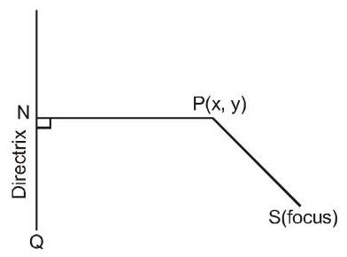

Let $\mathrm{S}$ be the focus, $\mathrm{{QN}}$ be the directrix and $\mathrm{P}$ be any point on the ellipse. Then, by definition,

$$
\frac{\mathrm{{PS}}}{\mathrm{{PN}}} = \mathrm{e}\text{ or }
$$

$\mathrm{{PS}} = \mathrm{e}\mathrm{{PN}},\mathrm{e} < 1$ , where $\mathrm{{PN}}$ is the length of the perpendicular from $\mathrm{P}$ on the directrix $\mathrm{{QN}}$ .

An Alternate Definition An ellipse is the locus of a point that moves in such a way that the sum of its distacnes from two fixed points (called foci) is constant.

## Solved Examples

Ex. 1 Find the equation to the ellipse whose focus is the point(-1,1), whose directrix is the straight line $\mathrm{x} - \mathrm{y} + 3 = 0$ and eccentricity is $\frac{1}{2}$ .

Sol. Let $\mathrm{P} \equiv  \left( {\mathrm{h},\mathrm{k}}\right)$ be moving point,

$$
\mathrm{e} = \frac{\mathrm{{PS}}}{\mathrm{{PM}}} = \frac{1}{2}
$$

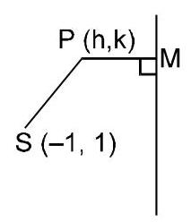

$\Rightarrow  {\left( \mathrm{h} + 1\right) }^{2} + {\left( \mathrm{k} - 1\right) }^{2}$

$= \frac{1}{4}{\left( \frac{h - k + 3}{\sqrt{2}}\right) }^{2}$

$\Rightarrow$ locus of $\mathrm{P}\left( {\mathrm{h},\mathrm{k}}\right)$ is

$8\left\{  {{x}^{2} + {y}^{2} + {2x} - {2y} + 2}\right\}$

$= \left( {{x}^{2} + {y}^{2} - {2xy} + {6x} - {6y} + 9}\right)$

$7{x}^{2} + 7{y}^{2} + {2xy} + {10x} - {10y} + 7 = 0.$ Note :

The general equation of a conic with focus $\left( {\mathrm{p},\mathrm{q}}\right) \&$ directrix $\ell \mathrm{x} + \mathrm{{my}} + \mathrm{n} = 0$ is:

$\left( {{\ell }^{2} + {\mathrm{m}}^{2}}\right) \left\lbrack  {{\left( \mathrm{x} - \mathrm{p}\right) }^{2} + {\left( \mathrm{y} - \mathrm{q}\right) }^{2}}\right\rbrack   = {\mathrm{e}}^{2}{\left( \ell \mathrm{x} + \mathrm{{my}} + \mathrm{n}\right) }^{2}$

$\equiv  a{x}^{2} + {2hxy} + b{y}^{2} + {2gx} + {2fy} + c = 0$

represent ellipse if $0 < \mathrm{e} < 1;\Delta  \neq  0,{\mathrm{\;h}}^{2} < \mathrm{{ab}}$

## EQUATION OF AN ELLIPSE IN STANDARD FORM

The Standard form of the equation of an ellipse is

$$
\frac{{x}^{2}}{{a}^{2}} + \frac{{y}^{2}}{{b}^{2}} = 1\left( {a > b}\right) ,
$$

where $a$ and $b$ are constants.

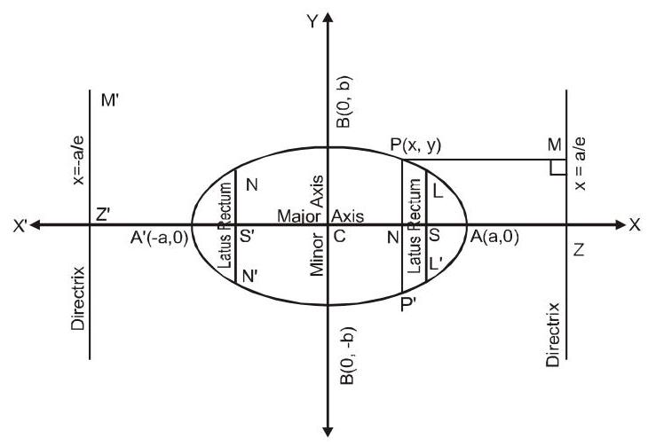

## TERMS RELATED TO AN ELLIPSE

A sketch of the locus of a moving point satisfying the equation $\frac{{x}^{2}}{{a}^{2}} + \frac{{y}^{2}}{{b}^{2}} = 1\left( {a > b}\right)$ , has been shown in the figure given above. Symmetry

(a) On replacing $y$ by -y, the above equation remains unchanged. So, the curve is symmetrical about $\mathrm{x}$ -axis.

(b) On replacing $\mathrm{x}$ by $- \mathrm{x}$ , the above equation remains unchanged. So, the curve is symmetrical about y-axis

Eccentricity: $e = \sqrt{1 - \frac{{b}^{2}}{{a}^{2}}},\left( {0 < e < 1}\right)$

Focii : $\mathrm{S} \equiv  \left( {\mathrm{{ae}},0}\right) \& {\mathrm{\;S}}^{\prime } \equiv  \left( {-\mathrm{{ae}},0}\right)$ .

Equations of Directrices : $x = \frac{a}{e}\& x =  - \frac{a}{e}$ .

Major Axis : The line segment A'A in which the focii ${\mathrm{S}}^{\prime }\& \mathrm{\;S}$ lie is of length $2\mathrm{a}\&$ is called the major axis (a > b) of the ellipse. Point of intersection of major axis with directrix is called the foot of the directrix (Z).

Minor Axis : The y-axis intersects the ellipse in the points ${\mathrm{B}}^{\prime } \equiv  \left( {{0}^{\prime } - \mathrm{b}}\right) \& \mathrm{\;B} \equiv  \left( {0,\mathrm{\;b}}\right)$ . The line segment B'B is of length $2\mathrm{\;b}\left( {\mathrm{\;b} < \mathrm{a}}\right)$ is called the minor axis of the ellipse.

Principal Axis : The major & minor axes together are called principal axis of the ellipse.

Vertices : Point of intersection of ellipse with major axis. ${\mathrm{A}}^{\prime } \equiv  \left( {-\mathrm{a},0}\right) \& \mathrm{\;A} \equiv  \left( {\mathrm{a},0}\right)$ .

Focal Chord : A chord which passes through a focus is called a focal chord.

Double Ordinate : A chord perpendicular to the major axis is called a double ordinate.

Latus Rectum : The focal chord perpendicular to the major axis is called the latus rectum.

Length of latus rectum (LLY)

$$
= \frac{2{b}^{2}}{a} = \frac{{\left( \text{ minor }axis\right) }^{2}}{\text{ major axis }} = {2a}\left( {1 - {e}^{2}}\right)
$$

$= 2\mathrm{e}$ (distance from focus to the corresponding directrix)

Centre : The point which bisects every chord of the conic drawn through it, is called the centre of the conic. $\mathrm{C} \equiv  \left( {0,0}\right)$ the origin is the centre of the ellipse

$$
\frac{{x}^{2}}{{a}^{2}} + \frac{{y}^{2}}{{b}^{2}} = 1
$$

Note :

(i) If the equation of the ellipse is given as $\frac{{x}^{2}}{{a}^{2}} + \frac{{y}^{2}}{{b}^{2}} = 1$ and nothing is mentioned then the rule is to assume that $a > b$ .

(ii) If $b > a$ is given, then the $y$ -axis will become major axis and $\mathrm{x}$ -axis will become the minor axis

and all other points and lines will change accordingly.

Equation: $\frac{{x}^{2}}{{a}^{2}} + \frac{{y}^{2}}{{b}^{2}} = 1$ Foci $\left( {0, \pm  \mathrm{{be}}}\right)$ Directrices : $\mathrm{y} =  \pm  \frac{\mathrm{b}}{\mathrm{e}}$ ${\mathrm{a}}^{2} = {\mathrm{b}}^{2}\left( {1 - {\mathrm{e}}^{2}}\right) ,\mathrm{a} < \mathrm{b}$ . $\Rightarrow  \mathrm{e} = \sqrt{1 - \frac{{\mathrm{a}}^{2}}{{\mathrm{\;b}}^{2}}}$

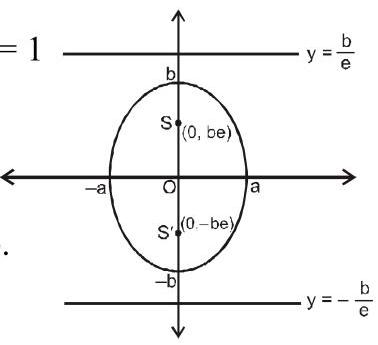

Vertices $\left( {0, \pm  \mathrm{b}}\right)$ ; L.R. $y =  \pm$ be

$\ell \left( {\mathrm{L} \cdot  \mathrm{R} \cdot  }\right)  = \frac{2{\mathrm{a}}^{2}}{\mathrm{\;b}},$ centre $: \left( {0,0}\right)$ TWO STANDARD FORMS OF THE ELLIPSE

<table><tr><td>Standard equation</td><td>$\frac{{x}^{2}}{{a}^{2}} + \frac{{y}^{2}}{{b}^{2}} = 1\left( {a > b}\right)$ (Horizontal Form of an Ellipse)</td><td>$\frac{{x}^{2}}{{b}^{2}} + \frac{{y}^{2}}{{a}^{2}} = 1\;\left( {a > b}\right)$ (Vertical Form of an ellipse)</td></tr><tr><td>Shape of the ellipse</td><td>  </td><td>  </td></tr><tr><td>Centre</td><td>(0,0)</td><td>(0,0)</td></tr><tr><td>Equation of major axis</td><td>y = 0</td><td>$\mathrm{x} = 0$</td></tr><tr><td>Equation of minor axis</td><td>x = 0</td><td>y = 0</td></tr><tr><td>Length of major axis</td><td>2a</td><td>2a</td></tr><tr><td>Length of minor axis</td><td>2b</td><td>2b</td></tr><tr><td>Foci</td><td>$\left( {\pm \text{ae,0}}\right)$</td><td>$\left( {0, \pm  \mathrm{{ae}}}\right)$</td></tr><tr><td>Vertices</td><td>$\left( {\pm \mathrm{a},0}\right)$</td><td>$\left( {0, \pm  \mathrm{a}}\right)$</td></tr><tr><td>Equation of directrices</td><td>$x =  \pm  \frac{a}{e}$</td><td>$y =  \pm  \frac{a}{e}$</td></tr><tr><td>Eccentricity</td><td>$e = \sqrt{\frac{{a}^{2} - {b}^{2}}{{a}^{2}}}$</td><td>$e = \sqrt{\frac{{a}^{2} - {b}^{2}}{{a}^{2}}}$</td></tr><tr><td>Length of latus rectum</td><td>$\frac{2{b}^{2}}{a}$</td><td>$\frac{2{b}^{2}}{a}$</td></tr><tr><td>Ends of latus rectum</td><td>$\left( {\pm \mathrm{{ae}}, \pm  \frac{{\mathrm{b}}^{2}}{\mathrm{a}}}\right)$</td><td>$\left( {\pm \frac{{b}^{2}}{a}, \pm  {ae}}\right)$</td></tr><tr><td>Parametric coordinates</td><td>(a $\cos \theta ,\mathrm{b}\sin \theta$ )</td><td>(a $\cos \theta$ , b $\sin \theta$ )</td></tr><tr><td>Focal radius</td><td>$\mathrm{P} = \mathrm{a} - {\mathrm{{ex}}}_{1}$ and ${\mathrm{S}}^{\prime }\mathrm{P} = \mathrm{a} + {\mathrm{{ex}}}_{1}$</td><td>$\mathrm{{SP}} = \mathrm{a} - {\mathrm{{ey}}}_{1}$ and ${\mathrm{S}}^{\prime }\mathrm{P} = \mathrm{a} + {\mathrm{{ey}}}_{1}$ .</td></tr><tr><td>Sumoffocalradii SP+S'P=</td><td>2a</td><td>2a</td></tr><tr><td>Distance between foci</td><td>2ae</td><td>2ae</td></tr><tr><td>Distance b/w directrices</td><td>$\frac{2\mathrm{a}}{\mathrm{e}}$</td><td>$\frac{2\mathrm{a}}{\mathrm{e}}$</td></tr><tr><td>Tangents at the vertices</td><td>$\mathrm{x} =  \pm  \mathrm{a}$</td><td>y = ± a</td></tr></table>

## Solved Examples

Ex. 2 Find the centre, the length of the axes, eccentricity and the foci of the ellipse.

$$
{12}{x}^{2} + 4{y}^{2} + {24x} - {16y} + {25} = 0
$$

Sol. The given equation can be written in the form

$$
{12}{\left( x + 1\right) }^{2} + 4{\left( y - 2\right) }^{2} = 3
$$

$$
\frac{{\left( x + 1\right) }^{2}}{1/4} + \frac{{\left( y - 2\right) }^{2}}{3/4} = 1 \tag{1}
$$

Co-ordinates of centre of the ellipse are given by

$x + 1 = 0$ and $y - 2 = 0$

hence centre of the ellipse is(-1,2)

If $a$ and $b$ be the lengths of the semi major and semi minor axes, then ${\mathrm{a}}^{2} = 3/4,{\mathrm{\;b}}^{2} = 1/4$

$\therefore$ Length of major axis $= 2\mathrm{a} = \sqrt{3}$ ,

Length of minor axis $= 2\mathrm{\;b} = 1\;\therefore \mathrm{a} = \frac{\sqrt{3}}{2},\mathrm{\;b} = \frac{1}{2}$

Since ${b}^{2} = {a}^{2}\left( {1 - {e}^{2}}\right) \;\therefore 1/4 = 3/4\left( {1 - {e}^{2}}\right)$

$\Rightarrow  \mathrm{e} = \sqrt{2/3}\;\therefore \mathrm{{ae}} = \frac{\sqrt{3}}{2} \times  \frac{\sqrt{2}}{\sqrt{3}} = \frac{1}{\sqrt{2}}$ ,

Co-ordinates of foci are given by

$\mathrm{x} + 1 = 0,\mathrm{y} - 2 =  \pm$ ae

Thus foci are $\left( {-1,2 \pm  \frac{1}{\sqrt{2}}}\right)$

Ex. 3 Find the equation of the ellipse having its centre at the point(2, - 3)one focus at(3, - 3)and one vertex at (4, - 3).

Sol. $\mathrm{C} \equiv  \left( {2, - 3}\right) ,\mathrm{S} \equiv  \left( {3, - 3}\right)$ and $\mathrm{A} \equiv  \left( {4, - 3}\right)$

Now $\mathrm{{CA}} = \sqrt{{\left( 4 - 2\right) }^{2} + {\left( -3 + 3\right) }^{2}} = 2$

$\therefore \mathrm{a} = 2$

Again $\mathrm{{CA}} = \sqrt{{\left( 3 - 2\right) }^{2} + {\left( -3 + 3\right) }^{2}} = 1$

$\therefore \mathrm{{ae}} = 1\;\therefore \mathrm{e} = \frac{1}{\mathrm{a}} = \frac{1}{2}$

Let the directrix cut the major-axis at $Q$ .

Then $\frac{\mathrm{{AS}}}{\mathrm{{AQ}}} = \mathrm{e} = \frac{1}{2}$

If $Q \equiv  \left( {\alpha ,\beta }\right)$ , then $\mathrm{{SA}} : \mathrm{{AQ}} = \mathrm{e} : 1 = 1 : 2$

$$
\therefore \mathrm{A} = \left( {\frac{\alpha  + 6}{3},\frac{\beta  - 6}{3}}\right)  = \left( {4, - 3}\right)
$$

$$
\Rightarrow  \;\frac{\alpha  + 6}{3} = 4,\frac{\beta  - 6}{3} =  - 3\;\therefore \;\alpha  = 6,\beta  =  - 3
$$

Slope of $\mathrm{{CA}} = 0$ , therefore directrix will be parallel to y-axis.

Since directrix is parallel to y-axis and it passes through point $\mathrm{Q}\left( {6, - 3}\right)$

$\therefore$ equation of directrix will be $\mathrm{x} = 6$

Let $\mathrm{P}\left( {\mathrm{x},\mathrm{y}}\right)$ is a point on ellipse. then

$$
e = \frac{1}{2} = \frac{PS}{PN} = \frac{\sqrt{{\left( x - 3\right) }^{2} + {\left( y + 3\right) }^{2}}}{\left| x - 6/\sqrt{{1}^{2}}\right| }
$$

$$
\therefore \frac{1}{4} = \frac{{\left( x - 3\right) }^{2} + {\left( y + 3\right) }^{2}}{{\left( x - 6\right) }^{2}}\text{;}
$$

$$
{\left( x - 6\right) }^{2} = 4\left\lbrack  {{\left( x - 3\right) }^{2} + {\left( y + 3\right) }^{2}}\right\rbrack
$$

$$
\text{or}{x}^{2} - {12x} + {36} = 4\left\lbrack  {{x}^{2} - {6x} + 9 + {y}^{2} + {6y} + 9}\right\rbrack
$$

or $3{x}^{2} + 4{y}^{2} - {12x} + {24y} + {36} = 0$

Ex. 4 Find the equation to the ellipse whose centre is origin, axes are the axes of co-ordinate and passes through the points(2,2)and(3,1).

Sol. Let the equation to the ellipse is $\frac{{x}^{2}}{{a}^{2}} + \frac{{y}^{2}}{{b}^{2}} = 1$

Since it passes through the points(2,2)and(3,1)

$$
\therefore \frac{4}{{a}^{2}} + \frac{4}{{b}^{2}} = 1 \tag{i}
$$

$$
\text{and}\frac{9}{{a}^{2}} + \frac{1}{{b}^{2}} = 1 \tag{ii}
$$

from (i) -4 (ii), we get

$$
\frac{4 - {36}}{{a}^{2}} = 1 - 4\; \Rightarrow  \;{a}^{2} = \frac{32}{3}
$$

from (i), we get

$$
\frac{1}{{b}^{2}} = \frac{1}{4} - \frac{3}{32} = \frac{8 - 3}{32}\;{b}^{2} = \frac{32}{5}
$$

$\therefore$ Ellipse is $3{x}^{2} + 5{y}^{2} = {32}$

Ex. 5 Find the equation of the ellipse whose focii are (4,0)and(-4,0)and eccentricity is $\frac{1}{3}$

Sol. Since both focus lies on x-axis, therefore x-axis is major axis and mid point of focii is origin which is centre and a line perpendicular to major axis and passes through centre is minor axis which is y-axis.

Let equation of ellipse is $\frac{{x}^{2}}{{a}^{2}} + \frac{{y}^{2}}{{b}^{2}} = 1$

$\because \mathrm{{ae}} = 4\;$ and $\;\mathrm{e} = \frac{1}{3}$ (Given)

$\therefore a = {12}\;$ and $\;{b}^{2} = {a}^{2}\left( {1 - {e}^{2}}\right)$

$\Rightarrow  {\mathrm{b}}^{2} = {144}\left( {1 - \frac{1}{9}}\right)$

${\mathrm{b}}^{2} = {16} \times  8$

$$
\text{b = 8}\sqrt{2}
$$

Equation of ellipse is $\frac{{x}^{2}}{144} + \frac{{y}^{2}}{128} = 1$

Ex. 6 If minor-axis of ellipse subtend a right angle at its focus then find the eccentricity of ellipse.

Sol. Let the equation of ellipse is $\frac{{x}^{2}}{{a}^{2}} + \frac{{y}^{2}}{{b}^{2}} = 1$

$\left( {a > b}\right)$

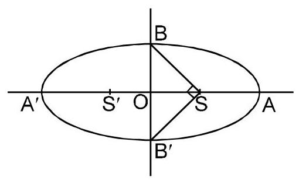

$\because \angle {\mathrm{{BSB}}}^{\prime } = \frac{\pi }{2}$

and $\;\mathrm{{OB}} = {\mathrm{{OB}}}^{\prime }$

$$
\therefore \angle \mathrm{{BSO}} = \frac{\pi }{4}
$$

$$
\Rightarrow  \mathrm{{OS}} = \mathrm{{OB}}
$$

$$
\Rightarrow  {\mathrm{e}}^{2} = \frac{{\mathrm{b}}^{2}}{{\mathrm{a}}^{2}} = 1 - {\mathrm{e}}^{2}\; \Rightarrow  \;\mathrm{e} = \frac{1}{\sqrt{2}}
$$

### Ex.7 From a point $Q$ on the circle ${x}^{2} + {y}^{2} = {a}^{2}$ , perpendicular QM are drawn to $\mathrm{x}$ -axis, find the locus of point 'P' dividing QM in ratio $2 : 1$ .

Sol. Let

$$
\mathrm{Q} \equiv  \left( {\mathrm{a}\cos \theta ,\mathrm{a}\sin \theta }\right)
$$

$$
\mathrm{M} \equiv  \left( {\mathrm{a}\cos \theta ,0}\right)
$$

Let

$$
\mathrm{P} \equiv  \left( {\mathrm{h},\mathrm{k}}\right)
$$

$$
\mathrm{h} = \mathrm{a}\cos \theta ,\mathrm{k} = \frac{\mathrm{a}\sin \theta }{3}
$$

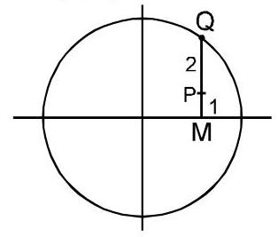

$\therefore$

$$
{\left( \frac{3k}{a}\right) }^{2} + {\left( \frac{h}{a}\right) }^{2} = 1
$$

$\Rightarrow  \;$ Locus of $\mathrm{P}$ is $\frac{{\mathrm{x}}^{2}}{{\mathrm{a}}^{2}} + \frac{{\mathrm{y}}^{2}}{{\left( \mathrm{a}/3\right) }^{2}} = 1$

Ex. 8 Find the equation of axes, directrix, co-ordinate of focii, centre, vertices, length of latus - rectum and eccentricity of an ellipse $\frac{{\left( x - 3\right) }^{2}}{25} + \frac{{\left( y - 2\right) }^{2}}{16} = 1$ .

Sol. Let $x - 3 = X, y - 2 = Y$ , so equation of ellipse

becomes as $\frac{{x}^{2}}{{5}^{2}} + \frac{{y}^{2}}{{4}^{2}} = 1$ .

equation of major axis is $\mathrm{Y} = 0$ $\Rightarrow  \mathrm{y} = 2$ .

equation of minor axis is $\mathrm{X} = 0$

centre $\left( {\mathrm{X} = 0,\mathrm{Y} = 0}\right)$ $\Rightarrow  \mathrm{x} = 3,\mathrm{y} = 2$

$\mathrm{C} \equiv  \left( {3,2}\right)$

Length of semi-major axis $a = 5$

Length of major axis $2\mathrm{a} = {10}$

Length of semi-minor axis $b = 4$

Length of minor axis $= 2\mathrm{\;b} = 8$ .

Let 'e' be eccentricity

$\therefore {\mathrm{b}}^{2} = {\mathrm{a}}^{2}\left( {1 - {\mathrm{e}}^{2}}\right)$

$\mathrm{e} = \sqrt{\frac{{\mathrm{a}}^{2} - {\mathrm{b}}^{2}}{{\mathrm{a}}^{2}}} = \sqrt{\frac{{25} - {16}}{25}} = \frac{3}{5}.$

Length of latus rectum $= {\mathrm{{LL}}}^{\prime } = \frac{2{\mathrm{\;b}}^{2}}{\mathrm{a}} = \frac{2 \times  {16}}{5} = \frac{32}{5}$

Co-ordinates focii are $\mathrm{X} =  \pm$ ae, $\mathrm{Y} = 0$

$\Rightarrow  \mathrm{S} \equiv  \left( {\mathrm{X} = 3,\mathrm{Y} = 0}\right) \;\& \;{\mathrm{\;S}}^{\prime } \equiv  \left( {\mathrm{X} =  - 3,\mathrm{Y} = 0}\right)$

$\Rightarrow  \mathrm{S} \equiv  \left( {6,2}\right)$ & S' $\equiv  \left( {0,2}\right)$

## Co-ordinate of vertices

Extremities of major axis

$\mathrm{A} \equiv  \left( {\mathrm{X} = \mathrm{a},\mathrm{Y} = 0}\right) \;\& \;{\mathrm{\;A}}^{\prime } \equiv  \left( {\mathrm{X} =  - \mathrm{a},\mathrm{Y} = 0}\right)$

$\Rightarrow  \mathrm{A} \equiv  \left( {\mathrm{x} = 8,\mathrm{y} = 2}\right) \& \;{\mathrm{\;A}}^{\prime } = \left( {\mathrm{x} =  - 2,2}\right)$

A $\equiv  \left( {8,2}\right)$ & ${\mathrm{A}}^{\prime } \equiv  \left( {-2,2}\right)$

Extremities of minor axis

$\mathrm{B} \equiv  \left( {\mathrm{X} = 0,\mathrm{Y} = \mathrm{b}}\right) \;\& \;{\mathrm{\;B}}^{\prime } \equiv  \left( {\mathrm{X} = 0,\mathrm{Y} =  - \mathrm{b}}\right)$

$\mathrm{B} \equiv  \left( {\mathrm{x} = 3,\mathrm{y} = 6}\right) \;\& \;{\mathrm{\;B}}^{\prime } \equiv  \left( {\mathrm{x} = 3,\mathrm{y} =  - 2}\right)$

B ≡ (3,6) & ${\mathrm{B}}^{\prime } \equiv  \left( {3, - 2}\right)$

Equation of directrix $\mathrm{X} =  \pm  \frac{\mathrm{a}}{\mathrm{e}}$

$\mathrm{x} - 3 =  \pm  \frac{25}{3}\; \Rightarrow  \;\mathrm{x} = \frac{34}{3}\;\& \;\mathrm{x} =  - \frac{16}{3}$

## Auxillary Circle

The circle drawn on major axis AA' as diameter is known as the Auciliary circle.

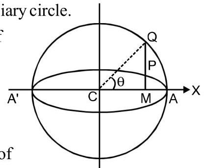

Let the equation of the ellipse be $\frac{{x}^{2}}{{a}^{2}} + \frac{{y}^{2}}{{b}^{2}} = 1$

Then the equation of its auxiliary circle is ${x}^{2} + {y}^{2} = {a}^{2}$ .

Let $\mathrm{Q}$ be a point on auxiliary circle so that $\mathrm{{QM}}$ , perpendicular to major axis meets the ellipse at $\mathrm{P}$ . The points $\mathrm{P}$ and $\mathrm{Q}$ are called as corresponding point on the ellipse and auxiliary circle respectively.

The angle $\theta$ is known as eccentric angle of the point $\mathrm{P}$ on the ellipse.

It may be noted that the $\mathrm{{CQ}}$ and not $\mathrm{{CP}}$ is inclined at $\theta$ with $\mathrm{x}$ -axis.

Note that :

$$
\frac{\ell \left( \mathrm{{PM}}\right) }{\ell \left( \mathrm{{QM}}\right) } = \frac{\mathrm{b}}{\mathrm{a}} = \frac{\text{ Semi minor axis }}{\text{ Semi major axis }}
$$

## NOTE :

If from each point of a circle perpendiculars are drawn upon a fixed diameter then the locus of the points dividing these perpendiculars in a given ratio is an ellipse of which the given circle is the auxiliary circle. Ellipse

## Solved Examples

Ex. 9 Find the focal distance of a point $\mathrm{P}\left( \theta \right)$ on the ellipse

$$
\frac{{x}^{2}}{{a}^{2}} + \frac{{y}^{2}}{{b}^{2}} = 1\;\left( {a > b}\right)
$$

Sol. Let 'e' be the eccentricity of ellipse.

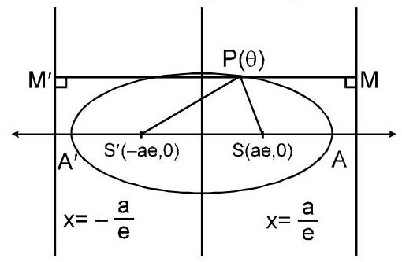

$\therefore$

$$
\mathrm{{PS}} = \mathrm{e} \cdot  \mathrm{{PM}} = \mathrm{e}\left( {\frac{\mathrm{a}}{\mathrm{e}} - \mathrm{a}\cos \theta }\right)
$$

$$
\text{PS} = \left( {a - {ae}\cos \theta }\right)
$$

$$
\text{and}\;{\mathrm{{PS}}}^{\prime } = \mathrm{e}.{\mathrm{{PM}}}^{\prime } = \mathrm{e}\left( {\mathrm{a}\cos \theta  + \frac{\mathrm{a}}{\mathrm{e}}}\right)
$$

$$
{\mathrm{{PS}}}^{\prime } = \mathrm{a} + \mathrm{{ae}}\cos \theta
$$

$\therefore \;$ focal distance are $\left( {a \pm  {ae}\cos \theta }\right)$

Note : $\;\mathrm{{PS}} + {\mathrm{{PS}}}^{\prime } = 2\mathrm{a}\;\mathrm{{PS}} + {\mathrm{{PS}}}^{\prime } = {\mathrm{{AA}}}^{\prime }$

Ex. 10 Find the distance from centre of the point $\mathrm{P}$ on the ellipse $\frac{{x}^{2}}{{a}^{2}} + \frac{{y}^{2}}{{b}^{2}} = 1$ whose radius makes angle $\alpha$ with x-axis.

Sol. Let $\mathrm{P} \equiv  \left( {\mathrm{a}\cos \theta ,\mathrm{b}\sin \theta }\right)$

$$
\therefore {\mathrm{m}}_{\left( \mathrm{{op}}\right) } = \frac{\mathrm{b}}{\mathrm{a}}\tan \theta  = \tan \alpha  \Rightarrow  \tan \theta  = \frac{\mathrm{a}}{\mathrm{b}}\tan \alpha
$$

$$
\mathrm{{OP}} = \sqrt{{\mathrm{a}}^{2}{\cos }^{2}\theta  + {\mathrm{b}}^{2}{\sin }^{2}\theta } = \sqrt{\frac{{\mathrm{a}}^{2} + {\mathrm{b}}^{2}{\tan }^{2}\theta }{{\sec }^{2}\theta }}
$$

$$
= \sqrt{\frac{{a}^{2} + {b}^{2}{\tan }^{2}\theta }{1 + {\tan }^{2}\theta }} = \sqrt{\frac{{a}^{2} + {b}^{2} \times  \frac{{a}^{2}}{{b}^{2}}{\tan }^{2}\alpha }{1 + \frac{{a}^{2}}{{b}^{2}}{\tan }^{2}\alpha }}
$$

$$
\mathrm{{OP}} = \frac{\mathrm{{ab}}}{\sqrt{{\mathrm{a}}^{2}{\sin }^{2}\alpha  + {\mathrm{b}}^{2}{\cos }^{2}\alpha }}
$$

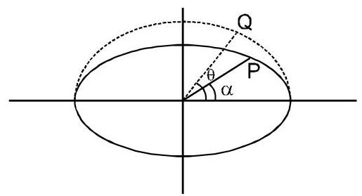

## PARAMETRIC EQUATION OF THE ELLIPSE

The coordinates $\mathrm{x} = \mathrm{a}\cos \theta$ and $\mathrm{y} = \mathrm{b}\sin \theta$ satisfy the equation

$$
\frac{{x}^{2}}{{a}^{2}} + \frac{{y}^{2}}{{b}^{2}} = 1
$$

for all real values of $\theta$ . Thus, $x = a\cos \theta , y = b$ $\sin \theta$ are the parametric equation of the ellipse $\frac{{x}^{2}}{{a}^{2}} + \frac{{y}^{2}}{{b}^{2}} = 1$ , where the parameter $0 \leq   < {2\pi }$ .

Hence the coordinates of any point on the ellipse

$$
\frac{{x}^{2}}{{a}^{2}} + \frac{{y}^{2}}{{b}^{2}} = 1
$$

may be taken as (a $\cos \theta ,\mathrm{b}\sin \theta$ ). This point is also called the point ’ $\theta$ ’.

The angle $\theta$ is called the eccentric angle of the point (a $\cos \theta ,\mathrm{b}\sin \theta$ ) on the ellipse.

## Equation of Chord

The equation of the chord joining the points $\mathrm{P} \equiv  ($ acos $\left. {{\theta }_{1}\text{, bsin}{\theta }_{1}}\right)$ and $Q \equiv  \left( {\operatorname{acos}{\theta }_{2}\text{, bsin}{\theta }_{2}}\right)$ is

$$
\frac{x}{a}\cos \left( \frac{{\theta }_{1} + {\theta }_{2}}{2}\right)  + \frac{y}{b}\sin \left( \frac{{\theta }_{1} + {\theta }_{2}}{2}\right)  = \cos \left( \frac{{\theta }_{1} - {\theta }_{2}}{2}\right) .
$$

## Solved Examples

Ex. 11 Write the equation of chord of an ellipse

$$
\frac{{x}^{2}}{25} + \frac{{y}^{2}}{16} = 1\text{ joining two points }P\left( \frac{\pi }{4}\right) \text{ and }Q\left( \frac{5\pi }{4}\right) .
$$

Sol. Equation of chord is $\frac{x}{5}\cos \frac{\left( \frac{\pi }{4} + \frac{5\pi }{4}\right) }{2} + \frac{y}{4}$ .

$$
\sin \frac{\left( \frac{\pi }{4} + \frac{5\pi }{4}\right) }{2} = \cos \frac{\left( \frac{\pi }{4} - \frac{5\pi }{4}\right) }{2}
$$

$$
\frac{x}{5} \cdot  \cos \left( \frac{3\pi }{4}\right)  + \frac{y}{4} \cdot  \sin \left( \frac{3\pi }{4}\right)  = 0
$$

$$
- \frac{x}{5} + \frac{y}{4} = 0\; \Rightarrow  \;{4x} = {5y}
$$

Ex. 12 If $\mathrm{P}\left( \alpha \right)$ and $\mathrm{P}\left( \beta \right)$ are extremities of a focal chord

of ellipse then prove that its eccentricity

$$
\mathrm{e} = \left| \frac{\cos \left( \frac{\alpha  - \beta }{2}\right) }{\cos \left( \frac{\alpha  + \beta }{2}\right) }\right| .
$$

Sol. Let the equation of ellipse is $\frac{{x}^{2}}{{a}^{2}} + \frac{{y}^{2}}{{b}^{2}} = 1$

$\therefore$ equation of chord is $\frac{x}{a}\cos \left( \frac{\alpha  + \beta }{2}\right)  + \frac{y}{b}$

$\sin \left( \frac{\alpha  + \beta }{2}\right)  = \cos \left( \frac{\alpha  - \beta }{2}\right)$

Since above chord is focal chord,

$\therefore$ it passes through focus (ae,0) or(-ae,0)

$\therefore  \pm  \mathrm{e}\cos \left( \frac{\alpha  + \beta }{2}\right)  = \cos \left( \frac{\alpha  - \beta }{2}\right)$

$\therefore \mathrm{e} = \left| \frac{\cos \left( \frac{\alpha  - \beta }{2}\right) }{\cos \left( \frac{\alpha  + \beta }{2}\right) }\right|$ Ans.

Note :

$$
\because  \pm  \mathrm{e} = \frac{\cos \frac{\alpha  - \beta }{2}}{\cos \frac{\alpha  + \beta }{2}} \Rightarrow   \pm  \mathrm{e} = \frac{1 + \tan \frac{\alpha }{2} \cdot  \tan \frac{\beta }{2}}{1 - \tan \frac{\alpha }{2} \cdot  \tan \frac{\beta }{2}}
$$

Applying componendo and dividendo

$$
\frac{1 \pm  e}{\pm e - 1} = \frac{2}{2\tan \frac{\alpha }{2} \cdot  \tan \frac{\beta }{2}}
$$

$$
\tan \frac{\alpha }{2}\tan \frac{\beta }{2} = \frac{1 + e}{e - 1}\text{ or }\frac{e - 1}{1 + e}
$$

Ex. 13 Find the angle between two diameters of the ellipse $\frac{{x}^{2}}{{a}^{2}} + \frac{{y}^{2}}{{b}^{2}} = 1$ . Whose extremities have eccentricity angle $\alpha$ and $\beta  = \alpha  + \frac{\pi }{2}$ .

Sol. Let ellipse is $\frac{{x}^{2}}{{a}^{2}} + \frac{{y}^{2}}{{b}^{2}} = 1$

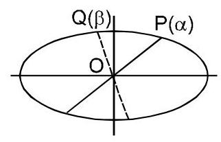

Slope of $\mathrm{{OP}} = {\mathrm{m}}_{1} = \frac{\mathrm{b}\sin \alpha }{\mathrm{a}\cos \alpha } = \frac{\mathrm{b}}{\mathrm{a}}\tan \alpha$

Slope of $\mathrm{{OQ}} = {\mathrm{m}}_{2} = \frac{\mathrm{b}\sin \beta }{\mathrm{a}\cos \beta } =  - \frac{\mathrm{b}}{\mathrm{a}}\cot \alpha$

given $\beta  = \alpha  + \frac{\pi }{2}$

$\therefore \tan \theta  = \left| \frac{{m}_{1} - {m}_{2}}{1 + {m}_{1}{m}_{2}}\right|  = \left| {\;\frac{\frac{b}{a}\left( {\tan \alpha  + \cot \alpha }\right) }{1 - \frac{{b}^{2}}{{a}^{2}}}}\right.$

$$
= \left| \frac{2ab}{\left( {{a}^{2} - {b}^{2}}\right) \sin {2\alpha }}\right|
$$

## POSITION OF A POINT WITH  RESPECT TO AN ELLIPSE

The point $\mathrm{P}\left( {{\mathrm{x}}_{1},{\mathrm{y}}_{1}}\right)$ lies outside, on or inside the ellipse

$$
\frac{{x}^{2}}{{a}^{2}} + \frac{{y}^{2}}{{b}^{2}} = 1\text{ according as }
$$

$$
\frac{{x}_{1}^{2}}{{a}^{2}} + \frac{{y}_{1}^{2}}{{b}^{2}} - 1 > 0, = 0\text{ or } < 0.
$$

## Solved Examples

Ex. 14 Check whether the point $\mathrm{P}\left( {3,2}\right)$ lies inside or outside of the ellipse $\frac{{x}^{2}}{25} + \frac{{y}^{2}}{16} = 1$ . Sol. ${\mathrm{S}}_{1} \equiv  \frac{9}{25} + \frac{4}{16} - 1 = \frac{9}{25} + \frac{1}{4} - 1 < 0$ $\therefore$ Point $\mathrm{P} \equiv  \left( {3,2}\right)$ lies inside the ellipse. Ex. 15 Find the set of value(s) of ’ $\alpha$ ’ for which the point $\mathrm{P}\left( {\alpha , - \alpha }\right)$ lies inside the ellipse $\frac{{\mathrm{x}}^{2}}{16} + \frac{{\mathrm{y}}^{2}}{9} = 1$ . Sol. If $\mathrm{P}\left( {\alpha , - \alpha }\right)$ lies inside the ellipse

$$
\therefore {\mathrm{S}}_{1} < 0
$$

$$
\Rightarrow  \frac{{\alpha }^{2}}{16} + \frac{{\alpha }^{2}}{9} - 1 < 0
$$

$$
\Rightarrow  \frac{25}{144} \cdot  {\alpha }^{2} < 1\; \Rightarrow  \;{\alpha }^{2} < \frac{144}{25}
$$

$$
\therefore \alpha  \in  \left( {-\frac{12}{5},\frac{12}{5}}\right) \text{.}
$$

## CONDITION OF TANGENCY AND  POINT OF CONTACT

The condition for the line $\mathrm{y} = \mathrm{{mx}} + \mathrm{c}$ to be a tangent to the ellipse $\frac{{x}^{2}}{{a}^{2}} + \frac{{y}^{2}}{{b}^{2}} = 1$ is that ${c}^{2} = {a}^{2}{m}^{2} + {b}^{2}$ and the coordinates of the points of contact are

$$
\left( {\pm \frac{{a}^{2}m}{\sqrt{{a}^{2}{m}^{2} + {b}^{2}}}, \mp  \frac{{b}^{2}}{\sqrt{{a}^{2}{m}^{2} + {b}^{2}}}}\right)
$$

Note

* $\mathrm{x}\cos \mathrm{a} + \mathrm{y}\sin \mathrm{a} = \mathrm{p}$ is a tangent if

$$
{\mathrm{p}}^{2} = {\mathrm{a}}^{2}{\cos }^{2}\alpha  + {\mathrm{b}}^{2}{\sin }^{2}\alpha .
$$

$1\mathrm{x} + \mathrm{{my}} + \mathrm{n} = 0$ is a tangent if ${\mathrm{n}}^{2} = {\mathrm{a}}^{2}{\mathrm{l}}^{2} + {\mathrm{b}}^{2}{\mathrm{\;m}}^{2}$ .

## Solved Examples

Ex. 16 Find the set of value(s) of ’ $\lambda$ ’ for which the line ${3x} - {4y} + \lambda  = 0$ intersect the ellipse $\frac{{x}^{2}}{16} + \frac{{y}^{2}}{9} = 1$ at two distinct points.

Sol. Solving given line with ellipse,

$$
\text{we get}\frac{{\left( 4y - \lambda \right) }^{2}}{9 \times  {16}} + \frac{{y}^{2}}{9} = 1
$$

$$
\frac{2{y}^{2}}{9} - \frac{y\lambda }{18} + \frac{{\lambda }^{2}}{144} - 1 = 0
$$

Since, line intersect the parabola at two distinct points,

$\therefore$ roots of above equation are real &distinct

$\therefore \mathrm{D} > 0$

$$
\Rightarrow  \frac{{\lambda }^{2}}{{\left( {18}\right) }^{2}} - \frac{8}{9} \cdot  \left( {\frac{{\lambda }^{2}}{144} - 1}\right)  > 0
$$

$$
\Rightarrow   - {12}\sqrt{2} < \lambda  < {12}\sqrt{2}
$$

## Tangents :

(a) Slope form: $y = {mx} \pm  \sqrt{{a}^{2}{m}^{2} + {b}^{2}}$ is tangent to the ellipse $\frac{{x}^{2}}{{a}^{2}} + \frac{{y}^{2}}{{b}^{2}} = 1$ for all values of $m$ .

(b) Point form: $\frac{{\mathrm{{xx}}}_{1}}{{\mathrm{a}}^{2}} + \frac{{\mathrm{{yy}}}_{1}}{{\mathrm{\;b}}^{2}} = 1$ is tangent to the ellipse

$$
\frac{{x}^{2}}{{a}^{2}} + \frac{{y}^{2}}{{b}^{2}} = 1\text{ at }\left( {{x}_{1},{y}_{1}}\right) .
$$

(c) Parametric form: $\frac{x\cos \theta }{a} + \frac{y\sin \theta }{b} = 1$ is tangent to the ellipse $\frac{{x}^{2}}{{a}^{2}} + \frac{{y}^{2}}{{b}^{2}} = 1$ at the point $\left( {a\cos \theta , b\sin \theta }\right)$ .

Note :

(i) There are two tangents to the ellipse having the same $\mathrm{m}$ , i.e. there are two tangents parallel to any given direction.These tangents touches the ellipse at extremities of a diameter.

(ii) Point of intersection of the tangents at the point $\alpha \&$

$$
\beta \text{is,}\left( {a\frac{\cos \frac{\alpha  + \beta }{2}}{\cos \frac{\alpha  - \beta }{2}}, b\frac{\sin \frac{\alpha  + \beta }{2}}{\cos \frac{\alpha  - \beta }{2}}}\right)
$$

(iii) The eccentric angles of the points of contact of two parallel tangents differ by $\pi$ .

## Solved Examples

Ex. 17 Find the equations of the tangents to the ellipse $3{x}^{2} + 4{y}^{2} = {12}$ which are perpendicular to the line $y + {2x} = 4$ .

Sol. Slope of tangent $= \mathrm{m} = \frac{1}{2}$

Given ellipse is $\frac{{x}^{2}}{4} + \frac{{y}^{2}}{3} = 1$

Equation of tangent whose slope is ’ $m$ ’ is

$$
\mathrm{y} = \mathrm{{mx}} \pm  \sqrt{4{\mathrm{\;m}}^{2} + 3}
$$

$$
\because \mathrm{m} = \frac{1}{2}
$$

$$
\therefore \mathrm{y} = \frac{1}{2}\mathrm{x} \pm  \sqrt{1 + 3}
$$

$$
2\mathrm{y} = \mathrm{x} \pm  4
$$

Ex. 18 For what value of $\lambda$ does the line $y = x + \lambda$ touches the ellipse $9{x}^{2} + {16}{y}^{2} = {144}$ .

Sol. :: Equation of ellipse is

$9{x}^{2} + {16}{y}^{2} = {144}\;$ or $\;\frac{{x}^{2}}{16} + \frac{{y}^{2}}{9} = 1$

Comparing this with $\frac{{x}^{2}}{{a}^{2}} + \frac{{y}^{2}}{{b}^{2}} = 1$

then we get ${a}^{2} = {16}$ and ${b}^{2} = 9$

and comparing the line $\mathrm{y} = \mathrm{x} + \lambda$ with $\mathrm{y} = \mathrm{{mx}} + \mathrm{c}$

$\therefore \;\mathrm{m} = 1$ and $\mathrm{c} = \lambda$

If the line $\mathrm{y} = \mathrm{x} + \lambda$ touches the ellipse

$9{x}^{2} + {16}{y}^{2} = {144}$ , then ${c}^{2} = {a}^{2}{m}^{2} + {b}^{2}$

$\Rightarrow  {\lambda }^{2} = {16} \times  {1}^{2} + 9\; \Rightarrow  {\lambda }^{2} = {25}\;\therefore \;\lambda  =  \pm  5$

Ex. 19 Find the equation of tangent to the ellipse

$4{x}^{2} + 9{y}^{2} = {36}$ at the point(3, - 2).

Sol. We have $4{x}^{2} + 9{y}^{2} = {36}\; \Rightarrow  \;\frac{{x}^{2}}{9} + \frac{{y}^{2}}{4} = 1$ .

This is of the form $\frac{{x}^{2}}{{a}^{2}} + \frac{{y}^{2}}{{b}^{2}} = 1$ ,

where ${a}^{2} = 9$ and ${b}^{2} = 4$ .

We, know that the equation of the tangent to the

ellipse $\frac{{x}^{2}}{{a}^{2}} + \frac{{y}^{2}}{{b}^{2}} = 1$ at $\left( {{x}_{1},{y}_{1}}\right)$ is $\frac{x{x}_{1}}{{a}^{2}} + \frac{y{y}_{1}}{{b}^{2}} = 1$

So, the eqaution of the tangent to the given ellipse at (3, -2) is

$$
\frac{3x}{9} - \frac{2y}{4} = 1\;\text{ i.e.,}\;\frac{x}{3} - \frac{y}{2} = 1
$$

Ex. 20 Find the equations of the tangetns to the ellipse $3{x}^{2} + 4{y}^{2} = {12}$ which are perpendicular to the line $y + {2x} = 4$ .

Sol. Let $\mathrm{m}$ be the slope of the tangent, since the tangent is perpendicualr to the line $y + {2x} = 4$ .

$\therefore \mathrm{{mx}} - 2 =  - 1\; \Rightarrow  \;\mathrm{m} = \frac{1}{2}$

Since $3{x}^{2} + 4{y}^{2} = {12}\;$ or $\;\frac{{x}^{2}}{4} + \frac{{y}^{2}}{3} = 1$

Comparing this with $\frac{{x}^{2}}{{a}^{2}} + \frac{{y}^{2}}{{b}^{2}} = 1$

$\therefore {\mathrm{a}}^{2} = 4$ and ${\mathrm{b}}^{2} = 3$

So the equation of the tangent are

$y = \frac{1}{2}x \pm  \sqrt{4 \times  \frac{1}{2} + 3}$

$\Rightarrow  \mathrm{y} = \frac{1}{2}\mathrm{x} \pm  2$ $x - {2y} \pm  4 = 0$

Ex. 21 A tangent to the ellipse $\frac{{x}^{2}}{{a}^{2}} + \frac{{y}^{2}}{{b}^{2}} = 1$ touches at the point $\mathrm{P}$ on it in the first quadrant and meets the co-ordinate axes in A and B respectively. If $\mathrm{P}$ divides $\mathrm{{AB}}$ in the ratio $3 : 1$ , find the equation of the tangent.

Sol. Let $\;\mathrm{P} \equiv  \left( {\mathrm{a}\cos \theta ,\mathrm{b}\sin \theta }\right)$

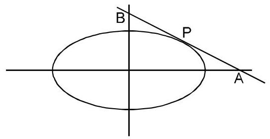

$\therefore$ equation of tangent is

$$
\frac{x}{a}\cos \theta  + \frac{y}{b}\sin \theta  = 1
$$

$\mathrm{A} \equiv  \left( {\mathrm{a}\sec \theta ,0}\right)$ $\mathrm{B} \equiv  \left( {0,\mathrm{\;b}\operatorname{cosec}\theta }\right)$

$\because \mathrm{P}$ divide $\mathrm{{AB}}$ internally in the ratio $3 : 1$

$\therefore a\cos \theta  = \frac{a\sec \theta }{4}$

$\Rightarrow  {\cos }^{2}\theta  = \frac{1}{4}\; \Rightarrow  \;\cos \theta  = \frac{1}{2}$ and

$\mathrm{b}\sin \theta  = \frac{3\mathrm{\;b}\operatorname{cosec}\theta }{4}\; \Rightarrow  \;\sin \theta  = \frac{\sqrt{3}}{2}$

$\therefore$ tangent is $\frac{x}{2a} + \frac{\sqrt{3}y}{2b} = 1$

$\Rightarrow  {bx} + \sqrt{3}$ ay = 2ab

Ex. 22 Prove that the locus of the point of intersection of tangents to an ellipse at two points whose eccentric angle differ by a constant $\alpha$ is an ellipse.

Sol. Let $\mathrm{P}\left( {\mathrm{h},\mathrm{k}}\right)$ be the point of intersection of tangents at $\mathrm{A}\left( \theta \right)$ and $\mathrm{B}\left( \beta \right)$ to the ellipse.

$$
\therefore \mathrm{h} = \frac{a\cos \left( \frac{\theta  + \beta }{2}\right) }{\cos \left( \frac{\theta  - \beta }{2}\right) }\& \mathrm{k} = \frac{b\sin \left( \frac{\theta  + \beta }{2}\right) }{\cos \left( \frac{\theta  - \beta }{2}\right) }
$$

$$
\Rightarrow  {\left( \frac{h}{a}\right) }^{2} + {\left( \frac{k}{b}\right) }^{2} = {\sec }^{2}\left( \frac{\theta  - \beta }{2}\right)
$$

but given that $\theta  - \beta  = \alpha$

$\therefore$ locus is $\frac{{x}^{2}}{{a}^{2}{\sec }^{2}\left( \frac{\alpha }{2}\right) } + \frac{{y}^{2}}{{b}^{2}{\sec }^{2}\left( \frac{\alpha }{2}\right) } = 1$ Ellipse

Ex. 23 Find the locus of foot of perpendicular drawn from centre to any tangent to the ellipse $\frac{{x}^{2}}{{a}^{2}} + \frac{{y}^{2}}{{b}^{2}} = 1$ .

Sol. Let $P\left( {h, k}\right)$ be the foot of perpendicular to a tangent

$$
y = {mx} + \sqrt{{a}^{2}{m}^{2} + {b}^{2}} \tag{i}
$$

from centre

$$
\therefore \frac{\mathrm{k}}{\mathrm{h}} \cdot  \mathrm{m} =  - 1\; \Rightarrow  \;\mathrm{m} =  - \frac{\mathrm{h}}{\mathrm{k}} \tag{ii}
$$

$\because \mathrm{P}\left( {\mathrm{h},\mathrm{k}}\right)$ lies on tangent

$\therefore \mathrm{k} = \mathrm{{mh}} + \sqrt{{\mathrm{a}}^{2}{\mathrm{\;m}}^{2} + {\mathrm{b}}^{2}}$(iii)

from equation (ii) & (iii), we get

$$
{\left( k + \frac{{h}^{2}}{k}\right) }^{2} = \frac{{a}^{2}{h}^{2}}{{k}^{2}} + {b}^{2}
$$

$$
\text{locus is}{\left( {x}^{2} + {y}^{2}\right) }^{2} = {a}^{2}{x}^{2} + {b}^{2}{y}^{2}
$$

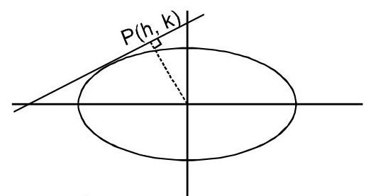

EQUATION OF NORMAL IN

DIFFERENT FORMS

## (i) Point Form

The equation of the normal to the ellipse $\frac{{x}^{2}}{{a}^{2}} + \frac{{y}^{2}}{{b}^{2}} = 1$ at the point $\left( {{x}_{1},{y}_{1}}\right)$ is $\frac{{a}^{2}x}{{x}_{1}} - \frac{{b}^{2}y}{{y}_{1}} = {a}^{2} - {b}^{2}$ .

(ii) Parametric Form

The equation of the normal to the ellipse $\frac{{x}^{2}}{{a}^{2}} + \frac{{y}^{2}}{{b}^{2}} = 1$ at the point (acos $\theta$ , bsin $\theta$ ) is

ax $\sec \theta  -$ by $\operatorname{cosec}\theta  = {a}^{2} - {b}^{2}$ .

or $\frac{ax}{\cos \theta } - \frac{by}{\sin \theta } = {a}^{2} - {b}^{2}$ .

(iii) Slope Form

The equation of normal to the ellipse $\frac{{x}^{2}}{{a}^{2}} + \frac{{y}^{2}}{{b}^{2}} = 1$

in terms of slope ’ $m$ ’ is $y = {mx} \pm  \frac{m\left( {{a}^{2} - {b}^{2}}\right) }{\sqrt{{a}^{2} + {b}^{2}{m}^{2}}}$