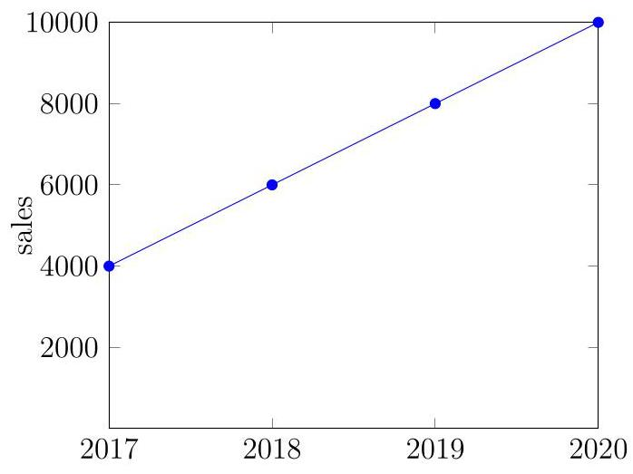
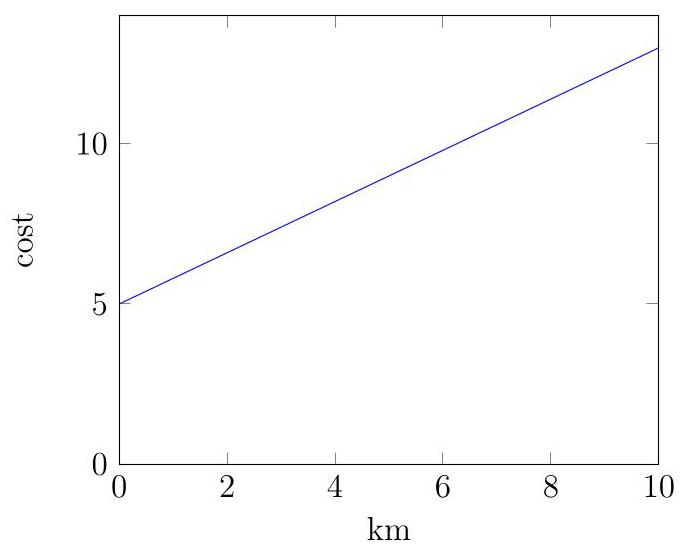

## Math requirements for BBA

This document gives an overview of the mathematical skills we expect from prospective BBA students.

We assume you can with confidence manipulate algebraic expressions such as fractions, powers, roots, polynomials and lineair and quadratic equations. Moreover you are familiar with algebraic and graphical properties of lineair and quadratic functions, and thus with lines and parabolas: you can construct such functions when some points or properties are given, and you can calculate roots, vertices, slopes and intersection points in the cases detailed below.

The simple examples given in this overview are only supposed to indicate what each topic involves. They are no indication of the type of problems you are supposed to be able to solve. But, the 'Examples' at the end do give such an indication.

## 1 Basis Algebraic Skills

## 1. Manipulation of algebraic expressions

a) brackets and distributive properties $a\left( {x + 2}\right)  = {ax} + 2,\left( {x + 2}\right) \left( {x + 3}\right)  = {x}^{2} + {5x} + 6,$

...

b) special products ${\left( a \pm  b\right) }^{2} = {a}^{2} \pm  {2ab} + {b}^{2}$

$\left( {a + b}\right) \left( {a - b}\right)  = {a}^{2} - {b}^{2}$

c) simplification of fractions $\frac{21}{7},\frac{{2ax} + {3a}}{a},\ldots$

d) addition and subtraction of fractions $\frac{1}{2} + \frac{1}{3},\frac{a}{b} + \frac{1}{2},\ldots$

e) multiplication and division of fractions $\frac{1}{2} \cdot  \frac{1}{3},\frac{a}{b} \cdot  \frac{1}{2},\frac{1}{2}/\frac{a}{b},\ldots$

f) exponents ${3}^{2},{x}^{3},\ldots$

g) roots $\sqrt{2},\sqrt{9},\sqrt[3]{27},\sqrt{{x}^{4}}\ldots$ h) substituting values for variables $f\left( 2\right) , f\left( {x + 1}\right) , f\left( a\right)$ when $f\left( x\right)  = {x}^{2} + 1$

## 2. Factoring of polynomials

a) collecting common factors ${2a}{x}^{2}{2abx}a = 4{a}^{3}b{x}^{3}$

b) collecting similar terms ${2a}{x}^{2} + {3x} + 4{x}^{2} + {4x} = \left( {{2a} + 4}\right) {x}^{2} + {7x}$

c) special products with polynomials ${x}^{2} + {2ax} + {a}^{2} = {\left( x + a\right) }^{2}$

## 3. Powers

a) powers with negative exponents ${2}^{-1} = {0.5},{x}^{-1} = \frac{1}{x},\ldots$

b) powers with fractional exponents (radicals) ${5}^{\frac{1}{3}} = \sqrt[3]{5},{x}^{\frac{3}{2}} = x\sqrt{x},\ldots$

c) product/quotient of powers with same base ${2}^{4} \cdot  {2}^{5} = {2}^{9},\frac{{6}^{5}}{{6}^{2}} = {6}^{3},{a}^{x} \cdot  {a}^{y} = {a}^{x + y},\ldots$

d) power of a power ${4}^{{3}^{2}} = {4}^{9}$ but ${\left( {4}^{3}\right) }^{2} = {4}^{6},\ldots$

e) product/quotient of powers with same exponent ${2}^{4} \cdot  {3}^{4} = {6}^{4},\frac{{6}^{5}}{{2}^{5}} = {3}^{5},{a}^{x} \cdot  {b}^{x} = {\left( ab\right) }^{x},\ldots$

## 4. Solving equations

a) linear equations ${2x} + 7 = 5,{ax} + b = 0,\ldots$

b) quadratic equations ${x}^{2} - 4 = 0,2{x}^{2} + {3x} + 4 = 5,\ldots$

c) simple rational equations $\frac{x + 1}{x - 1} = 2,\frac{x + 1}{x - 1} = {2x},\ldots$

d) power equations ${2}^{x} = {16},{3}^{x + 1} = 1,\ldots$

e) simple radical equations $\sqrt{x - 1} = 5,\ldots$

f) equivalence of equations ${2x} + 4 = 0 \Leftrightarrow  x =  - 2$ but,

${\left( x + 2\right) }^{2} = 4 \Leftrightarrow  x = 0$ or $x =  - 4$ g) simple higher order polynomial equations $\left( {x - 1}\right) \left( {x - 2}\right) \left( {x - \pi }\right)  = 0$ or ${x}^{4} + 3{x}^{2} - 4 = 0$

## 5. Simple word problems

a) translate word problems to algebraic equa- Translate 'Al is two years older than Bo' tions into ${a}_{A} = {a}_{B} + 2$ with ${a}_{A}$ the age of $\mathrm{{Al}}$ an ${a}_{B}$ the age of Bo.

## 2 Linear functions

## 1. Concept of linear function

a) the equation of linear function is $y = {mx} + b$ with $m \neq  0$ (i.e. polynomial of degree 1) b) the graph of linear function is a straight line 2. Interpretation of an equation $y = {mx} + b$

a) $m$ is the slope of the line

b) $m$ is a rate of change if $x$ increases by 1 unit, then $y$ changes by $m$ units c) $m$ is a difference quotient $m = \frac{\Delta y}{\Delta x} = \frac{{y}_{1} - {y}_{2}}{{x}_{1} - {x}_{2}}$ with $\left( {{x}_{1},{y}_{1}}\right)$ and

$\left( {{x}_{2},{y}_{2}}\right)$ two points on the line d) the sign of $m$ determines whether line is increasing or decreasing

e) the absolute value of $m$ determines how steep the line is f) parallel lines have equal slopes (i.e. the same $m$ ) g) perpendicular lines have slopes with product equal to -1

(i.e. ${m}_{1}{m}_{2} =  - 1$ )

h) $b$ is the $y$ -intercept $x = 0 \Rightarrow  y = b$ i) $b$ is the function value of 0 i.e. $b = f\left( 0\right)$ (with $f\left( x\right)  = {mx} + b$ )

j) $b = 0$ iff the origin is on the line i.e. $f\left( 0\right)  = 0$

(with $f\left( x\right)  = {mx} + b$ , and thus $f\left( x\right)  = {mx}$ )

## 3. Determine equation of a line

a) line given by slope $m$ and one point $\left( {{x}_{1},{y}_{1}}\right)$ $y - {y}_{1} = m\left( {x - {x}_{1}}\right)$

b) line given by points $\left( {{x}_{1},{y}_{1}}\right)$ and $\left( {{x}_{2},{y}_{2}}\right)$ $y - {y}_{1} = \frac{{y}_{1} - {y}_{2}}{{x}_{1} - {x}_{2}}\left( {x - {x}_{1}}\right)$

c) line given by a graph determine points and/or slope

4. Solve linear equations ${mx} + b = 0$

a) solve linear equations, e.g. ${2x} + 7 = 5$ or ${ax} + b = 0$

b) solve equations leading to linear equations, e.g. $x\left( {x - 2}\right)  = {x}^{2} + 7$

c) a solution is the $x$ -intercept of the corresponding line $y = {mx} + b$

5. Solve linear inequalities ${mx} + b > 0$

a) solve linear inequalities, e.g. ${2x} >  - 5, - x < 2$ or ${mx} + b > 0$

b) the solution of ${mx} + b > 0$ is the interval where line $y = {mx} + b$ is above the horizontal axis

c) the solution of ${m}_{1}x + {b}_{1} > {m}_{2}x + {b}_{2}$ is the interval where line $y = {m}_{1}x + {b}_{1}$ is above line $y = {m}_{2}x + {b}_{2}$

6. Implicit equation of a line ${ax} + {by} + c = 0$

a) equivalence with $y =  - \frac{a}{b}x - \frac{c}{b}$ if $b \neq  0$

b) $a = 0$ implies horizontal line, $b = 0$ implies vertical line

## 7. System of two linear equations

a) finding the solution of a system of two linear equations by solving one equation for one variable and substituting it into the other equation

b) graphical interpretation of the solution as intersection point of the lines corresponding to the equations

8. Applications and word problems involving linear functions

a) Setting up equations for a given word problem and using these equations to solve the problem, by calculating a function value, solving a linear equation, solving a linear inequality, solving a system of linear equations, ...

## 3 Quadratic functions, equations and distances

## 1. Concept of quadratic function

a) the equation of a quadratic function is $y = a{x}^{2} + {bx} + c$ with $a \neq  0$ (i.e. polynomial of degree 2)

b) the graph of a quadratic function is a parabola

2. Solve quadratic equations $a{x}^{2} + {bx} + c = 0$ a) the discriminant $D = {b}^{2} - {4ac}$ sign of $D$ determines number of solutions b) if $D > 0$ , there are two solutions:

$$
{x}_{1} = \frac{-b + \sqrt{D}}{2a}\text{ and }{x}_{2} = \frac{-b - \sqrt{D}}{2a}
$$

c)

d) if $D = 0$ , there is one solution: ${x}_{1} = {x}_{2} = \frac{-b}{2a}$

(or two coinciding solutions) e) if $D < 0$ , there are no solutions at least not in the real numbers $\mathbb{R}$

### 3.The graph of a quadratic function is a parabola

a) if $a > 0$ the parabola is opening upwards

b) if $a < 0$ the parabola is opening downwards

c) if $D > 0$ the $x$ -axis and parabola intersect in two points

d) if $D = 0$ the $x$ -axis and parabola have one common point, and the horizontal axis is tangent to the parabola

e) if $D < 0$ the $x$ -axis and parabola do not intersect

f) $c$ is equal to the $y$ -intercept of the parabola

4. The vertex of a parabola $y = a{x}^{2} + {bx} + c$

a) The vertex is the highest or lowest point of the parabola

b) its $y$ -coordinate is the maximum/minimum value of the corresponding quadratic function

c) its $x$ -coordinate is where the maximum/minimum value is reached

d) its $x$ -coordinate is at $x = \frac{-b}{2a}$

e) its $y$ -coordinate is found by evaluating the equation at its $x$ -coordinate

## 5. Factoring polynomials of the second degree

a) if $D > 0 : a{x}^{2} + {bx} + c = a\left( {x - {x}_{1}}\right) \left( {x - {x}_{2}}\right)$ with ${x}_{1}$ and ${x}_{2}$ the solutions of

$$
a{x}^{2} + {bx} + c = 0
$$

b) if $D = 0 : a{x}^{2} + {bx} + c = a{\left( x - {x}_{0}\right) }^{2}$ with ${x}_{0} =  - \frac{b}{2a}$ the unique solution of

$$
a{x}^{2} + {bx} + c = 0
$$

c) if $D < 0 : a{x}^{2} + {bx} + c$ cannot be factorized

## 6. Solve quadratic inequalities

a) of type $a{x}^{2} + {bx} + c > 0$ , also with other inequality signs

b) sketch the graph of the left hand side and draw conclusions from this graph

## 7. Find the equation of a parabola

a) if three points are given.

b) if the vertex and a point (resp. the y-intercept) are given

c) if two zeros and a point (resp. the y-intercept) are given

### 8.The distance between two points.

a) Pythagorean theorem ${a}^{2} + {b}^{2} = {c}^{2}$

b) Distance between two points $\sqrt{{\left( {x}_{1} - {x}_{2}\right) }^{2} + {\left( {y}_{1} - {y}_{2}\right) }^{2}}$

c) Equation of the unit-circle ${x}^{2} + {y}^{2} = 1$

d) Equation of circle with given center and ${\left( x - {x}_{1}\right) }^{2} + {\left( y - {y}_{1}\right) }^{2} = {r}^{2}$ radius

e) Find center and radius of circle with given ${x}^{2} + {2x} + {y}^{2} + {2x} = 2$ equation (by completing the squares)

## 9. Solve simple systems of two quadratic equations

a) two equations with two unknowns involving at most squares of the unknowns b) graphical interpretation of the solution as intersection points

## 10. Applications and word problems involving quadratic functions

a) Setting up equations for a given word problem and using these equations to solve the problem, by calculating a function value, solving a quadratic equation, solving a quadratic inequality, finding the maximum or minimum value,...

## 4 Examples

This section contains some typical problems you are supposed to be able to solve.

### 4.1 Basis algebraic skills

1) Evaluate: $- 2\left( {{a}^{2} + b}\right)  + {3ac}$ if $a = 2, b =  - 1, c =  - 3$ .

2) Expand and collect terms: $\left( {{x}^{2} + {3x}}\right) \left( {{5x} - 1}\right)  - {4x}\left( {{x}^{3} - {x}^{2} + {3x} - 1}\right)$ .

3) Expand and collect terms: ${\left( 3{x}^{2} - 5\right) }^{2}$ .

4) Simplify: $\frac{\frac{1}{3} - \frac{1}{4}}{\frac{1}{3} + \frac{1}{4}}$

5) Simplify: $\frac{{3x} + 2}{\left( {x - 1}\right) \left( {x + 3}\right) } + \frac{x}{\left( {x - 1}\right) \left( {x - 2}\right) }$

6) Simplify: $\frac{{x}^{2} - {y}^{2}}{{x}^{2}} - 1$

7) Simplify: $\frac{\frac{{x}^{2} - {y}^{2}}{xy}}{\frac{x}{{y}^{2}}}$

8) Factor: ${x}^{4} - 2{x}^{3} - {16}{x}^{2} + {32x}$ .

9) Factor: ${16}{x}^{4} + {24}{x}^{2}{y}^{3} + 9{y}^{6}$

10) Factor: ${z}^{2} + {12z} + {20}$

11) Simplify: ${64}^{-\frac{2}{3}}$ (use no calculator).

12) Calculate: $\sqrt[4]{81}$ (use no calculator).

13) Simplify: $\sqrt{x} \cdot  \frac{1}{{x}^{2}}$ .

14) Simplify: ${\left( {x}^{5}\right) }^{\frac{7}{5}}$ .

15) Solve for $t : {2t} - 7 = 3\left( {t + 2}\right)$ .

16) Solve for $x :  - {x}^{2} + {3x} + {10} = 0$

17) Solve for $s :  - {s}^{3} + 4{s}^{2} + s - 4 = 0$

18) Solve for $x : \frac{1}{x + 1} + \frac{1}{x - 1} = \frac{3}{4}$

19) Solve for $z : 4{z}^{\frac{3}{4}} = {32}$

## 4 Examples

20) Solve for $x : 2\sqrt{x + 2} + {11} = 3$

21) Solve for $x : {2x} - 7 > 3\left( {x + 2}\right)$ .

22) Solve the system $\left\{  \begin{array}{l} {2x} + {2y} + 1 = 0 \\  x + {4y} - 1 = 0 \end{array}\right.$

Solutions:

1) -24

2) $- 4{x}^{4} + 9{x}^{3} + 2{x}^{2} + x$

3) $9{x}^{4} - {30}{x}^{2} + {25}$

4) $\frac{1}{7}$

5) $\frac{4{x}^{2} - x - 4}{\left( {x - 1}\right) \left( {x - 2}\right) \left( {x + 3}\right) }$

6) $- \frac{{y}^{2}}{{x}^{2}}$

7) $\frac{y\left( {{x}^{2} - {y}^{2}}\right) }{{x}^{2}}$

8) $x\left( {x - 2}\right) \left( {x - 4}\right) \left( {x + 4}\right)$

9) ${\left( 4{x}^{2} + 3{y}^{3}\right) }^{2}$

10) $\left( {z + 2}\right) \left( {z + {10}}\right)$

11) $\frac{1}{16}$ or $\frac{1}{{2}^{4}}$ or ${2}^{-4}$

12) 3

13) $\frac{1}{x\sqrt{x}}$

14) ${x}^{7}$

15) $t =  - {13}$

16) $x =  - 2$ or $x = 5$

17) $\;s =  - 1$ or $s = 1$ or $s = 4$

18) $x = 3$ or $x =  - \frac{1}{3}$

19) $z = {16}$

20) no solutions

21) $x <  - {13}$

22) $\;x =  - 1$ and $y = \frac{1}{2}$

---

(Version April 12, 2021)

---

### 4.2 Linear functions

1) Which of following functions are linear? For the linear functions, also find out whether they increase or decrease.

1. $y = {x}^{3}$

2. $y = {3x}$

3. $y = {3x} - 5$

4. $y =  - 5$

5. $y =  - 2\left( {{3x} - 5}\right)$

6. $y = x\left( {{3x} - 5}\right)$

7. $y = x\left( {{3x} - 5}\right)  - 3{x}^{2}$

8. $y - {3x} = 5$

2) The equation of the line through the points $P\left( {2,1}\right)$ and $Q\left( {1,2}\right)$ is $\ldots$

3) The equation of the line through the point $P\left( {2,1}\right)$ and parallel to the line with equation $y = x + 1$ is ...

4) The equation of the line through the point $P\left( {2,1}\right)$ and parallel to the line through $Q\left( {5,2}\right)$ and $R\left( {0,{4.5}}\right)$ is ...

5) The equation of the line through the origin and perpendicular to the line with equation $y = {2x} + 3$ is ...

6) Are the lines ${2x} + {3y} = 4$ and ${3x} - {2y} = 4$ perpendicular to each other?

7) The intersection point of the lines ${2x} + {3y} = 4$ and ${3x} - {2y} = 4$ is $\ldots$

8) The cost $c$ to produce $q$ units of a certain good consists of two parts. There is a fixed cost of 280 EUR, plus a variable cost of 3 EUR per unit produced. The equation giving the cost $c$ in EUR in terms of the number $q$ of units produced is ...

9) A new product was launched in 2017. The graph below shows how many units of this product were sold in the years 2017 to 2020. If the sales continue increasing in the same way, how many units of the product will be sold in 2023?

10) The cost $c$ of a taxi ride of $x\mathrm{\;{km}}$ is given by the equation $c = 5 + {0.8x}$ . Draw a graph showing the prices of taxi rides for distances between 0 and ${10}\mathrm{\;{km}}$ .

11) Electricity company A charges a fixed rate of 100 EUR per year and 0.2 EUR per kilowatt-hour of electricity consumed. Company B has no fixed rate, but charges 0.22 EUR per kilowatt-hour consumed. Find out for which yearly consumption of electricity company $\mathrm{B}$ is cheaper than $\mathrm{A}$ .

## Solutions:

1) 1. $y = {x}^{3}$ is not linear

2. $y = {3x}$ is linear, increasing

3. $y = {3x} - 5$ is linear, increasing

4. $y =  - 5$ is constant

5. $y =  - 2\left( {{3x} - 5}\right)$ is linear, decreasing

6. $y = x\left( {{3x} - 5}\right)$ is not linear

7. $y = x\left( {{3x} - 5}\right)  - 3{x}^{2}$ is linear, decreasing

8. $y - {3x} = 5$ is linear, increasing

2) $y =  - x + 3$

3) $y = x - 1$

4) $y =  - {0.5x} + 2$

5) $y =  - {0.5x}$

6) Yes

7) $\left( {\frac{20}{13},\frac{4}{13}}\right)$

8) $c = {280} + {3q}$

9) 16000

10)

11) for yearly consumption below 5000 kilowatt-hours

---

(Version April 12, 2021)

---

### 4.3 Quadratic functions

1) The solutions of the equation $- 2{x}^{2} + {3x} + 5 = 0$ are ... and ...

2) The two solutions of the equation $2{x}^{2} + {bx} + 5 = 0$ coincide when $b = \ldots$ .

3) The quadratic function $f\left( x\right)  =  - {x}^{2} + {bx} + c$ reaches its maximum value 5 at $x = 3$ when $b = \ldots$ and $c = \ldots$ .

4) Factor the polynomial $4{x}^{2} - {8x} - 5$ if possible

) Solve for $x =  - {x}^{2} + {3x} + {30} \leq  x\left( {x - 1}\right)$

6) Find the equation of the parabola going through the points $P\left( {-1,{10}}\right) , Q\left( {1,3}\right)$ and $R\left( {2,{5.5}}\right)$ .

7) Find the equation of the circle with center $P\left( {1,2}\right)$ and radius 4

8) Find the center and radius of the circle ${x}^{2} + {y}^{2} + {2x} - 3 = 0$

9) Solve the system $\left\{  \begin{array}{l} {10x} - 3{y}^{2} = {48} \\  x - {3y} = 0 \end{array}\right.$

10) For a certain good, the relation between the number $q$ of items sold and the price $p$ per item is given by $q = {120} - {0.4p}$ . Express the total revenue $r$ in terms of $p$ and find the price for which the revenue is maximal.

11) A company charges 200 EUR for each leather bag. In order to motivate shop keepers to buy greater lots of bags, the company decides to implement the following pricing strategy: for each bag in excess of 150 bags ordered, the price per bag will be reduced by 1 EUR for all bags in the lot (not only for the supplementary ones). For example, if the shop keeper decides to buy a lot of 155 bags, he receives the reduction five times and it applies to each of the 155 bags. Hence, each bag in the lot costs 195 EUR then. The maximum revenue in this scenario is ... EUR.

## Solutions:

1) -1 and 2.5

2) $b = 2\sqrt{10}$ or $b =  - 2\sqrt{10}$

3) $b = 6$ and $c =  - 4$

4) $4{x}^{2} - {8x} - 5 = 4\left( {x + {0.5}}\right) \left( {x - {2.5}}\right)  = \left( {{2x} + 1}\right) \left( {{2x} - 5}\right)$

5) $x \leq   - 3$ or $x \geq  5$

6) $y = 2{x}^{2} - {3.5x} + {4.5}$

7) ${\left( x - 1\right) }^{2} + {\left( y - 2\right) }^{2} = {4}^{2}$ (or ${x}^{2} - {2x} + {y}^{2} - {4y} - {11} = 0$ )

8) center $P\left( {-1,0}\right)$ and radius 2

9) Either $x = 6$ and $y = 2$ or $x = {24}$ and $y = 8$ .

10) $r =  - {0.4}{p}^{2} + {120p}$ , and $r$ is maximal for $p = {150}$

11) 30625 EUR (for 175 bags)