FARMING An X-brace on a rectangular barn door is both decorative and functional. It helps to prevent the door from warping over time.

If ${ST} = 3\frac{13}{16}$ feet, $\mathrm{{PS}} = 7$ feet, and

$m\angle {PTQ} = {67}$ , find each measure.

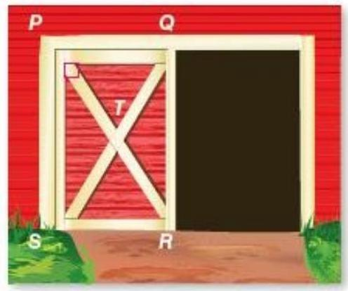

1. QR

SOLUTION:

The opposite sides of a rectangle are parallel and congruent. Therefore, $\mathrm{{QR}} = \mathrm{{PS}} = 7\mathrm{{ft}}$ .

2. SQ

SOLUTION:

The diagonals of a rectangle bisect each other. So,

${SQ} = 2\left( {ST}\right)$

$= 2\left( \frac{61}{16}\right)$

$= \frac{61}{8}$

$= 7\frac{5}{8}$

3. $m\angle {TQR}$

SOLUTION:

The diagonals of a rectangle are congruent and bisect each other. So, $\bigtriangleup {TQR}$ is an isosceles triangle. Then, $\angle {TQR} \cong  \angle {TRQ}$ .

By the Exterior Angle Theorem,

$m\angle {TQR} + m\angle {TRQ} = m\angle {PTQ} = {67}$ .

Therefore, $m\angle {TQR} = \frac{1}{2}\left( {m\angle {PTQ}}\right)  = \frac{1}{2}\left( {67}\right)  = {33.5}$ .

## 4. $m\angle {TSR}$

## SOLUTION:

The diagonals of a rectangle are congruent and bisect each other. So, $\bigtriangleup {TSR}$ is an isosceles triangle. Then, $\angle {TSR} \cong  \angle {TRS}$ .

By the Vertical Angle Theorem,

$m\angle {STR} = m\angle {PTQ} = {67}$ .

Therefore, $m\angle {TSR} = \frac{1}{2}\left( {{180} - m\angle {STR}}\right)  = \frac{1}{2}\left( {113}\right)  = {56.5}$ .

ALGEBRA Quadrilateral DEFG is a rectangle.

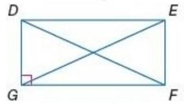

5. If $\mathrm{{FD}} = 3\mathrm{x} - 7$ and $\mathrm{{EG}} = \mathrm{x} + 5$ , find $\mathrm{{EG}}$ . SOLUTION:

The diagonals of a rectangle are congruent to each

other. So, $\mathrm{{FD}} = \mathrm{{EG}}$ .

${3x} - 7 = x + 5$

${2x} = {12}$

$x = 6$

Use the value of $\mathrm{x}$ to find $\mathrm{{EG}}$ .

$\mathrm{{EG}} = 6 + 5 = {11}$

6. If $m\angle {EFD} = {2x} - 3$ and $m\angle {DFG} = x + {12}$ ,

find $m\angle {EFD}$ .

SOLUTION:

All four angles of a rectangle are right angles. So,

$m\angle {EFD} + m\angle {DFG} = {90}$ .

${2x} - 3 + x + {12} = {90}$

${3x} = {81}$

$x = {27}$

$m\angle {EFD} = 2\left( {27}\right)  - 3$

$= {51}$

7. PROOF If ABDE is a rectangle and $\overline{BC} \cong  \overline{DC}$ , prove that $\overline{AC} \cong  \overline{EC}$ .

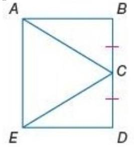

## SOLUTION:

You need to walk through the proof step by step. Look over what you are given and what you need to prove. You are given ABDE is a rectangle and

$\overline{BC} \cong  \overline{DC}$ . You need to prove $\overline{AC} \cong  \overline{EC}$ . Use the properties that you have learned about rectangles to walk through the proof.

Given: ABDE is a rectangle; $\overline{BC} \cong  \overline{DC}$

Prove: $\overline{AC} \cong  \overline{EC}$

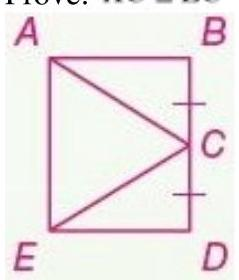

Statements(Reasons)

1. ABDE is a rectangle; $\overline{BC} \cong  \overline{DC}$ .

(Given)

2. ABDE is a parallelogram. (Def. of

rectangle)

3. $\overline{AB} \cong  \overline{DE}$ (Opp. sides of a $\square$ are $\cong$ .)

4. $\angle B$ and $\angle D$ are right angles.(Def. of rectangle)

5. $\angle B \cong  \angle D$ (All rt $\angle \mathrm{s}$ are $\cong$ .)

6. $\bigtriangleup {ABC} \cong  \bigtriangleup {EDC}\left( \mathrm{{SAS}}\right)$

7. $\overline{AC} \cong  \overline{EC}$ (CPCTC) COORDINATE GEOMETRY Graph each quadrilateral with the given vertices. Determine whether the figure is a rectangle. Justify your answer using the indicated formula.

8. $\mathrm{W}\left( {-4,3}\right) ,\mathrm{X}\left( {1,5}\right) ,\mathrm{Y}\left( {3,1}\right) ,\mathrm{Z}\left( {-2, - 2}\right)$ ; Slope Formula SOLUTION:

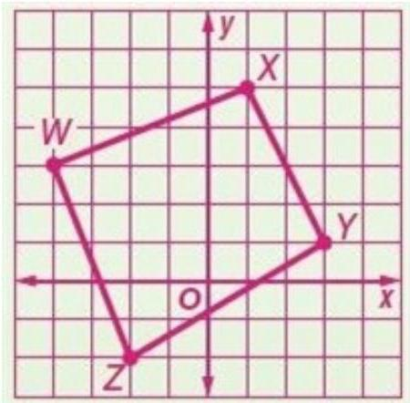

Use the slope formula to find the slope of the sides of the quadrilateral.

$$
{m}_{WX} = \frac{5 - 3}{1 - \left( {-4}\right) } = \frac{2}{5}
$$

$$
{m}_{XY} = \frac{1 - 5}{3 - 1} =  - 2
$$

$$
{m}_{YZ} = \frac{-2 - 1}{-2 - 3} = \frac{3}{5}
$$

$$
{m}_{WZ} = \frac{-2 - 3}{-2 - \left( {-4}\right) } =  - \frac{5}{2}
$$

There are no parallel sides, so WXYZ is not a

parallelogram. Therefore, WXYZ is not a rectangle.

9. A $\left( {4,3}\right) ,\mathrm{B}\left( {4, - 2}\right) ,\mathrm{C}\left( {-4, - 2}\right) ,\mathrm{D}\left( {-4,3}\right)$ ; Distance Formula

SOLUTION:

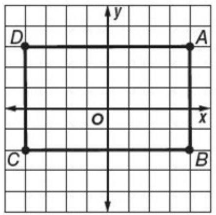

First, Use the Distance formula to find the lengths of the sides of the quadrilateral.

$$
{AB} = \sqrt{{\left( 4 - 4\right) }^{2} + {\left( -2 - 3\right) }^{2}} = \sqrt{0 + {\left( -5\right) }^{2}} = \sqrt{25} = 5
$$

$$
{BC} = \sqrt{{\left( -4 - 4\right) }^{2} + {\left( -2 - \left( -2\right) \right) }^{2}} = \sqrt{{\left( -8\right) }^{2} + 0} = \sqrt{64} = 8
$$

$$
{CD} = \sqrt{{\left( -4 - \left( -4\right) \right) }^{2} + {\left( 3 - \left( -2\right) \right) }^{2}} = \sqrt{0 + {5}^{2}} = \sqrt{25} = 5
$$

$$
{AD} = \sqrt{{\left( -4 - 4\right) }^{2} + {\left( 3 - 3\right) }^{2}} = \sqrt{{\left( -8\right) }^{2} + 0} = \sqrt{64} = 8
$$

$$
{AB} = 5 = {CD},{BC} = 8 = {AD}\text{, so ABCD is a}
$$

parallelogram.

A parallelogram is a rectangle if the diagonals are congruent. Use the Distance formula to find the lengths of the diagonals.

$$
{AC} = \sqrt{{\left( -4 - 4\right) }^{2} + {\left( -2 - 3\right) }^{2}} = \sqrt{{\left( -8\right) }^{2} + {\left( -5\right) }^{2}} = \sqrt{{64} + {25}} = \sqrt{89}
$$

$$
{BD} = \sqrt{{\left( -4 - 4\right) }^{2} + {\left( 3 - \left( -2\right) \right) }^{2}} = \sqrt{{\left( -8\right) }^{2} + {\left( 5\right) }^{2}} = \sqrt{{64} + {25}} = \sqrt{89}
$$

So the diagonals are congruent. Thus, ABCD is a rectangle.

FENCING X-braces are also used to provide support in rectangular fencing. If $\mathrm{{AB}} = 6$ feet, $\mathrm{{AD}} = 2$ feet, and $m\angle {DAE} = {65}$ , find each measure.

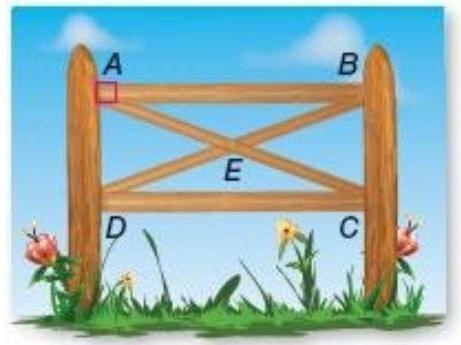

10. BC SOLUTION:

The opposite sides of a rectangle are parallel and congruent. Therefore, $\mathrm{{BC}} = \mathrm{{AD}} = 2\mathrm{{ft}}$ .

11. DB

SOLUTION:

All four angles of a rectangle are right angles. So,

$\bigtriangleup {BCD}$ is a right triangle. By the Pythagorean

Theorem, ${\mathrm{{DB}}}^{2} = {\mathrm{{BC}}}^{2} + {\mathrm{{DC}}}^{2}$ .

$\mathrm{{BC}} = \mathrm{{AD}} = 2$

$\mathrm{{DC}} = \mathrm{{AB}} = 6$

$D{B}^{2} = {\left( 2\right) }^{2} + {\left( 6\right) }^{2} = {40}$

$$
{DB} = \sqrt{40} \approx  {6.3}
$$

12. m $\angle {CEB}$

SOLUTION:

The diagonals of a rectangle are congruent and bisect each other. So, $\bigtriangleup {AED}$ is an isosceles triangle.

Then, $\angle {DAE} \cong  \angle {ADE}$

$$
m\angle {AED} = {180} - \left( {m\angle {DAE} + m\angle {ADE}}\right)
$$

$$
= {180} - \left( {{65} + {65}}\right)
$$

$$
= {50}
$$

By the Vertical Angle Theorem,

$m\angle {CEB} = m\angle {AED} = {50}$ .

13. $m\angle {EDC}$

SOLUTION:

The diagonals of a rectangle are congruent and bisect each other. So, $\bigtriangleup {AED}$ is an isosceles triangle.

Then, $m\angle {ADE} = m\angle {DAE} = {50}$ .

All four angles of a rectangle are right angles. $m\angle {EDC} = {90} - m\angle {ADE}$

$$
= {90} - {65}
$$

$$
= {25}
$$

CCSS REGULARITY Quadrilateral WXYZ is a rectangle.

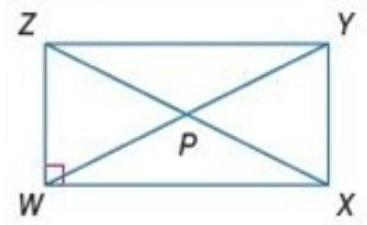

14. If $\mathrm{{ZY}} = 2\mathrm{x} + 3$ and $\mathrm{{WX}} = \mathrm{x} + 4$ , find $\mathrm{{WX}}$ . SOLUTION: The opposite sides of a rectangle are parallel and congruent. So, $\mathrm{{ZY}} = \mathrm{{WX}}$ .

${2x} + 3 = x + 4$

x = 1

Use the value of $x$ to find ${WX}$ .

$\mathrm{{WX}} = 1 + 4 = 5$ .

15. If $\mathrm{{PY}} = 3\mathrm{x} - 5$ and $\mathrm{{WP}} = 2\mathrm{x} + {11}$ , find $\mathrm{{ZP}}$ .

SOLUTION:

The diagonals of a rectangle bisect each other. So, $\mathrm{{PY}} = \mathrm{{WP}}$ .

${3x} - 5 = {2x} + {11}$

$x = {16}$

The diagonals of a rectangle are congruent and bisect each other. So, $\bigtriangleup {ZPW}$ is an isosceles triangle. ${ZP} = {WP}$

$$
= 2\left( {16}\right)  + {11}
$$

$$
= {43}
$$

16. If $m\angle {ZYW} = {2x} - 7$ and $m\angle {WYX} = {2x} + 5$ , find $m\angle {ZYW}$ .

SOLUTION:

All four angles of a rectangle are right angles. So, $m\angle {ZYW} + m\angle {WYX} = {90}$ .

---

${2x} - 7 + {2x} + 5 = {90}$

${4x} = {92}$

$x = {23}$

$m\angle {ZYW} = 2\left( {23}\right)  - 7$

	$= {39}$

---

17. If $\mathrm{{ZP}} = 4\mathrm{x} - 9$ and $\mathrm{{PY}} = 2\mathrm{x} + 5$ , find $\mathrm{{ZX}}$ .

SOLUTION:

The diagonals of a rectangle are congruent and bisect each other. So, $\mathrm{{ZP}} = \mathrm{{PY}}$ .

${4x} - 9 = {2x} + 5$

${2x} = {14}$

$x = 7$

Then $\mathrm{{ZP}} = 4\left( 7\right)  - 9 = {19}$ .

Therefore, $\mathrm{{ZX}} = 2\left( \mathrm{{ZP}}\right)  = {38}$ .

18. If $m\angle {XZY} = {3x} + 6$ and $m\angle {XZW} = {5x} - {12}$ , find $m\angle {YXZ}$ .

SOLUTION:

All four angles of a rectangle are right angles. So, $m\angle {YZX} + m\angle {XZW} = {90}$ .

${3x} + 6 + {5x} - {12} = {90}$

${8x} = {96}$

$x = {12}$

$m\angle {YXZ} = m\angle {XZW} = 5\left( {12}\right)  - {12} = {48}$

19. If $m\angle {ZXW} = x - {11}$ and $m\angle {WZX} = x - 9$ , find $m\angle {ZXY}$ .

SOLUTION:

All four angles of a rectangle are right angles. So, $\bigtriangleup {ZWX}$ is a right triangle. Then,

$m\angle {ZXW} + m\angle {WZX} = {90}$ .

$x - {11} + x - 9 = {90}$

${2x} = {110}$

$x = {55}$

Therefore, $m\angle {WZX} = {55} - 9$ or 46 . Since $\overline{ZX}$ is a transversal of parallel sides $\overline{ZY}$ and $\overline{WX}$ , alternate interior angles $\angle \mathrm{{WZX}}$ and $\angle \mathrm{{ZXY}}$ are congruent. So, $m\angle {ZXY} = m\angle {WZX} = {46}$ . PROOF Write a two-column proof.

20. Given: ABCD is a rectangle. Prove: $\bigtriangleup {ADC} \cong  \bigtriangleup {BCD}$

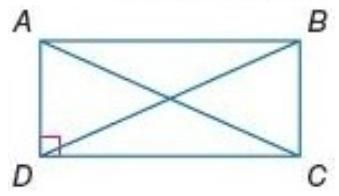

SOLUTION:

You need to walk through the proof step by step. Look over what you are given and what you need to prove. Here, you are given ABCD is a rectangle. You need to prove $\bigtriangleup {ADC} \cong  \bigtriangleup {BCD}$ . Use the properties that you have learned about rectangles to walk through the proof.

Given: ABCD is a rectangle.

Prove: $\bigtriangleup {ADC} \cong  \bigtriangleup {BCD}$

Proof:

Statements (Reasons)

1. ABCD is a rectangle. (Given)

2. ABCD is a parallelogram. (Def. of rectangle)

3. $\overline{AD} \cong  \overline{BC}$ (Opp. sides of a ▫ are $\cong$ .)

4. $\overline{DC} \cong  \overline{CD}$ (Refl. Prop.)

5. $\overline{AC} \cong  \overline{BD}$ (Diagonals of a rectangle are $\cong$ .)

6. $\bigtriangleup {ADC} \cong  \bigtriangleup {BCD}$ (SSS)

21. Given: QTVW is a rectangle.

$\overline{QR} \cong  \overline{ST}$

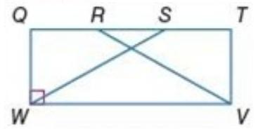

Prove: $\bigtriangleup {SWQ} \cong  \bigtriangleup {RVT}$ SOLUTION: You need to walk through the proof step by step. Look over what you are given and what you need to prove. Here, you are given QTVW is a rectangle and $\overline{QR} \cong  \overline{ST}$ . You need to prove $\bigtriangleup {SWQ} \cong  \bigtriangleup {RVT}$ . Use the properties that you have learned about rectangles to walk through the proof.

Given: QTVW is a rectangle.

$$
\overline{QR} \cong  \overline{ST}
$$

Prove: $\bigtriangleup {SWQ} \cong  \bigtriangleup {RVT}$

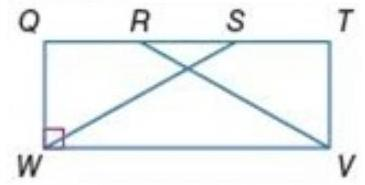

Proof:

Statements (Reasons)

1. QTVW is a rectangle; $\overline{QR} \cong  \overline{ST}$ .(Given)

2. QTVW is a parallelogram. (Def. of rectangle)

3. $\overline{WQ} \cong  \overline{VT}$ (Opp sides of a $\square$ are $\cong$ .)

4. $\angle Q$ and $\angle T$ are right angles.(Def. of rectangle)

5. $\angle Q \cong  \angle T$ (All rt $\angle \mathrm{s}$ are $\cong$ .)

6. QR = ST (Def. of ≅ segs.)

7. $\overline{RS} \cong  \overline{RS}$ (Refl. Prop.)

8. RS = RS (Def. of ≅ segs.)

9. QR + RS = RS + ST (Add. prop.)

10. QS = QR + RS, RT = RS + ST (Seg. Add. Post.)

11. QS = RT (Subst.)

12. $\overline{QS} \cong  \overline{RT}$ (Def. of ≅ segs.)

13. $\bigtriangleup {SWQ} \cong  \bigtriangleup {RVT}\left( \mathrm{{SAS}}\right)$

COORDINATE GEOMETRY Graph each quadrilateral with the given vertices. Determine whether the figure is a rectangle. Justify your answer using the indicated formula.

22. W(-2,4), X(5,5), Y(6,-2), Z(-1,-3); Slope Formula SOLUTION:

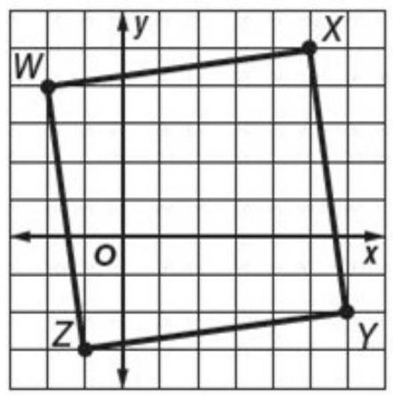

Use the slope formula to find the slope of the sides of the quadrilateral.

$$
{m}_{WX} = \frac{5 - 4}{5 - \left( {-2}\right) } = \frac{1}{7}
$$

$$
{m}_{XY} = \frac{-2 - 5}{6 - 5} =  - 7
$$

$$
{m}_{YZ} = \frac{-3 - \left( {-2}\right) }{-1 - 6} = \frac{1}{7}
$$

$$
{m}_{WZ} = \frac{-3 - 4}{-1 - \left( {-2}\right) } =  - 7
$$

The slopes of each pair of opposite sides are equal. So, the two pairs of opposite sides are parallel. Therefore, the quadrilateral WXYZ is a parallelogram. The products of the slopes of the adjacent sides are -1 . So, any two adjacent sides are perpendicular to each other. That is, all the four angles are right angles. Therefore, WXYZ is a rectangle.

23. $\mathrm{J}\left( {3,3}\right) ,\mathrm{K}\left( {-5,2}\right) ,\mathrm{L}\left( {-4, - 4}\right) ,\mathrm{M}\left( {4, - 3}\right)$ ; Distance Formula

SOLUTION:

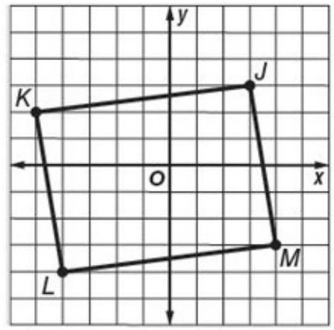

First, Use the Distance formula to find the lengths of the sides of the quadrilateral.

$$
{JK} = \sqrt{{\left( -5 - 3\right) }^{2} + {\left( 2 - 3\right) }^{2}} = \sqrt{{\left( -8\right) }^{2} + {\left( -1\right) }^{2}} = \sqrt{{64} + 1} = \sqrt{65}
$$

$$
{KL} = \sqrt{{\left( -4 - \left( -5\right) \right) }^{2} + {\left( -4 - 2\right) }^{2}} = \sqrt{{1}^{2} + {\left( -6\right) }^{2}} = \sqrt{37}
$$

$$
{LM} = \sqrt{{\left( 4 - \left( -4\right) \right) }^{2} + {\left( -3 - \left( -4\right) \right) }^{2}} = \sqrt{{8}^{2} + {1}^{2}} = \sqrt{65}
$$

$$
{JM} = \sqrt{{\left( 4 - 3\right) }^{2} + {\left( 3 - \left( -3\right) \right) }^{2}} = \sqrt{{1}^{2} + {6}^{2}} = \sqrt{37}
$$

${JK} = \sqrt{65} = {LM},{KL} = 8 = {JM},$ so JKLM is a

parallelogram.

A parallelogram is a rectangle if the diagonals are congruent. Use the Distance formula to find the lengths of the diagonals.

${KM} = \sqrt{{\left( 4 - \left( -5\right) \right) }^{2} + {\left( -3 - 2\right) }^{2}} = \sqrt{{9}^{2} + {\left( -5\right) }^{2}} = \sqrt{{81} + {25}} = \sqrt{106}$

${JL} = \sqrt{{\left( -4 - 3\right) }^{2} + {\left( -4 - 3\right) }^{2}} = \sqrt{{\left( -7\right) }^{2} + {\left( -7\right) }^{2}} = \sqrt{{49} + {49}} = \sqrt{98}$

So the diagonals are not congruent. Thus, JKLM is not a rectangle.

24. $\mathrm{Q}\left( {-2,2}\right) ,\mathrm{R}\left( {0, - 2}\right) ,\mathrm{S}\left( {6,1}\right) ,\mathrm{T}\left( {4,5}\right)$ ; Distance Formula SOLUTION:

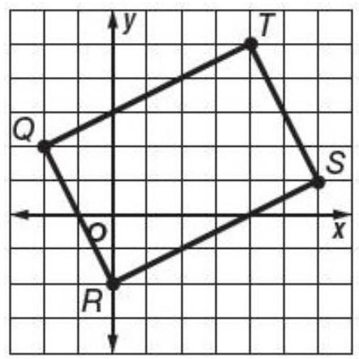

First, use the Distance Formula to find the lengths of the sides of the quadrilateral.

$$
{QR} = \sqrt{{\left( 0 - \left( -2\right) \right) }^{2} + {\left( -2 - 2\right) }^{2}} = \sqrt{{2}^{2} + {\left( -4\right) }^{2}} = \sqrt{4 + {16}} = \sqrt{20}
$$

$$
{RS} = \sqrt{{\left( 6 - 0\right) }^{2} + {\left( 1 - \left( -2\right) \right) }^{2}} = \sqrt{{6}^{2} + {3}^{2}} = \sqrt{{36} + 9} = \sqrt{45}
$$

$$
{ST} = \sqrt{{\left( 4 - 6\right) }^{2} + {\left( 5 - 1\right) }^{2}} = \sqrt{{\left( -2\right) }^{2} + {4}^{2}} = \sqrt{4 + {16}} = \sqrt{20}
$$

$$
{QT} = \sqrt{{\left( 4 - \left( -2\right) \right) }^{2} + {\left( 5 - 2\right) }^{2}} = \sqrt{{6}^{2} + {3}^{2}} = \sqrt{{36} + 9} = \sqrt{45}
$$

$$
{QR} = \sqrt{20} = {ST},{RS} = \sqrt{45} = {QT}\text{, so QRST is a}
$$

parallelogram.

A parallelogram is a rectangle if the diagonals are congruent. Use the Distance Formula to find the lengths of the diagonals.

$$
{QS} = \sqrt{{\left( 6 - \left( -2\right) \right) }^{2} + {\left( 2 - 1\right) }^{2}} = \sqrt{{8}^{2} + {1}^{2}} = \sqrt{{64} + 1} = \sqrt{65}
$$

${RT} = \sqrt{{\left( 4 - 0\right) }^{2} + {\left( 5 - \left( -2\right) \right) }^{2}} = \sqrt{{4}^{2} + {7}^{2}} = \sqrt{{16} + {49}} = \sqrt{65}$

So the diagonals are congruent. Thus, QRST is a rectangle.

25. $\mathrm{G}\left( {1,8}\right) ,\mathrm{H}\left( {-7,7}\right) ,\mathrm{J}\left( {-6,1}\right) ,\mathrm{K}\left( {2,2}\right)$ ; Slope Formula SOLUTION:

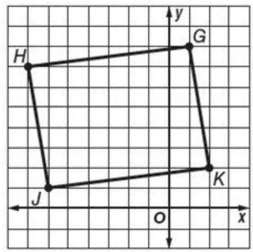

First, use the slope formula to find the lengths of the sides of the quadrilateral.

$$
{m}_{GH} = \frac{7 - 8}{-7 - 1} = \frac{1}{8}
$$

$$
{m}_{HJ} = \frac{1 - 7}{-6 - \left( {-7}\right) } =  - 6
$$

$$
{m}_{JK} = \frac{2 - 1}{2 - \left( {-6}\right) } = \frac{1}{8}
$$

$$
{m}_{GK} = \frac{2 - 8}{2 - 1} =  - 6
$$

The slopes of each pair of opposite sides are equal. So, the two pairs of opposite sides are parallel.

Therefore, the quadrilateral GHJK is a

parallelogram.

None of the adjacent sides have slopes whose

product is -1 . So, the angles are not right angles.

Therefore, GHJK is not a rectangle.

Quadrilateral ABCD is a rectangle. Find each measure if $m\angle 2 = {40}$ .

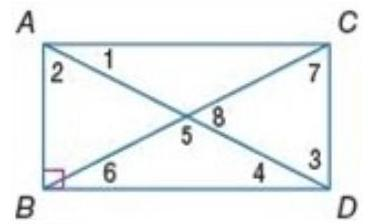

26. $m\angle 1$

SOLUTION:

All four angles of a rectangle are right angles. So,

$m\angle 1 + m\angle 2 = {90}$ .

$m\angle 1 = {90} - {40}$

$$
= {50}
$$

27. $m\angle 7$

SOLUTION:

The measures of angles 2 and 3 are equal as they are alternate interior angles.

Since the diagonals of a rectangle are congruent and bisect each other, the triangle with the angles 3,7 and 8 is an isosceles triangle. So, $m\angle 7 = m\angle 3$ .

Therefore, $m\angle 7 = m\angle 2 = {40}$ .

28. $m\angle 3$

SOLUTION:

The measures of angles 2 and 3 are equal as they are alternate interior angles.

Therefore, $m\angle 3 = m\angle 2 = {40}$ .

29. $m\angle 5$

SOLUTION:

All four angles of a rectangle are right angles. So,

$m\angle 1 + m\angle 2 = {90}$ .

$$
m\angle 1 = {90} - {40}
$$

$$
= {50}
$$

The measures of angles 1 and 4 are equal as they are alternate interior angles.

Therefore, $m\angle 4 = m\angle 1 = {50}$ .

Since the diagonals of a rectangle are congruent and bisect each other, the triangle with the angles 4,5 and 6 is an isosceles triangle. So, $m\angle 6 = m\angle 4 = {50}$ . The sum of the three angles of a triangle is 180 . Therefore, $\mathrm{m}\angle 5 = {180} - \left( {{50} + {50}}\right)  = {80}$ . 30. $m\angle 6$

SOLUTION:

All four angles of a rectangle are right angles. So,

$m\angle 1 + m\angle 2 = {90}$ .

$$
m\angle 1 = {90} - {40}
$$

$$
= {50}
$$

The measures of angles 1 and 4 are equal as they are alternate interior angles.

Therefore, $m\angle 4 = m\angle 1 = {50}$ .

Since the diagonals of a rectangle are congruent and bisect each other, the triangle with the angles 4,5 and 6 is an isosceles triangle. Therefore, $\mathrm{m}\angle 6 =$ $\mathrm{m}\angle 4 = {50}$ .

31. $m\angle 8$

## SOLUTION:

The measures of angles 2 and 3 are equal as they are alternate interior angles.

Since the diagonals of a rectangle are congruent and bisect each other, the triangle with the angles 3,7 and 8 is an isosceles triangle. So, $m\angle 3 = m\angle 7 = {40}$ . The sum of the three angles of a triangle is 180. Therefore, $\mathrm{m}\angle 8 = {180} - \left( {{40} + {40}}\right)  = {100}$ .

32. CCSS MODELING Jody is building a new bookshelf using wood and metal supports like the one shown. To what length should she cut the metal supports in order for the bookshelf to be square, which means that the angles formed by the shelves and the vertical supports are all right angles? Explain your reasoning.

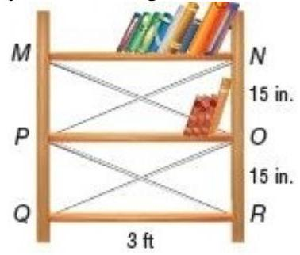

SOLUTION:

In order for the bookshelf to be square, the lengths of all of the metal supports should be equal. Since we know the length of the bookshelves and the distance between them, use the Pythagorean Theorem to find the lengths of the metal supports.

Let $\mathrm{x}$ be the length of each support. Express 3 feet as 36 inches.

$$
{15}^{2} + {36}^{2} = {x}^{2}
$$

$$
{1521} = {x}^{2}
$$

$$
\sqrt{1521} = x
$$

$$
{39} = x
$$

Therefore, the metal supports should each be 39 inches long or 3 feet 3 inches long.

PROOF Write a two-column proof.

33. Theorem 8.13

SOLUTION:

You need to walk through the proof step by step. Look over what you are given and what you need to prove. Here, you are given WXYZ is a rectangle with diagonals $\overline{WY}$ and $\overline{XZ}$ . You need to prove

$\overline{WY} \cong  \overline{XZ}$ . Use the properties that you have learned about rectangles to walk through the proof. Given: WXYZ is a rectangle with diagonals $\overline{WY}$ and $\overline{XZ}$ .

Prove: $\overline{WY} \cong  \overline{XZ}$

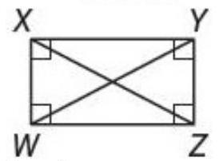

Proof:

1. WXYZ is a rectangle with diagonals $\overline{WY}$ and $\overline{XZ}$ . (Given)

2. $\overline{WX} \cong  \overline{ZY}$ (Opp. sides of a $\square$ are $\cong$ .)

3. $\overline{WZ} \cong  \overline{WZ}$ (Refl. Prop.)

4. $\angle {XWZ}$ and $\angle {YZW}$ are right angles. (Def. of rectangle)

5. $\angle {XWZ} \cong  \angle {YZW}$ (All right $\angle \mathrm{s}$ are $\cong$ .)

6. $\bigtriangleup {XWZ} \cong  \bigtriangleup {YZW}$ (SAS)

7. $\overline{WY} \cong  \overline{XZ}$ (CPCTC)

34. Theorem 8.14

SOLUTION:

You need to walk through the proof step by step. Look over what you are given and what you need to prove. Here, you are given

$\overline{WX} \cong  \overline{YZ},\overline{XY} \cong  \overline{WZ}$ , and $\overline{WY} \cong  \overline{XZ}$ . You need to prove that WXYZ is a rectangle.. Use the properties that you have learned about rectangles to walk through the proof.

Given: $\overline{WX} \cong  \overline{YZ},\overline{XY} \cong  \overline{WZ}$ , and $\overline{WY} \cong  \overline{XZ}$

Prove: WXYZ is a rectangle.

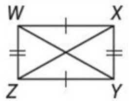

Proof:

1. $\overline{WX} \cong  \overline{YZ},\overline{XY} \cong  \overline{WZ}$ , and $\overline{WY} \cong  \overline{XZ}$ (Given)

2. $\bigtriangleup {WZX} \cong  \bigtriangleup {XYW}$ (SSS)

3. $\angle {ZWX} \cong  \angle {YXW}\left( \mathrm{{CPCTC}}\right)$

4. $m\angle {ZWX} = m\angle {YXW}$ (Def. of $\cong  \angle \mathrm{s}$ )

5. WXYZ is a parallelogram. (If both pairs of opp. sides are $\cong$ , then quad. is $\square$ .)

6. $\angle {ZWX}$ and $\angle {YXW}$ are supplementary. (Cons. $\angle \mathrm{s}$ of $\square$ are suppl.)

7. $m\angle {ZWX} + m\angle {YXW} = {180}$ (Def of suppl.)

8. $\angle {ZWX}$ and $\angle {YXW}$ are right angles. (If

$2\angle$ are $\cong$ and suppl., each $\angle$ is a rt. $\angle$ .)

9. $\angle {WZY}$ and $\angle {XYZ}$ are right angles. (If a $\square$ has 1

rt. $\angle$ , it has $4\mathrm{{rt}}.\angle \mathrm{s}$ .)

10. WXYZ is a rectangle. (Def. of rectangle) PROOF Write a paragraph proof of each statement.

35. If a parallelogram has one right angle, then it is a rectangle.

## SOLUTION:

You need to walk through the proof step by step. Look over what you are given and what you need to prove. Here, you are given a parallelogram with one right angle. You need to prove that it is a rectangle. Let ABCD be a parallelogram with one right angle. Then use the properties of parallelograms to walk through the proof.

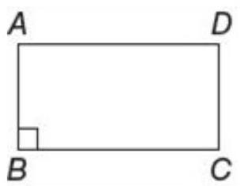

$\mathrm{{ABCD}}$ is a parallelogram, and $\angle B$ is a right angle. Since ABCD is a parallelogram and has one right angle, then it has four right angles. So by the definition of a rectangle, $\mathrm{{ABCD}}$ is a rectangle.

36. If a quadrilateral has four right angles, then it is a rectangle.

## SOLUTION:

You need to walk through the proof step by step. Look over what you are given and what you need to prove. Here, you are given a quadrilateral with four right angles. You need to prove that it is a rectangle. Let ABCD be a quadrilateral with four right angles. Then use the properties of parallelograms and rectangles to walk through the proof.

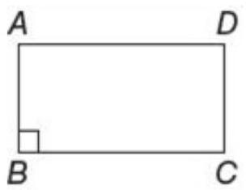

ABCD is a quadrilateral with four right angles. $\mathrm{{ABCD}}$ is a parallelogram because both pairs of opposite angles are congruent. By definition of a rectangle, ABCD is a rectangle.

37. CONSTRUCTION Construct a rectangle using the construction for congruent segments and the construction for a line perpendicular to another line through a point on the line. Justify each step of the

eSolutions Manual - Powered by Cognero

construction.

## SOLUTION:

Sample answer:

Step 1: Graph a line and place points $\mathrm{P}$ and $\mathrm{Q}$ on the line.

Step 2: Place the compass on point P. Using the same compass setting, draw an arc to the left and right of $\mathrm{P}$ that intersects

Step 3: Open the compass to a setting greater than the distance from $\mathrm{P}$ to either point of intersection. Place the compass on each point of intersection and draw arcs that intersect above $\overrightarrow{PQ}$ .

Step 4: Draw line a through point $\mathrm{P}$ and the intersection of the arcs drawn in step 3 .

Step 5: Repeat steps 2 and 3 using point Q.

Step 6: Draw line b through point $\mathrm{Q}$ and the intersection of the arcs drawn in step 5 .

Step 7: Using any compass setting, put the compass at $\mathrm{P}$ and draw an arc above it that intersects line a. Label the point of intersection R.

Step 8: Using the same compass setting, put the compass at $\mathrm{Q}$ and draw an arc above it that intersects line b. Label the point of intersection S.

Step 9: Draw $\overline{RS}$ .

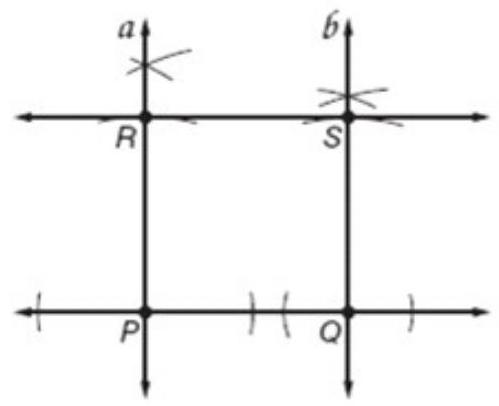

Since $\overline{RP} \bot  \overline{PQ}$ and $\overline{SQ} \bot  \overline{PQ}$ , the measure of angles $\mathrm{P}$ and $\mathrm{Q}$ is 90 degrees. Lines that are perpendicular to the same line are parallel, so

$\overline{RP}\parallel \overline{SQ}$ . The same compass setting was used to