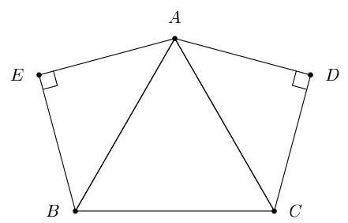
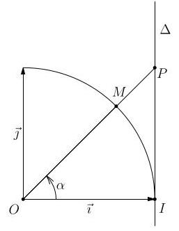

## Trigonométrie

Le plan est muni d’un repère orthonormé direct $\left( {O,\overrightarrow{i},\overrightarrow{j}}\right)$ et $k$ représente un entier (positif ou négatif).

## Exercice ${\mathrm{n}}^{ \circ  }1$

Dans la figure ci-dessous, ${ABC}$ est un triangle équilatéral et ${ADC}$ et ${AEB}$ sont des triangles rectangles isocèles.

Déterminer une mesure en radians des angles orientés suivants :

1. $\left( {\overrightarrow{AB},\overrightarrow{AC}}\right)$ 2. $\left( {\overrightarrow{DC},\overrightarrow{DA}}\right)$ 3. $\left( {\overrightarrow{EB},\overrightarrow{EA}}\right)$ 4.

5. $\left( {\overrightarrow{AE},\overrightarrow{AD}}\right)$ 6. $\left( {\overrightarrow{BC},\overrightarrow{BE}}\right)$

## Exercice ${\mathrm{n}}^{ \circ  }2$

Déterminer la mesure principale des angles orientés de mesure :

1. $\frac{13\pi }{6}$ :

2. $- \frac{37\pi }{3}$ :

3. $\frac{19\pi }{6}$ :

4. $- \frac{21\pi }{8}$ :

5. $- {20\pi }$ :

6. ${11\pi }$ : - Exercice n°3

1. Calculer $\sin x$ sachant que $\cos x = \frac{\sqrt{3}}{5}$ et $x \in  \left\lbrack  {0;\frac{\pi }{2}}\right\rbrack$ .

2. Calculer $\sin x$ sachant que $\cos x = \sqrt{3} - 2$ et $x \in  \left\lbrack  {-\pi ; - \frac{\pi }{2}}\right\rbrack$ .

3. Calculer $\cos x$ sachant que $\sin x = \frac{3}{4}$ et $x \in  \left\lbrack  {0;\frac{\pi }{2}}\right\rbrack$ .

4. Calculer $\cos x$ sachant que $\sin x = \frac{-2}{\sqrt{5}}$ et $x \in  \left\lbrack  {-\frac{\pi }{2};0}\right\rbrack$ .

- Exercice n ${}^{ \circ  }4$

Exprimer en fonction de $\cos x$ et $\sin x$ les expressions suivantes :

1. $A\left( x\right)  = \cos \left( {\frac{\pi }{2} + x}\right)  + \cos \left( {{2\pi } - x}\right)  + 2\sin \left( {\pi  - x}\right)  + \cos \left( {\pi  + x}\right)$

2. $B\left( x\right)  = \cos \left( {\pi  - x}\right)  + \cos \left( {\frac{\pi }{2} - x}\right)  - \sin \left( {\frac{\pi }{2} - x}\right)$

3. $C\left( x\right)  = \sin \left( {\pi  + x}\right)  + \sin \left( {{3\pi } - x}\right)  + \sin \left( {x - {7\pi }}\right)  - \sin \left( {{9\pi } - x}\right)$

4. $D\left( x\right)  = \cos \left( {\frac{5\pi }{2} - x}\right)  + \cos \left( {\pi  - x}\right)  + \sin \left( {{5\pi } - x}\right)$

Exercice ${\mathrm{n}}^{ \circ  }5$

Déterminer les valeurs exactes de :

1. $\cos \left( \frac{7\pi }{3}\right)$ 2. $\sin \left( {-\frac{13\pi }{4}}\right)$

3. $\cos \left( \frac{31\pi }{6}\right)$ 4. $\sin \left( {-{15\pi }}\right)$

5. $\cos \left( {10\pi }\right)$ 6. $\sin \left( {-\frac{7\pi }{2}}\right)$

## Exercice n°6

Résoudre dans $\mathbb{R}$ les équations suivantes :

1. $\cos x =  - \frac{\sqrt{2}}{2}$ .

2. $\cos x =  - \frac{6}{5}$ .

3. $\cos \left( {\frac{\pi }{3} - {2x}}\right)  = \frac{\sqrt{3}}{2}$ .

4. $\sin x = \frac{\sqrt{3}}{2}$ .

5. $\sin x = 1$ .

6. $\sin \left( {2x}\right)  = \frac{1}{2}$ .

7. $- 2{\left( \sin x\right) }^{2} + \sin x + 1 = 0$ .

## Exercice ${\mathrm{n}}^{ \circ  }7$

1. Résoudre dans $\rbrack  - \pi ;\pi \rbrack$ l’équation $\cos x =  - \frac{1}{2}$ .

2. Résoudre dans $\left\lbrack  {0;\pi }\right\rbrack$ l’inéquation $\cos x >  - \frac{1}{2}$ .

3. Résoudre dans $\rbrack  - \pi ;\pi \rbrack$ l’équation $\sin x = \frac{\sqrt{3}}{2}$ .

4. Résoudre dans $\left\lbrack  {0;\pi }\right\rbrack$ l’inéquation $\sin x \geq  \frac{\sqrt{3}}{2}$ .

## Exercice ${\mathrm{n}}^{ \circ  }8$

1. Compléter le tableau de signes ci-dessous :

<table><tr><td>$x$</td><td>$- \pi$$\pi$</td></tr><tr><td>$\sin x$</td><td/></tr><tr><td>$\cos x$</td><td/></tr><tr><td>$\sin x\cos x$</td><td/></tr></table>

2. En déduire les solutions dans $\left\lbrack  {-\pi ;\pi }\right\rbrack$ de l’inéquation $\sin x\cos x > 0$ .

## Exercice n°9

Dans un repère orthonormé direct $\left( {O,\overrightarrow{i},\overrightarrow{j}}\right)$ , on considère :

- le point $M$ associé à une mesure $\alpha$ (avec $\left. {\left. {\alpha  \in  }\right\rbrack  0;\frac{\pi }{2}}\right)$ ) sur le cercle trigono-métrique de centre $O$ ;

- $\Delta$ la droite d’équation $x = 1$ ;

- $P$ le point d’intersection des droites(OM)et $\Delta$

1. a) Donner les coordonnées du point $M$ en fonction de $\alpha$ .

b) Déterminer l’équation réduite de la droite(OM).

c) En déduire l’ordonnée du point $P$ en fonction de $\alpha$ .

2. Pour tout réel $x$ tel que $\cos x \neq  0$ , on appelle tangente de $x$ le réel noté $\tan x$ tel que $\tan x = \frac{\sin x}{\cos x}$ .

Donner les valeurs exactes de :

a) $\tan 0$

b) $\tan \left( \frac{\pi }{6}\right)$

c) $\tan \left( \frac{\pi }{4}\right)$

d) $\tan \left( \frac{\pi }{3}\right)$

## Exercice n°10

On considère trois points distincts deux à deux $A, B$ et $C$ et la proposition

suivante : « Si $A, B$ et $C$ sont alignés alors la mesure principale de $\left( {\overrightarrow{AB},\overrightarrow{AC}}\right)$ est égale à 0. »

1. Cette proposition est-elle vraie?

2. Énoncer la réciproque de cette proposition.

3. La réciproque est-elle vraie?