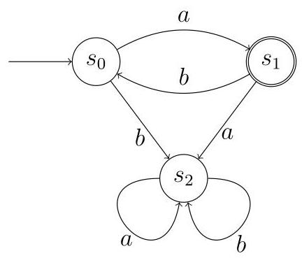
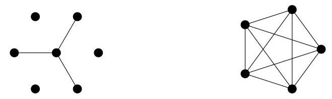

## MAT 2011 Q7

Alice and Bob have a large bag of coins which they use to play a game called HT-2. In this game, Alice and Bob take turns placing one coin at a time on the table, each to the right of the previous one; thus they build a row of coins that grows to the right. Alice always places the first coin. Each coin is placed head-up (H) or tail-up (T), and cannot be flipped or moved once it has been placed.

A player loses the game if he or she places a coin that results in two adjacent coins having the same pattern of heads and tails as another adjacent pair somewhere in the row (reading a pattern from left to right). For example, Bob has lost this game by producing a second instance of HT (where $a$ and $b$ denote coins placed by Alice and Bob respectively):

<table><tr><td/><td/><td/><td>$b$</td><td/><td/></tr><tr><td/><td>$H$</td><td>$T$</td><td/><td>$H$</td><td>$T$</td></tr></table>

and Alice has lost this game by producing a second instance of TT (overlapping pairs can count as repeats):

$\begin{array}{lllll} a & b & a & b & a \end{array}$

$\begin{array}{lllll} T & H & T & T & T \end{array}$

(i) What is the smallest number of coins that might be placed in a game of HT-2 (including the final coin that causes a player to lose)? What is the largest number? Justify each answer.

(ii) Bob can always win a game of HT-2 by adopting a particular strategy. Describe the strategy.

For any positive integer $n$ , there is a game HT- $n$ with the same rules as HT-2, except that the game is lost by a player who creates an unbroken sequence of $n$ heads and tails that appears elsewhere in the row. For example, Bob has lost this game of HT-3 by producing a second instance of THT:

(iii) Suppose $n$ is odd, and Bob chooses to play by always duplicating Alice’s previous play (and Alice knows that this is Bob's strategy). Show that Alice can always win.

## In these games, a maximum time of one minute is allowed for each turn.

(iv) Can we be certain that a game of HT-6 will be finished within two hours? Justify your answer.

## MAT 2012 Q7

Amy and Brian play a game together, as follows. They take it in turns to write down a number from the set $\{ 0,1,2\}$ , with Amy playing first. On each turn (except Amy’s first turn), the player must not repeat the number just played by the previous player.

In their first version of the game, Brian wins if, after he plays, the sum of all the numbers played so far is a multiple of 3 . For example, Brian will win after the sequence

$$
2,0\left| {1,2}\right| 1,0
$$

(where we draw a box around each round) because the sum of the numbers is 6 . Amy wins if Brian has not won within five rounds; for example, Amy wins after the sequence

$$
2,0\left| {1,2}\right| 1,2\left| {0,2}\right| 1,2
$$

(i) Show that if Amy starts by playing either 1 or 2, then Brian can immediately win.

(ii) Suppose, instead, Amy starts by playing 0 . Show that Brian can always win within two rounds.

They now decide to change the rules so that Brian wins if, after he plays, the sum of all the numbers played so far is one less than a multiple of 3. Again, Amy wins if Brian has not won within five rounds. It is still the case that a player must not repeat the number just played previously.

(iii) Show that if Amy starts by playing either 0 or 2 , then Brian can immediately win.

(iv) Suppose, instead, Amy starts by playing 1. Explain why it cannot benefit Brian to play 2, assuming Amy plays with the best strategy.

(v) So suppose Amy starts by playing 1, and Brian then plays 0 . How should Amy play next?

(vi) Assuming both play with the best strategies, who will win the game? Explain your answer.

## MAT 2014 Q7

A finite automaton is a mathematical model of a simple computing device. A small finite automaton is illustrated below.

A finite automaton has some finite number of states; the above automaton has three states, labelled ${s}_{0},{s}_{1}$ and ${s}_{2}$ . The initial state, ${s}_{0}$ , is indicated with an incoming arrow. The automaton receives inputs (e.g. via button presses), which might cause it to change state. In the example, the inputs are $a$ and $b$ . The state changes are illustrated by arrows; for example, if the automaton is in state ${s}_{1}$ and it receives input $b$ , it changes to state ${s}_{0}$ ; if it is in state ${s}_{2}$ and receives either input, it remains in state ${s}_{2}$ . (For each state, there is precisely one out-going arrow for each input.)

Some of the states are defined to be accepting states; in the example, just ${s}_{1}$ is defined to be an accepting state, represented by the double circle. A word is a sequence of inputs. The automaton accepts a word $w$ if that sequence of inputs leads to an accepting state from the initial state. For example, the above automaton accepts the word ${aba}$ .

(i) Write down a description of the set of words accepted by the above automaton. A clear but informal description will suffice.

(ii) Suppose we alter the above automaton by swapping accepting and non-accepting states; i.e. we make ${s}_{0}$ and ${s}_{2}$ accepting, and make ${s}_{1}$ non-accepting. Write down a description of the set of words accepted by this new automaton. Again, a clear but informal description will suffice.

(iii) Draw an automaton that accepts all words containing an even number (possibly zero) of $a$ ’s and any number of $b$ ’s (and no other words).

(iv) Now draw an automaton that accepts all words containing an even number of $a$ ’s or an odd number of $b$ ’s (and no other words).

Let ${a}^{n}$ represent $n$ consecutive $a$ ’s. Let $L$ be the set of all words of the form ${a}^{n}{b}^{n}$ where $n = 0,1,2,\ldots$ ; i.e. all words composed of some number of $a$ ’s followed by the same number of $b$ ’s. We will show that no finite automaton accepts precisely this set of words.

(v) Suppose a particular finite automaton $A$ does accept precisely the words in $L$ . Show that if $i \neq  j$ then the words ${a}^{i}$ and ${a}^{j}$ must lead to different states of $A$ . Hence show that this leads to a contradiction.

Bonus question (Interview question)

A "graph" is a collection of "nodes" (also called vertices or points), and a collection of "edges". Each edge connects exactly two nodes, and each pair of nodes is either connected by at most one edge (there are no double-edges, or loops from one node to itself).

Here are some examples.

The "degree" of a node is the number of edges that have an end at that node. For example, in the graph on the left, the node in the middle has degree 3 , there are three nodes with degree 1, and three nodes of degree zero. In the graph on the right, every node has degree 4 .

Can you draw a graph with 5 nodes where every node has odd degree? Draw such a graph or prove that it's impossible.

Answer and next part on the next page.

Hopefully you've spotted that the sum of the degrees is always even, because each edge has two ends. The sum of five odd degrees would be odd, so it's impossible.

Here’s a new question; given a list of five positive integers $\left( {{d}_{1},{d}_{2},{d}_{3},{d}_{4},{d}_{5}}\right)$ , and given that the sum of the integers is even, is there always a graph with five nodes where the degrees of the nodes are precisely the integers in the list? Prove it's always possible, or find a counter-example list.

Answer and next part on the next page.

This is not always possible. Your counter-example might be something like(1,1,1,1,42), which is impossible because each node can only have degree at most 4 . This is a correct answer to the question, but somehow it doesn't feel like we've discovered an interesting truth yet. Here's a harder version of the question.

Given a list of five positive integers $\left( {{d}_{1},{d}_{2},{d}_{3},{d}_{4},{d}_{5}}\right)$ , and given that the sum of the integers is even, and given that every integer in the list is less than five, is there always a graph with five nodes where the degrees of the nodes are precisely the integers in the list? Prove it's always possible, or find a counter-example list.

Answer on the next page.

This is not always possible. Your counter-example might be something like(0,0,0,0,2), which is impossible because the node with degree 2 isn't allowed to connect to any of the nodes with degree zero. If your counter-example involves nodes with degree zero, find a new counter-example with all the integers in the list bigger than zero.

In general, a sequence of numbers is called a "graphic sequence" if it can be the degrees of a graph. Erdős and Gallai proved in 1960 that a sequence is graphic if and only if

$$
\mathop{\sum }\limits_{{i = 1}}^{r}{d}_{i} \leq  r\left( {r - 1}\right)  + \mathop{\sum }\limits_{{i = r + 1}}^{n}\min \left( {r,{d}_{i}}\right) \;\text{ for each integer }r \leq  n - 1.
$$